## **Capítulo II: Requirements Elicitation \& Analysis**
- **2.1. Competidores**

  | Competidor                                                 | Descripción                                                                                                                          | Características                                                                   | Logo                                                                                                                                                                                                                                 
  |-|-|-|--------------------------------------------------------------------------------------------------------------------------------------------------------------------------------------------------------------------------------------|
  | **Ayfix**                                                  | Conecta a técnicos con usuarios para limpieza y reparaciones comunes, usando como canales principales apps móviles y páginas web.    | Canal de distribución principal: Aplicaciones de descarga y páginas web           |  |
  | **Servicio Técnico de empresas como Sodimac o Maestro**    | Ofrecen mantenimiento del hogar, pero con procesos más tradicionales y menor flexibilidad en comparación con plataformas digitales.  | Canal de distribución principal: Página web, tienda física y atención telefónica. |   |
  | **Sistemas de domótica (como Google Nest o Xiaomi Home)**  | Ofrecen soluciones inteligentes para el hogar, pero con costos elevados y sin conexión directa con técnicos locales.                 | Canal de distribución principal: Página web y tienda física.                      |   |

    - **2.1.1. Análisis competitivo**

        <table>
            <tr>
            <th colspan="2" align="center">¿Por qué llevar a cabo este análisis?</th>
            <th colspan="5" align="center">Lo realizamos para comprender mejor a la competencia y así ajustar la estrategia de negocio para competir con mayor efectividad.</th>
            </tr>
            <tr>
            <td colspan="2"></td>
            <td align="center">AlguienDijoChamba</td>
            <td align="center">Ayfix</td>
            <td align="center">Sodimac/Maestro</td>
            <td align="center">Nest/Xiaomi Home</td>
            </tr>
            <tr>
            <td rowspan="2" align="center">Perfil</td>
            <td align="center"><b>Overview</b></td>
            <td align="center">Aplicación que conecta a usuarios con técnicos especializados (gasfiteros, carpinteros, etc.) e incorpora un sistema de gamificación (niveles Bronce, Plata y Oro) para fidelizar clientes y motivar a los técnicos.</td>
            <td align="center">Plataforma que enlaza usuarios con técnicos para servicios del hogar, principalmente en limpieza, gasfitería y electricidad básica.</td>
            <td align="center">Servicios técnicos como valor agregado en tiendas físicas y online, vinculados a la compra de productos.</td>
            <td align="center">Sistemas inteligentes para el hogar: temperatura, consumo eléctrico, cámaras, asistentes de voz y más.</td>
            </tr>
            <tr>
            <td align="center"><b>Ventaja competitiva ¿Qué valor ofrece a los clientes?</b></td>
            <td align="center">Interfaz amigable, acceso rápido a técnicos verificados y beneficios por gamificación que generan confianza y fidelidad.</td>
            <td align="center">Amplia red de técnicos de contacto rápido y económico.</td>
            <td align="center">Marca reconocida con cobertura nacional y respaldo en infraestructura.</td>
            <td align="center">Tecnología avanzada e integración con ecosistemas de domótica.</td>
            </tr>
            <tr>
            <td rowspan="2" align="center">Perfil de Marketing</td>
            <td align="center"><b>Mercado objetivo</b></td>
            <td align="center">Hogares y usuarios que requieren servicios de mantenimiento y reparación.</td>
            <td align="center">Usuarios urbanos que requieren soluciones rápidas y económicas para reparaciones básicas.</td>
            <td align="center">Compradores frecuentes de productos para el hogar que necesitan instalación o mantenimiento.</td>
            <td align="center">Consumidores con alto poder adquisitivo interesados en automatización del hogar.</td>
            </tr>
            <tr>
            <td align="center"><b>Estrategias de marketing</b></td>
            <td align="center">Presencia en redes sociales, alianzas con empresas de servicios y campañas digitales.</td>
            <td align="center">Publicidad digital en redes, posicionamiento en tiendas de apps y promociones por servicio.</td>
            <td align="center">Marketing cruzado en tiendas físicas, paquetes con productos y servicios.</td>
            <td align="center">Marketing digital, presencia en retail y alianzas estratégicas con marcas tecnológicas.</td>
            </tr>
            <td rowspan="3" align="center">Perfil de producto</td>
            <td align="center"><b>Productos o servicios</b></td>
            <td align="center">Conexión con técnicos, gestión de solicitudes, pagos inmediatos y sistema de gamificación.</td>
            <td align="center">Servicios de reparaciones básicas, mantenimiento y limpieza.</td>
            <td align="center">Instalación de productos, soporte técnico y servicios adicionales.</td>
            <td align="center">Sensores, cámaras, medidores, asistentes de voz y soluciones de control inteligente.</td>
            </tr>
            <tr>
            <td align="center"><b>Precios y costos</b></td>
            <td align="center">Comisión por servicio y planes de suscripción para técnicos con beneficios adicionales.</td>
            <td align="center">Pago por servicio individual, sin suscripciones.</td>
            <td align="center">Incluido con la compra de productos o con costo adicional.</td>
            <td align="center">Alto costo por dispositivos y su instalación.</td>
            </tr>
            <tr>
            <td align="center"><b>Canales de distribución (web y/o móvil)</b></td>
            <td align="center">Aplicación móvil, página web, redes sociales y convenios con técnicos.</td>
            <td align="center">App móvil y página web.</td>
            <td align="center">Tiendas físicas, página web y call center.</td>
            <td align="center">Página web, e-commerce y tiendas físicas.</td>
            </tr>
            <tr>
            <td rowspan="4" align="center"><b>Análisis SWOT</b></td>
            <td align="center"><b>Fortalezas</b></td>
            <td align="center">Acceso rápido a técnicos verificados, variedad de servicios y motivación mediante gamificación.</td>
            <td align="center">Fácil acceso y rapidez en la contratación de técnicos.</td>
            <td align="center">Marca sólida y de confianza, infraestructura establecida.</td>
            <td align="center">Tecnología avanzada con ecosistema integral de domótica.</td>
            </tr>
            <tr>
            <td align="center"><b>Debilidades</b></td>
            <td align="center">Requiere tiempo para consolidar la red de técnicos y ganar confianza del mercado.</td>
            <td align="center">Limitados a servicios básicos, sin valor agregado.</td>
            <td align="center">Dependencia de terceros para servicios técnicos.</td>
            <td align="center">Costoso, complejo para usuarios comunes, no ofrece mano de obra técnica.</td>
            </tr>
            <tr>
            <td align="center"><b>Oportunidades</b></td>
            <td align="center">Ampliar cobertura a oficinas, edificios y nuevos servicios.</td>
            <td align="center">Escalar hacia servicios especializados.</td>
            <td align="center">Integrar soluciones digitales para mayor agilidad.</td>
            <td align="center">Complementar con técnicos o incluir soporte humano.</td>
            </tr>
            <tr>
            <td align="center"><b>Amenazas</b></td>
            <td align="center">Que grandes competidores copien el modelo y lo escalen más rápido.</td>
            <td align="center">Competencia creciente en apps similares.</td>
            <td align="center">Riesgo de que plataformas digitales más ágiles los desplacen.</td>
            <td align="center">Preferencia de usuarios por alternativas más simples y económicas.</td>
            </tr>
        </table>

    - **2.1.2. Estrategias y tácticas frente a competidores**  
      **Propuesta de valor diferenciada:** Crear una plataforma que conecte de forma rápida y confiable a los usuarios con técnicos especializados (plomeros, electricistas, carpinteros, entre otros), destacándose por la facilidad de uso y tiempos de respuesta cortos.

      **Estrategia digital multicanal:** Posicionarse con campañas en redes sociales, influencers del hogar y tecnología, además de publicidad segmentada en zonas urbanas con alta demanda de servicios básicos.

      **Generación de confianza:** Incorporar testimonios y casos de éxito reales en la aplicación y en campañas publicitarias para transmitir credibilidad y mostrar resultados tangibles.

      **Beneficios iniciales:** Ofrecer promociones y descuentos de lanzamiento, junto con un sistema de gamificación (niveles Bronce, Plata, Oro) que brinde beneficios como descuentos, soporte prioritario y técnicos preferenciales.

      **Valor para técnicos:** Implementar pagos instantáneos al finalizar el servicio, eliminando esperas y motivando a los profesionales a preferir la plataforma.
- **2.2. Entrevistas**
    - **2.2.1. Diseño de entrevistas**

      Con el propósito de identificar de manera más clara las necesidades, comportamientos y expectativas de nuestros usuarios potenciales, hemos elaborado un conjunto de entrevistas. Estas están enfocadas en evaluar la aceptación y el interés por los servicios que plantea AlguienDijoChamba, tanto desde la perspectiva de los hogares que requieren asistencia como desde la de los técnicos que ofrecen su trabajo.

      **Preguntas para el segmento Objetivo 1: Profesionales Tecnicos**

        1. ¿A qué oficio te dedicas actualmente? (fontanero, electricista, carpintero, etc.)
        2. ¿Cómo consigues hoy a tus clientes? (recomendaciones, redes sociales, volanteo, etc.)
        3. ¿Qué dificultades tienes al buscar nuevos clientes o mantener un flujo constante de trabajo?
        4. ¿Has usado antes una aplicación o plataforma digital para ofrecer tus servicios? ¿Qué tal fue tu experiencia?
        5. Si existiera una app como AlguienDijoChamba, ¿qué herramientas te gustaría que incluya para facilitar tu trabajo? (agenda, cotizaciones, chat, pagos, etc.)
        6. ¿Qué tan importante sería para ti contar con un perfil verificado y calificaciones que destaquen tu experiencia?
        7. ¿Qué opinas de un sistema de gamificación con niveles (Bronce, Plata, Oro) que te dé beneficios como mayor visibilidad, prioridad en solicitudes o menos comisión? ¿Lo considerarías motivador?
        8. ¿Qué beneficios te gustaría recibir al subir de nivel en este sistema?
        9. ¿Qué tan atractivo te resulta que la app te pague de forma instantánea al terminar el servicio, sin esperar días o trámites adicionales?
        10. ¿Qué esperas de una plataforma como esta en términos de pagos, seguridad, comunicación con clientes y flexibilidad?
        11. ¿Qué valorarías más en una plataforma como AlguienDijoChamba? (visibilidad, facilidad de pago, agenda organizada, historial de clientes, etc.)

      **Preguntas para el segmento Objetivo 2: Clientes**
        1. En tu casa, ¿cada cuánto tiempo sueles necesitar servicios de técnicos como fontaneros, electricistas o carpinteros?
        2. Cuando surge un problema en tu hogar, ¿cómo sueles encontrar a un técnico? (ejemplo: recomendaciones, redes sociales, directorios, etc.)
        3. ¿Qué dificultades has tenido al buscar un técnico confiable para tu casa?
        4. ¿Qué tan importante es para ti conocer las referencias, calificaciones o experiencia de un técnico antes de contratarlo?
        5. ¿Alguna vez has usado una aplicación o página web para contratar un técnico? ¿Cómo fue tu experiencia?
        6. Si existiera una app que verificara la identidad y experiencia de los técnicos, ¿te daría más confianza contratar por ahí?
        7. Si una app ofreciera un sistema de niveles (Bronce, Plata, Oro) que te otorgue beneficios como descuentos, acceso a técnicos preferenciales o soporte prioritario, ¿qué tan atractivo te parecería?
        8. ¿Qué beneficios esperarías recibir para motivarte a subir de nivel en un sistema de gamificación como este?
        9. ¿Qué opinas de que los técnicos reciban el pago inmediatamente al finalizar el servicio? ¿Crees que eso aumentaría tu confianza como usuario?
           Pensando en una app como AlguienDijoChamba, ¿qué funciones te serían más útiles? (ejemplo: chat con técnicos, historial de servicios, alertas, cotización inmediata, pagos digitales, etc.)
        10. Pensando en una app como AlguienDijoChamba, ¿qué funciones te serían más útiles? (ejemplo: chat con técnicos, historial de servicios, alertas, cotización inmediata, pagos digitales, etc.)

- **2.2.2. Registro de entrevistas**

  **Entrevistas Segmento Objetivo 1: Profesionales Tecnicos**

  **Entrevista 1:**
  Datos del entrevistador:
    - Nombre: Sebastian Matias Escobar Palomino

  Datos del entrevistado:
    - Nombre:Diego Fuentes
    - Edad: 21 años
    - Distrito de residencia: Santa Anita
    - Enlace: https://acortar.link/lcWDjG

       
  **Resumen de la entrevista:**

  Diego Fuentes considera que una aplicación como AlguienDijoChamba le ayudaría a expandirse un poco más y darse a conocer mejor como técnico, lo que le permitiría tener más trabajo disponible. Además, cree que las funcionalidades que se planean implementar son muy prácticas y diferenciarían esta aplicación de otras similares.

  **Entrevista 2:**
  Datos del entrevistador:
    - Nombre: Percy Alonso Muñiz

  Datos del entrevistado:
    - Nombre: Humberto Garcia
    - Edad: 50 años
    - Distrito de residencia: Jesus Maria
    - Enlace: https://acortar.link/qrirRT

    

  **Resumen de la entrevista:**

  Humberto García, electricista, mostró gran interés en la aplicación presentada, destacando que le parece una propuesta innovadora y con gran potencial. Señaló que la herramienta le sería de gran ayuda para llegar a más personas, ampliar su alcance profesional y facilitar la conexión con clientes que requieran sus servicios.

  **Entrevista 3:**
  Datos del entrevistador:
    - Nombre: Fabrisio Belahonia

  Datos del entrevistado:
    - Nombre: Cameron Bustamante
    - Edad: 25
    - Distrito de residencia: Monterrico
    - Enlace: https://acortar.link/nlnyYy

      

  **Resumen de la entrevista:**

  La entrevistada se dedica a confección y arreglos de ropa. Actualmente consigue clientes por recomendaciones y Facebook, pero enfrenta temporadas bajas y contactos poco serios. Considera que una app como Fix Now le ayudaría con visibilidad, agenda de entregas, cotizaciones rápidas, pagos seguros e inmediatos, y comunicación directa con clientes. Valora mucho contar con un perfil verificado y un sistema de niveles que le brinde beneficios como mayor visibilidad y menores comisiones.

  **Entrevistas Segmento Objetivo 2: Clientes**

  **Entrevista 1:**
  Datos del entrevistador:
    - Nombre: Percy Alonso Muñiz

  Datos del entrevistado:
    - Nombre: Jarol Saquiray
    - Edad: 20 años
    - Distrito de residencia: San Miguel
    - Enlace: https: https://acortar.link/PMdjl9

    

  **Resumen de la entrevista:**

  Jarol percibe una aplicación como AlguienDijoChamba como una alternativa confiable frente a redes sociales. Le atrae la idea de técnicos verificados, pagos transparentes y beneficios a través de niveles. Considera que la principal propuesta de valor debe ser la confianza y la rapidez en la atención.

  **Entrevista 2:**
  Datos del entrevistador:
    - Nombre: Percy Alonso Muñiz Huayanca

  Datos del entrevistado:
    - Nombre: Juan Pablo Yataco
    - Edad: 20 años
    - Distrito de residencia: Jesus Maria
    - Enlace: https://acortar.link/gCUwR5

    

  **Resumen de la entrevista:**

  Leonardo identifica como problemas principales la informalidad y la falta de confianza al contratar técnicos por canales tradicionales. Percibe en AlguienDijoChamba una solución viable gracias a la verificación de perfiles, la transparencia en costos y la facilidad de comunicación. Además, muestra interés en la gamificación y en sistemas de pago digital inmediato, lo cual refuerza la importancia de ofrecer seguridad, beneficios tangibles y una experiencia ágil para los usuarios.

  **Entrevista 3:**
  Datos del entrevistador:
    - Nombre: Percy Alonso Muñiz

  Datos del entrevistado:
    - Nombre: Dilanh Garcua
    - Edad: 19 años
    - Distrito de residencia: Surco
    - Enlace: https://acortar.link/cJmZsA

    

  **Resumen de la entrevista:**

  Ángel ve a AlguienDijoChamba como una oportunidad para resolver problemas de informalidad, costos inesperados y falta de garantías en los servicios técnicos. Considera que la verificación de técnicos, la transparencia en precios y los pagos digitales inmediatos son elementos esenciales. Además, valora la incorporación de un sistema de niveles con beneficios y la posibilidad de integrar monitoreo inteligente en el hogar, lo cual refuerza el atractivo de la plataforma.

- **2.2.3. Análisis de entrevistas**

  **Análisis Segmento Objetivo 1: Profesionales Tecnicos**

  Los entrevistados coinciden en que la aplicación representa una propuesta innovadora que les ayudaría a ampliar su alcance profesional, generar más oportunidades de trabajo y facilitar la conexión con potenciales clientes. Además, valoran las funcionalidades diferenciadoras que aportarían practicidad y competitividad frente a otras alternativas del mercado.

  **Analisis Segmento Objetivo 2: Clientes**

  Las entrevistas evidencian una necesidad común de confianza, transparencia y seguridad al contratar técnicos. La propuesta de AlguienDijoChamba resulta atractiva al combinar verificación de perfiles, referencias confiables, cotizaciones claras y pagos digitales inmediatos. Además, la incorporación de gamificación y monitoreo inteligente refuerza la diferenciación de la plataforma, respondiendo tanto a las expectativas prácticas (costos, rapidez, calidad) como a la generación de valor agregado en el hogar

  ### Conclusión
  En general, las entrevistas confirmaron que AlguienDijoChamba responde a necesidades reales. Los clientes buscan seguridad, transparencia y facilidad. Los técnicos necesitan herramientas para crecer profesionalmente y llegar a más personas. Ambos segmentos mostraron interés en la propuesta y en las funcionalidades planteadas, lo cual refuerza el valor de la plataforma que estamos construyendo.

- **2.3. Needfinding**
    - **2.3.1. User Personas**

      **Segmento Objetivo 1: Profesionales Tecnicos**

      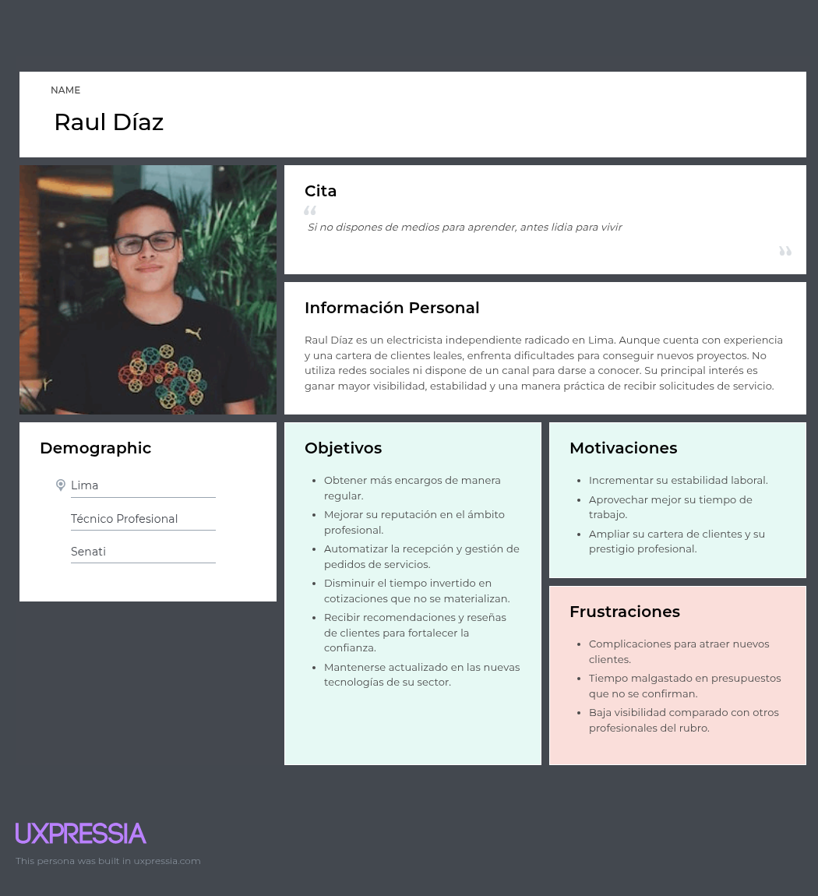

      **Segmento Objetivo 2: Clientes**

      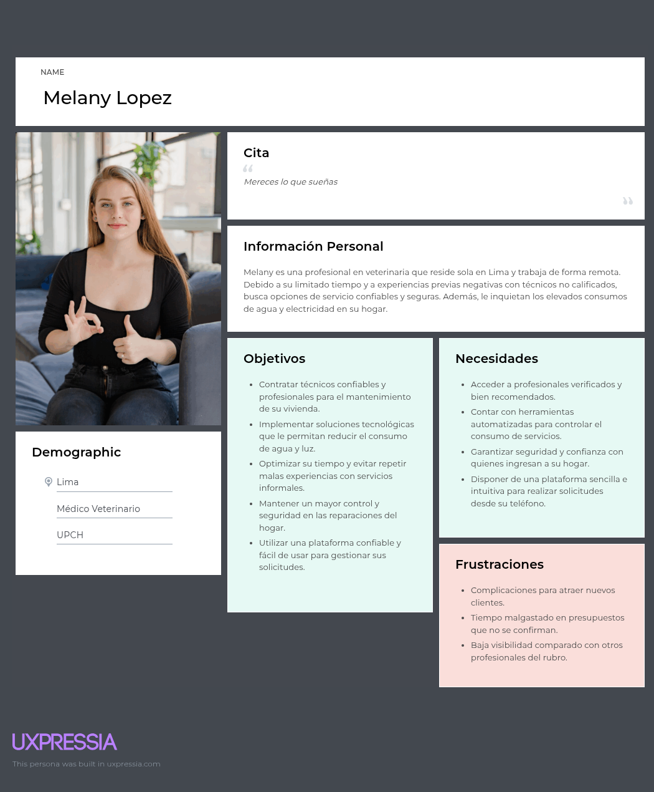
    - **2.3.2. User Task Matrix**

      A continuación, se presenta una matriz de tareas enfocada en los segmentos principales de la plataforma **AlguienDijoChamba**

      Esta herramienta permite identificar y clasificar las actividades clave que realiza cada segmento, considerando la frecuencia con la que las llevan a cabo y el nivel de importancia que representan dentro de su interacción con la plataforma.

      | Tarea                                                     | Profesionales Técnicos (Frecuencia / Importancia) | Clientes (Frecuencia / Importancia) |
      |-----------------------------------------------------------|---------------------------------------------------|-------------------------------------|
      | Registrarse en la plataforma                              | Baja / Alta                                       | Baja / Media                        |
      | Completar perfil y certificaciones                        | Baja / Alta                                       | -                                   |
      | Recibir notificaciones de servicios                       | Frecuente / Alta                                  | -                                   |
      | Aceptar o rechazar solicitudes                            | Frecuente / Alta                                  | -                                   |
      | Buscar técnicos según ubicación y oficio                  | -                                                 | Frecuente / Alta                    |
      | Revisar perfiles y calificaciones                         | -                                                 | Frecuente / Alta                    |
      | Agendar y confirmar servicio                              | -                                                 | Frecuente / Alta                    |
      | Calificar al técnico                                      | -                                                 | Frecuente / Alta                    |
      | Participar en gamificación (niveles, puntos, recompensas) | Frecuente / Media                                 | Frecuente / Media                   |

      Del análisis de esta matriz, se observa que:
        - Para los **técnicos**, las actividades más críticas son **recibir notificaciones** y **aceptar/rechazar solicitudes**, ya que determinan la generación de ingresos y la continuidad de su trabajo.
        - Para los **clientes**, las tareas más frecuentes y de mayor importancia están relacionadas con la **búsqueda, revisión de perfiles, agenda y calificación de técnicos**, lo que       refleja la necesidad de confianza y eficiencia en el proceso de contratación.
        - En ambos segmentos, la **gamificación** aparece como una oportunidad para mantener el compromiso, incentivar la participación y generar un ecosistema más dinámico.
        - Finalmente, tareas iniciales como el **registro** o completar el perfil, aunque se realizan una sola vez, tienen un peso alto en la experiencia inicial del usuario, por lo que deben diseñarse de forma simple e intuitiva.

    - **2.3.3. User Journey Mapping**

      **Segmento Objetivo 1: Profesionales Tecnicos**

      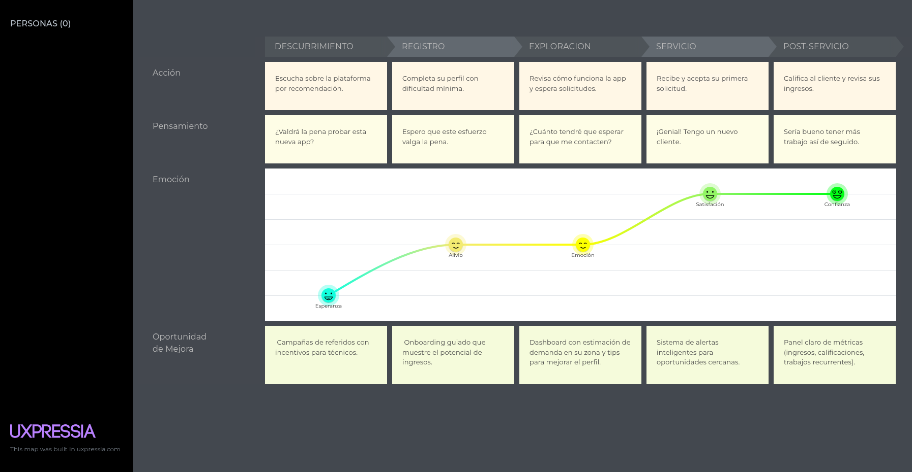

      **Segmento Objetivo 2: Clientes**

      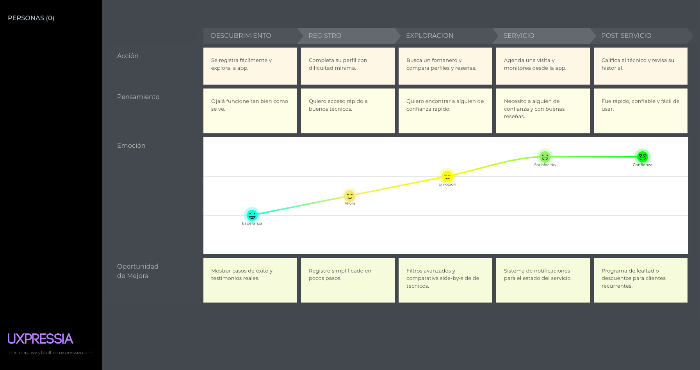

    - **2.3.4. Empathy Mapping**

      **Segmento Objetivo 1: Profesionales Tecnicos**

      #### Fernando Silva
      ---    

      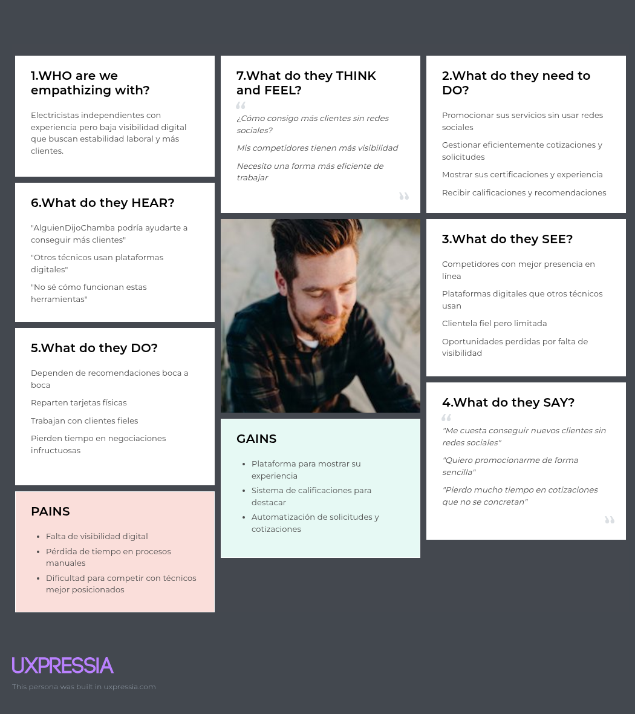

      **Segmento Objetivo 2: Clientes**

      #### Christian Martinez
      --- 

      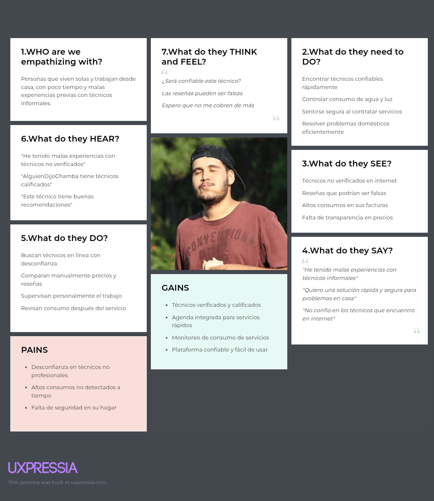
- **2.4. Ubiquitous Language** 

  | Término en Inglés (Español)             | Definición                                                                                                                                                                  |
  |-----------------------------------------|-----------------------------------------------------------------------------------------------------------------------------------------------------------------------------|
  | **Account (Cuenta)**                    | Identidad digital de un usuario dentro de la plataforma. Incluye credenciales de acceso y estado de la cuenta.                                                              |
  | **User (Usuario)**                      | Entidad básica que representa a una persona registrada en la plataforma. Contiene información personal esencial.                                                            |
  | **Customer (Cliente)**                  | Usuario que solicita servicios técnicos o profesionales a través de la plataforma.                                                                                          |
  | **Technician (Trabajador Técnico)**     | Profesional que ofrece servicios en la plataforma. Posee experiencia validada, habilidades técnicas ycertificaciones.                                                       |
  | **Experience (Experiencia)**            | Historial laboral de un trabajador técnico que respalda su trayectoria en distintos roles o empresas.                                                                       |
  | **Review (Reseña)**                     | Calificación y comentario que un usuario emite sobre un servicio recibido o prestado.                                                                                       |
  | **Proposal (Propuesta)**                | Oferta formal presentada por un trabajador técnico a un cliente. Contiene la descripción del trabajo, precio y tiempo estimado.                                             |
  | **Sales Order Payment (Orden de Pago)** | Registro financiero de la transacción entre cliente y trabajador por los servicios acordados.                                                                               |
  | **Hourly Rate (Tarifa por Hora)**       | Monto que un trabajador técnico define como su costo por hora de servicio.                                                                                                  |
  | **Field (Campo de Especialidad)**       | Área técnica específica en la que un trabajador se desempeña profesionalmente.                                                                                              |
  | **Skills (Habilidades)**                | Conjunto de competencias técnicas y conocimientos que posee un trabajador.                                                                                                  |
  | **Gamification (Gamificación)**         | Sistema de incentivos basado en puntos, niveles (Bronce, Plata, Oro) y recompensas, diseñado para motivar la participación activa y la fidelización de clientes y técnicos. |
  | **Level (Nivel)**                       | Categoría alcanzada dentro del sistema de gamificación (ej. Bronce, Plata, Oro) que refleja la participación, reputación y logros de un usuario en la plataforma.           |
  | **Reward (Recompensa)**                 | Beneficio tangible o intangible otorgado a clientes o técnicos como resultado de su participación y logros en la plataforma.                                                |

  | Término en Inglés (Español)             | Definición                                                                                                                                                                  |
  |-----------------------------------------|-----------------------------------------------------------------------------------------------------------------------------------------------------------------------------|
  | **Account (Cuenta)**                    | Identidad digital de un usuario dentro de la plataforma. Incluye credenciales de acceso y estado de la cuenta.                                                              |
  | **User (Usuario)**                      | Entidad básica que representa a una persona registrada en la plataforma. Contiene información personal esencial.                                                            |
  | **Customer (Cliente)**                  | Usuario que solicita servicios técnicos o profesionales a través de la plataforma.                                                                                          |
  | **Technician (Trabajador Técnico)**     | Profesional que ofrece servicios en la plataforma. Posee experiencia validada, habilidades técnicas y certificaciones.                                                      |
  | **Experience (Experiencia)**            | Historial laboral de un trabajador técnico que respalda su trayectoria en distintos roles o empresas.                                                                       |
  | **Review (Reseña)**                     | Calificación y comentario que un usuario emite sobre un servicio recibido o prestado.                                                                                       |
  | **Proposal (Propuesta)**                | Oferta formal presentada por un trabajador técnico a un cliente. Contiene la descripción del trabajo, precio y tiempo estimado.                                             |
  | **Sales Order Payment (Orden de Pago)** | Registro financiero de la transacción entre cliente y trabajador por los servicios acordados.                                                                               |
  | **Hourly Rate (Tarifa por Hora)**       | Monto que un trabajador técnico define como su costo por hora de servicio.                                                                                                  |
  | **Field (Campo de Especialidad)**       | Área técnica específica en la que un trabajador se desempeña profesionalmente.                                                                                              |
  | **Skills (Habilidades)**                | Conjunto de competencias técnicas y conocimientos que posee un trabajador.                                                                                                  |
  | **Gamification (Gamificación)**         | Sistema de incentivos basado en puntos, niveles (Bronce, Plata, Oro) y recompensas, diseñado para motivar la participación activa y la fidelización de clientes y técnicos. |
  | **Level (Nivel)**                       | Categoría alcanzada dentro del sistema de gamificación (ej. Bronce, Plata, Oro) que refleja la participación, reputación y logros de un usuario en la plataforma.           |
  | **Reward (Recompensa)**                 | Beneficio tangible o intangible otorgado a clientes o técnicos como resultado de su participación y logros en la plataforma.                                                |

- **2.4. Requirements specification**
    - **2.4.1. User Stories**
      ### Epic Story
      | Epic ID    | Título                                                                                                                                                                   |
      |------------|--------------------------------------------------------------------------------------------------------------------------------------------------------------------------|
      | **EP01**   | **Registro y Gestión de Perfil de Usuario**                                                                                                                              |
      |            | Como usuario (cliente o técnico), quiero crear, visualizar, editar y gestionar mi perfil para tener mis datos actualizados y poder utilizar la plataforma correctamente. |

      | Epic ID   | Título                                                                                                                                      |
      |-----------|---------------------------------------------------------------------------------------------------------------------------------------------|
      | **EP02**  | **Búsqueda y Contacto de Profesionales**                                                                                                    |
      |           | Como cliente, quiero buscar profesionales por especialidad, ubicación y reputación, y contactarlos fácilmente para solicitar sus servicios. |

      | Epic ID    | Título                                                                                                                                                                                                     |
      |------------|------------------------------------------------------------------------------------------------------------------------------------------------------------------------------------------------------------|
      | **EP03**   | **Gestión de Servicios Técnicos (para Profesionales)**                                                                                                                                                     |
      |            | Como profesional técnico, quiero gestionar mi perfil de servicios, disponibilidad y recibir solicitudes de trabajo a través de la app, asegurando que los pagos sean instantáneos al terminar el servicio. |

      | Epic ID    | Título                                                                                                                                                                                   |
      |------------|------------------------------------------------------------------------------------------------------------------------------------------------------------------------------------------|
      | **EP04**   | **Gamificación y Beneficios**                                                                                                                                                            |
      |            | Como usuario, quiero subir de nivel (Bronce, Plata, Oro) según mi actividad en la plataforma para desbloquear beneficios como descuentos, técnicos preferenciales y soporte prioritario. |

      | Epic ID    | Título                                                                                                                                                                                                                                                             |
      |------------|--------------------------------------------------------------------------------------------------------------------------------------------------------------------------------------------------------------------------------------------------------------------|
      | **EP05**   | **Gestión de Solicitudes y Contrataciones**                                                                                                                                                                                                                        |
      |            | Como cliente, quiero gestionar mis solicitudes de servicio, ver el estado de las contrataciones y realizar pagos de forma segura a través de la app. Como profesional, quiero gestionar las solicitudes recibidas y confirmar los trabajos con pagos instantáneos. |

      | Epic ID    | Título                                                                                                                                                                             |
      |------------|------------------------------------------------------------------------------------------------------------------------------------------------------------------------------------|
      | **EP06**   | **Sistema de Calificaciones y Reseñas**                                                                                                                                            |
      |            | Como cliente, quiero calificar y dejar reseñas sobre los servicios o profesionales, y ver las calificaciones y reseñas de otros para tomar decisiones informadas.                  |
  
      | Epic ID      | Título                                                                                                                                                                             |
      |--------------|------------------------------------------------------------------------------------------------------------------------------------------------------------------------------------|
      | **EP07**     | **Landing Page y Experiencia del Visitante**                                                                                                                                       |
      |              | Como visitante, quiero acceder a una landing page informativa y atractiva que me permita conocer los servicios, productos, niveles, testimonios y contactar fácilmente con FixNow. |

      ### User Stories

      <table border="1" cellspacing="0" cellpadding="6" style="border-collapse: collapse; width: 100%;">
        <tr>
          <th>Story ID</th>
          <th>User</th>
          <th>Priority</th>
          <th>Epic</th>
        </tr>
        <tr>
          <td>US01</td>
          <td>Cliente</td>
          <td>Alta</td>
          <td>EP01</td>
        </tr>
        <tr>
          <th colspan="4" align="center">Title</th>
        </tr>
        <tr>
          <td colspan="4" align="center">Registro de Nuevo Usuario</td>
        </tr>
        <tr>
          <th colspan="4" align="center">Description</th>
        </tr>
        <tr>
          <td colspan="4" align="center">Como nuevo cliente, quiero registrarme en la plataforma para poder buscar y contratar profesionales.</td>
        </tr>
        <tr>
          <th colspan="4" align="center">Acceptance Criteria</th>
        </tr>
        <tr>
          <td colspan="4">
            <ul>
              <li><strong>Escenario 1:</strong> Dado que soy un usuario nuevo, cuando ingreso correo válido y contraseña segura, entonces mi cuenta se crea exitosamente.</li>
              <li><strong>Escenario 2:</strong> Dado que ingreso datos inválidos, cuando intento registrarme, entonces la app muestra un mensaje de error indicando qué debo corregir.</li>
              <li><strong>Escenario 3:</strong> Dado que ya tengo una cuenta, cuando intento registrarme con el mismo correo, entonces la app indica que el correo ya está en uso.</li>
            </ul>
          </td>
        </tr>
      </table>

      <table border="1" cellspacing="0" cellpadding="6" style="border-collapse: collapse; width: 100%;">
        <tr>
          <th>Story ID</th>
          <th>User</th>
          <th>Priority</th>
          <th>Epic</th>
        </tr>
        <tr>
          <td>US02</td>
          <td>Profesional Técnico</td>
          <td>Alta</td>
          <td>EP01</td>
        </tr>
        <tr>
          <th colspan="4" align="center">Title</th>
        </tr>
        <tr>
          <td colspan="4" align="center">Registro de Nuevo Profesional</td>
        </tr>
        <tr>
          <th colspan="4" align="center">Description</th>
        </tr>
        <tr>
          <td colspan="4" align="center">Como nuevo profesional técnico, quiero registrarme detallando mis especialidades, experiencia y contacto para ofrecer mis servicios.</td>
        </tr>
        <tr>
          <th colspan="4" align="center">Acceptance Criteria</th>
        </tr>
        <tr>
          <td colspan="4">
            <ul>
              <li><strong>Escenario 1:</strong> Dado que completo todos los campos requeridos, cuando envío la información, entonces mi perfil se crea correctamente.</li>
              <li><strong>Escenario 2:</strong> Dado que omito campos obligatorios, cuando intento registrar el perfil, entonces la app indica qué información falta.</li>
              <li><strong>Escenario 3:</strong> Dado que ingreso datos incorrectos, cuando envío el registro, entonces la app muestra error indicando el formato correcto.</li>
            </ul>
          </td>
        </tr>
      </table>

      <table border="1" cellspacing="0" cellpadding="6" style="border-collapse: collapse; width: 100%;">
        <tr>
          <th>Story ID</th>
          <th>User</th>
          <th>Priority</th>
          <th>Epic</th>
        </tr>
        <tr>
          <td>US03</td>
          <td>Usuario</td>
          <td>Media</td>
          <td>EP01</td>
        </tr>
        <tr>
          <th colspan="4" align="center">Title</th>
        </tr>
        <tr>
          <td colspan="4" align="center">Recuperación de Cuenta/Login</td>
        </tr>
        <tr>
          <th colspan="4" align="center">Description</th>
        </tr>
        <tr>
          <td colspan="4" align="center">Como usuario, quiero recuperar mi cuenta o iniciar sesión mediante diferentes métodos para acceder fácilmente a la plataforma.</td>
        </tr>
        <tr>
          <th colspan="4" align="center">Acceptance Criteria</th>
        </tr>
        <tr>
          <td colspan="4">
            <ul>
              <li><strong>Escenario 1:</strong> Dado que olvidé mi contraseña, cuando solicito restablecerla, entonces recibo un correo con enlace para crear nueva contraseña.</li>
              <li><strong>Escenario 2:</strong> Dado que quiero acceder rápidamente, cuando uso inicio de sesión con Google, entonces me autentico sin necesidad de recordar contraseña.</li>
              <li><strong>Escenario 3:</strong> Dado que ingreso credenciales incorrectas, cuando intento iniciar sesión, entonces la app muestra mensaje de error específico.</li>
            </ul>
          </td>
        </tr>
      </table>

      <table border="1" cellspacing="0" cellpadding="6" style="border-collapse: collapse; width: 100%;">
        <tr>
          <th>Story ID</th>
          <th>User</th>
          <th>Priority</th>
          <th>Epic</th>
        </tr>
        <tr>
          <td>US04</td>
          <td>Usuario Registrado</td>
          <td>Media</td>
          <td>EP01</td>
        </tr>
        <tr>
          <th colspan="4" align="center">Title</th>
        </tr>
        <tr>
          <td colspan="4" align="center">Editar Perfil de Usuario</td>
        </tr>
        <tr>
          <th colspan="4" align="center">Description</th>
        </tr>
        <tr>
          <td colspan="4" align="center">Como usuario registrado, quiero poder editar la información de mi perfil para mantenerla actualizada.</td>
        </tr>
        <tr>
          <th colspan="4" align="center">Acceptance Criteria</th>
        </tr>
        <tr>
          <td colspan="4">
            <ul>
              <li><strong>Escenario 1:</strong> Dado que quiero actualizar mis datos, cuando modifico y guardo la información, entonces la app actualiza correctamente mi perfil.</li>
              <li><strong>Escenario 2:</strong> Dado que ingreso un número con formato incorrecto, cuando intento guardar, entonces la app muestra un mensaje de error.</li>
            </ul>
          </td>
        </tr>
      </table>
      ---
      <table border="1" cellspacing="0" cellpadding="6" style="border-collapse: collapse; width: 100%;">
        <tr>
          <th>Story ID</th>
          <th>User</th>
          <th>Priority</th>
          <th>Epic</th>
        </tr>
        <tr>
          <td>US05</td>
          <td>Cliente</td>
          <td>Alta</td>
          <td>EP02</td>
        </tr>
        <tr>
          <th colspan="4" align="center">Title</th>
        </tr>
        <tr>
          <td colspan="4" align="center">Ver Perfil Detallado del Profesional</td>
        </tr>
        <tr>
          <th colspan="4" align="center">Description</th>
        </tr>
        <tr>
          <td colspan="4" align="center">Como cliente, quiero ver el perfil completo de un profesional con toda su información relevante.</td>
        </tr>
        <tr>
          <th colspan="4" align="center">Acceptance Criteria</th>
        </tr>
        <tr>
          <td colspan="4">
            <ul>
              <li><strong>Escenario 1:</strong> Dado que quiero evaluar un profesional, cuando ingreso a su perfil, entonces puedo ver experiencia, especialidades, calificaciones, tarifas y disponibilidad.</li>
              <li><strong>Escenario 2:</strong> Dado que hay varios profesionales, cuando comparo perfiles, entonces puedo ver diferencias en tarifas, calificaciones y disponibilidad.</li>
              <li><strong>Escenario 3:</strong> Dado que necesito información específica, cuando visualizo el perfil, entonces puedo ver reseñas detalladas de otros clientes.</li>
            </ul>
          </td>
        </tr>
      </table>

      <table border="1" cellspacing="0" cellpadding="6" style="border-collapse: collapse; width: 100%;">
        <tr>
          <th>Story ID</th>
          <th>User</th>
          <th>Priority</th>
          <th>Epic</th>
        </tr>
        <tr>
          <td>US06</td>
          <td>Cliente</td>
          <td>Media</td>
          <td>EP02</td>
        </tr>
        <tr>
          <th colspan="4" align="center">Title</th>
        </tr>
        <tr>
          <td colspan="4" align="center">Contactar al Profesional</td>
        </tr>
        <tr>
          <th colspan="4" align="center">Description</th>
        </tr>
        <tr>
          <td colspan="4" align="center">Como cliente, quiero contactar directamente a un profesional para coordinar un servicio.</td>
        </tr>
        <tr>
          <th colspan="4" align="center">Acceptance Criteria</th>
        </tr>
        <tr>
          <td colspan="4">
            <ul>
              <li><strong>Escenario 1:</strong> Dado que quiero enviar un mensaje, cuando uso el perfil del profesional, entonces puedo enviarle un mensaje directo.</li>
              <li><strong>Escenario 2:</strong> Dado que quiero solicitar cotización, cuando la pido desde su perfil, entonces el profesional recibe mi solicitud con todos los detalles.</li>
            </ul>
          </td>
        </tr>
      </table>

      <table border="1" cellspacing="0" cellpadding="6" style="border-collapse: collapse; width: 100%;">
        <tr>
          <th>Story ID</th>
          <th>User</th>
          <th>Priority</th>
          <th>Epic</th>
        </tr>
        <tr>
          <td>US07</td>
          <td>Cliente</td>
          <td>Alta</td>
          <td>EP02</td>
        </tr>
        <tr>
          <th colspan="4" align="center">Title</th>
        </tr>
        <tr>
          <td colspan="4" align="center">Buscar Profesionales por Especialidad y Ubicación</td>
        </tr>
        <tr>
          <th colspan="4" align="center">Description</th>
        </tr>
        <tr>
          <td colspan="4" align="center">Como cliente, quiero buscar profesionales filtrando por tipo de servicio y ubicación para encontrar opciones adecuadas.</td>
        </tr>
        <tr>
          <th colspan="4" align="center">Acceptance Criteria</th>
        </tr>
        <tr>
          <td colspan="4">
            <ul>
              <li><strong>Escenario 1:</strong> Dado que busco un profesional, cuando aplico filtros de especialidad y ubicación, entonces la app muestra profesionales disponibles.</li>
              <li><strong>Escenario 2:</strong> Dado que no hay profesionales en mi zona, cuando realizo la búsqueda, entonces la app muestra un mensaje "no se encontraron resultados".</li>
              <li><strong>Escenario 3:</strong> Dado que quiero eficiencia, cuando uso filtros múltiples, entonces la app muestra resultados ordenados por reputación o cercanía.</li>
            </ul>
          </td>
        </tr>
      </table>

      <table border="1" cellspacing="0" cellpadding="6" style="border-collapse: collapse; width: 100%;">
        <tr>
          <th>Story ID</th>
          <th>User</th>
          <th>Priority</th>
          <th>Epic</th>
        </tr>
        <tr>
          <td>US08</td>
          <td>Cliente</td>
          <td>Alta</td>
          <td>EP02</td>
        </tr>
        <tr>
          <th colspan="4" align="center">Title</th>
        </tr>
        <tr>
          <td colspan="4" align="center">Solicitar Servicio al Profesional</td>
        </tr>
        <tr>
          <th colspan="4" align="center">Description</th>
        </tr>
        <tr>
          <td colspan="4" align="center">Como cliente, quiero contactar a un profesional y solicitar un servicio desde su perfil.</td>
        </tr>
        <tr>
          <th colspan="4" align="center">Acceptance Criteria</th>
        </tr>
        <tr>
          <td colspan="4">
            <ul>
              <li><strong>Escenario 1:</strong> Dado que quiero un servicio, cuando envío la solicitud desde el perfil del profesional, entonces puedo elegir fecha y hora, y el profesional recibe la solicitud.</li>
              <li><strong>Escenario 2:</strong> Dado que hay conflictos de horario, cuando selecciono fecha y hora, entonces la app alerta si hay disponibilidad del profesional.</li>
              <li><strong>Escenario 3:</strong> Dado que necesito agregar detalles, cuando incluyo información adicional, entonces el profesional recibe toda la información completa.</li>
            </ul>
          </td>
        </tr>
      </table>

      <table border="1" cellspacing="0" cellpadding="6" style="border-collapse: collapse; width: 100%;">
        <tr>
          <th>Story ID</th>
          <th>User</th>
          <th>Priority</th>
          <th>Epic</th>
        </tr>
        <tr>
          <td>US09</td>
          <td>Profesional Técnico</td>
          <td>Alta</td>
          <td>EP03</td>
        </tr>
        <tr>
          <th colspan="4" align="center">Title</th>
        </tr>
        <tr>
          <td colspan="4" align="center">Crear y Actualizar Servicios Ofrecidos</td>
        </tr>
        <tr>
          <th colspan="4" align="center">Description</th>
        </tr>
        <tr>
          <td colspan="4" align="center">Como técnico, quiero gestionar mi lista de servicios ofrecidos para mantenerla actualizada.</td>
        </tr>
        <tr>
          <th colspan="4" align="center">Acceptance Criteria</th>
        </tr>
        <tr>
          <td colspan="4">
            <ul>
              <li><strong>Escenario 1:</strong> Dado que quiero añadir o modificar un servicio, cuando actualizo mi perfil, entonces la lista de servicios se refleja para los clientes.</li>
              <li><strong>Escenario 2:</strong> Dado que quiero cambiar mis tarifas, cuando actualizo los precios, entonces los clientes ven las nuevas tarifas inmediatamente.</li>
            </ul>
          </td>
        </tr>
      </table>

      <table border="1" cellspacing="0" cellpadding="6" style="border-collapse: collapse; width: 100%;">
        <tr>
          <th>Story ID</th>
          <th>User</th>
          <th>Priority</th>
          <th>Epic</th>
        </tr>
        <tr>
          <td>US10</td>
          <td>Profesional Técnico</td>
          <td>Alta</td>
          <td>EP03</td>
        </tr>
        <tr>
          <th colspan="4" align="center">Title</th>
        </tr>
        <tr>
          <td colspan="4" align="center">Gestionar Disponibilidad</td>
        </tr>
        <tr>
          <th colspan="4" align="center">Description</th>
        </tr>
        <tr>
          <td colspan="4" align="center">Como técnico, quiero gestionar mi disponibilidad para solicitudes y poder indicar mis horarios de trabajo.</td>
        </tr>
        <tr>
          <th colspan="4" align="center">Acceptance Criteria</th>
        </tr>
        <tr>
          <td colspan="4">
            <ul>
              <li><strong>Escenario 1:</strong> Dado que quiero definir horarios, cuando actualizo disponibilidad, entonces la app muestra mis horas disponibles en tiempo real.</li>
              <li><strong>Escenario 2:</strong> Dado que tengo un imprevisto, cuando modifico mi disponibilidad, entonces las solicitudes futuras se ajustan automáticamente.</li>
            </ul>
          </td>
        </tr>
      </table>

      <table border="1" cellspacing="0" cellpadding="6" style="border-collapse: collapse; width: 100%;">
        <tr>
          <th>Story ID</th>
          <th>User</th>
          <th>Priority</th>
          <th>Epic</th>
        </tr>
        <tr>
          <td>US11</td>
          <td>Profesional Técnico</td>
          <td>Alta</td>
          <td>EP03</td>
        </tr>
        <tr>
          <th colspan="4" align="center">Title</th>
        </tr>
        <tr>
          <td colspan="4" align="center">Recibir y Gestionar Solicitudes de Servicio</td>
        </tr>
        <tr>
          <th colspan="4" align="center">Description</th>
        </tr>
        <tr>
          <td colspan="4" align="center">Como profesional, quiero recibir, aceptar o rechazar solicitudes de trabajo de los clientes para organizar mi agenda.</td>
        </tr>
        <tr>
          <th colspan="4" align="center">Acceptance Criteria</th>
        </tr>
        <tr>
          <td colspan="4">
            <ul>
              <li><strong>Escenario 1:</strong> Dado que recibo una solicitud, cuando la reviso, entonces puedo aceptarla o rechazarla con un comentario opcional.</li>
              <li><strong>Escenario 2:</strong> Dado que acepto una solicitud, cuando confirmo el servicio, entonces el cliente recibe una notificación de aceptación.</li>
              <li><strong>Escenario 3:</strong> Dado que rechazo una solicitud, cuando la rechazo, entonces el cliente recibe un mensaje explicando la razón.</li>
            </ul>
          </td>
        </tr>
      </table>

      <table border="1" cellspacing="0" cellpadding="6" style="border-collapse: collapse; width: 100%;">
        <tr>
          <th>Story ID</th>
          <th>User</th>
          <th>Priority</th>
          <th>Epic</th>
        </tr>
        <tr>
          <td>US12</td>
          <td>Cliente</td>
          <td>Alta</td>
          <td>EP05</td>
        </tr>
        <tr>
          <th colspan="4" align="center">Title</th>
        </tr>
        <tr>
          <td colspan="4" align="center">Gestionar Solicitudes Enviadas</td>
        </tr>
        <tr>
          <th colspan="4" align="center">Description</th>
        </tr>
        <tr>
          <td colspan="4" align="center">Como cliente, quiero ver y gestionar las solicitudes de servicios que he enviado para hacer seguimiento al estado.</td>
        </tr>
        <tr>
          <th colspan="4" align="center">Acceptance Criteria</th>
        </tr>
        <tr>
          <td colspan="4">
            <ul>
              <li><strong>Escenario 1:</strong> Dado que tengo solicitudes activas, cuando ingreso a mi panel, entonces puedo ver su estado (pendiente, aceptada o rechazada).</li>
              <li><strong>Escenario 2:</strong> Dado que quiero cancelar una solicitud, cuando aún no fue aceptada, entonces puedo eliminarla sin penalización.</li>
            </ul>
          </td>
        </tr>
      </table>

      <table border="1" cellspacing="0" cellpadding="6" style="border-collapse: collapse; width: 100%;">
        <tr>
          <th>Story ID</th>
          <th>User</th>
          <th>Priority</th>
          <th>Epic</th>
        </tr>
        <tr>
          <td>US13</td>
          <td>Profesional Técnico</td>
          <td>Alta</td>
          <td>EP05</td>
        </tr>
        <tr>
          <th colspan="4" align="center">Title</th>
        </tr>
        <tr>
          <td colspan="4" align="center">Confirmar Finalización del Servicio</td>
        </tr>
        <tr>
          <th colspan="4" align="center">Description</th>
        </tr>
        <tr>
          <td colspan="4" align="center">Como técnico, quiero confirmar la finalización de un servicio para recibir el pago de forma automática.</td>
        </tr>
        <tr>
          <th colspan="4" align="center">Acceptance Criteria</th>
        </tr>
        <tr>
          <td colspan="4">
            <ul>
              <li><strong>Escenario 1:</strong> Dado que he completado un servicio, cuando lo marco como finalizado, entonces el sistema procesa el pago instantáneo.</li>
              <li><strong>Escenario 2:</strong> Dado que el cliente no confirma el servicio, cuando pasan 24 horas, entonces el pago se libera automáticamente.</li>
            </ul>
          </td>
        </tr>
      </table>

      <table border="1" cellspacing="0" cellpadding="6" style="border-collapse: collapse; width: 100%;">
        <tr>
          <th>Story ID</th>
          <th>User</th>
          <th>Priority</th>
          <th>Epic</th>
        </tr>
        <tr>
          <td>US14</td>
          <td>Cliente</td>
          <td>Alta</td>
          <td>EP05</td>
        </tr>
        <tr>
          <th colspan="4" align="center">Title</th>
        </tr>
        <tr>
          <td colspan="4" align="center">Realizar Pago Seguro del Servicio</td>
        </tr>
        <tr>
          <th colspan="4" align="center">Description</th>
        </tr>
        <tr>
          <td colspan="4" align="center">Como cliente, quiero realizar el pago del servicio de forma segura dentro de la aplicación para garantizar protección en la transacción.</td>
        </tr>
        <tr>
          <th colspan="4" align="center">Acceptance Criteria</th>
        </tr>
        <tr>
          <td colspan="4">
            <ul>
              <li><strong>Escenario 1:</strong> Dado que quiero pagar un servicio, cuando selecciono el método de pago, entonces la app procesa el pago de manera segura.</li>
              <li><strong>Escenario 2:</strong> Dado que hubo un error, cuando el pago no se procesa, entonces se muestra un mensaje con opciones de reintento.</li>
            </ul>
          </td>
        </tr>
      </table>

      <table border="1" cellspacing="0" cellpadding="6" style="border-collapse: collapse; width: 100%;">
        <tr>
          <th>Story ID</th>
          <th>User</th>
          <th>Priority</th>
          <th>Epic</th>
        </tr>
        <tr>
          <td>US15</td>
          <td>Cliente</td>
          <td>Media</td>
          <td>EP05</td>
        </tr>
        <tr>
          <th colspan="4" align="center">Title</th>
        </tr>
        <tr>
          <td colspan="4" align="center">Ver Historial de Servicios Contratados</td>
        </tr>
        <tr>
          <th colspan="4" align="center">Description</th>
        </tr>
        <tr>
          <td colspan="4" align="center">Como cliente, quiero ver el historial de mis servicios pasados para consultar fechas, profesionales y montos pagados.</td>
        </tr>
        <tr>
          <th colspan="4" align="center">Acceptance Criteria</th>
        </tr>
        <tr>
          <td colspan="4">
            <ul>
              <li><strong>Escenario 1:</strong> Dado que quiero revisar mi historial, cuando ingreso al apartado de servicios anteriores, entonces se muestran todos los servicios finalizados con detalles.</li>
              <li><strong>Escenario 2:</strong> Dado que necesito comprobante, cuando selecciono un servicio específico, entonces puedo ver su recibo o factura.</li>
            </ul>
          </td>
        </tr>
      </table>

      <table border="1" cellspacing="0" cellpadding="6" style="border-collapse: collapse; width: 100%;">
        <tr>
          <th>Story ID</th>
          <th>User</th>
          <th>Priority</th>
          <th>Epic</th>
        </tr>
        <tr>
          <td>US16</td>
          <td>Usuario</td>
          <td>Media</td>
          <td>EP04</td>
        </tr>
        <tr>
          <th colspan="4" align="center">Title</th>
        </tr>
        <tr>
          <td colspan="4" align="center">Recibir Recompensas por Logros</td>
        </tr>
        <tr>
          <th colspan="4" align="center">Description</th>
        </tr>
        <tr>
          <td colspan="4" align="center">Como usuario, quiero recibir recompensas cuando cumplo logros o subo de nivel para mantenerme motivado en la plataforma.</td>
        </tr>
        <tr>
          <th colspan="4" align="center">Acceptance Criteria</th>
        </tr>
        <tr>
          <td colspan="4">
            <ul>
              <li><strong>Escenario 1:</strong> Dado que completo un logro, cuando alcanzo el objetivo, entonces recibo una notificación y la recompensa se aplica automáticamente.</li>
              <li><strong>Escenario 2:</strong> Dado que subo de nivel, cuando alcanzo un nuevo rango, entonces desbloqueo beneficios y recompensas exclusivas.</li>
            </ul>
          </td>
        </tr>
      </table>

      <table border="1" cellspacing="0" cellpadding="6" style="border-collapse: collapse; width: 100%;">
        <tr>
          <th>Story ID</th>
          <th>User</th>
          <th>Priority</th>
          <th>Epic</th>
        </tr>
        <tr>
          <td>US17</td>
          <td>Cliente</td>
          <td>Alta</td>
          <td>EP05</td>
        </tr>
        <tr>
          <th colspan="4" align="center">Title</th>
        </tr>
        <tr>
          <td colspan="4" align="center">Crear Solicitud de Servicio</td>
        </tr>
        <tr>
          <th colspan="4" align="center">Description</th>
        </tr>
        <tr>
          <td colspan="4" align="center">Como cliente, quiero crear una solicitud de servicio detallada para que los profesionales puedan atender mi necesidad adecuadamente.</td>
        </tr>
        <tr>
          <th colspan="4" align="center">Acceptance Criteria</th>
        </tr>
        <tr>
          <td colspan="4">
            <ul>
              <li><strong>Escenario 1:</strong> Dado que necesito un servicio, cuando creo la solicitud, entonces puedo agregar una descripción, fecha y hora deseadas.</li>
              <li><strong>Escenario 2:</strong> Dado que el profesional tiene horarios limitados, cuando selecciono una fecha no disponible, entonces la app alerta sobre la falta de disponibilidad.</li>
              <li><strong>Escenario 3:</strong> Dado que quiero confirmar detalles, cuando envío la solicitud, entonces recibo un resumen de la información registrada.</li>
            </ul>
          </td>
        </tr>
      </table>

      <table border="1" cellspacing="0" cellpadding="6" style="border-collapse: collapse; width: 100%;">
        <tr>
          <th>Story ID</th>
          <th>User</th>
          <th>Priority</th>
          <th>Epic</th>
        </tr>
        <tr>
          <td>US18</td>
          <td>Cliente</td>
          <td>Media</td>
          <td>EP05</td>
        </tr>
        <tr>
          <th colspan="4" align="center">Title</th>
        </tr>
        <tr>
          <td colspan="4" align="center">Ver Estado de la Solicitud</td>
        </tr>
        <tr>
          <th colspan="4" align="center">Description</th>
        </tr>
        <tr>
          <td colspan="4" align="center">Como cliente, quiero ver el estado de mis solicitudes en tiempo real para saber si fueron aceptadas o completadas.</td>
        </tr>
        <tr>
          <th colspan="4" align="center">Acceptance Criteria</th>
        </tr>
        <tr>
          <td colspan="4">
            <ul>
              <li><strong>Escenario 1:</strong> Dado que tengo solicitudes activas, cuando ingreso a mis solicitudes, entonces puedo ver su estado actualizado (pendiente, en progreso, completada).</li>
              <li><strong>Escenario 2:</strong> Dado que el estado cambia, cuando ocurre una actualización, entonces recibo una notificación automática del cambio.</li>
            </ul>
          </td>
        </tr>
      </table>

      <table border="1" cellspacing="0" cellpadding="6" style="border-collapse: collapse; width: 100%;">
        <tr>
          <th>Story ID</th>
          <th>User</th>
          <th>Priority</th>
          <th>Epic</th>
        </tr>
        <tr>
          <td>US19</td>
          <td>Cliente</td>
          <td>Alta</td>
          <td>EP05</td>
        </tr>
        <tr>
          <th colspan="4" align="center">Title</th>
        </tr>
        <tr>
          <td colspan="4" align="center">Realizar Pago del Servicio</td>
        </tr>
        <tr>
          <th colspan="4" align="center">Description</th>
        </tr>
        <tr>
          <td colspan="4" align="center">Como cliente, quiero pagar los servicios de forma segura dentro de la aplicación para confirmar el trabajo realizado.</td>
        </tr>
        <tr>
          <th colspan="4" align="center">Acceptance Criteria</th>
        </tr>
        <tr>
          <td colspan="4">
            <ul>
              <li><strong>Escenario 1:</strong> Dado que el servicio fue completado, cuando realizo el pago, entonces la app confirma la transacción y emite un comprobante.</li>
              <li><strong>Escenario 2:</strong> Dado que el pago falla, cuando ocurre un error, entonces la app muestra un mensaje indicando el motivo del fallo.</li>
              <li><strong>Escenario 3:</strong> Dado que quiero seguridad, cuando realizo el pago, entonces la transacción se almacena en el historial de pagos.</li>
            </ul>
          </td>
        </tr>
      </table>

      <table border="1" cellspacing="0" cellpadding="6" style="border-collapse: collapse; width: 100%;">
        <tr>
          <th>Story ID</th>
          <th>User</th>
          <th>Priority</th>
          <th>Epic</th>
        </tr>
        <tr>
          <td>US20</td>
          <td>Cliente</td>
          <td>Media</td>
          <td>EP05</td>
        </tr>
        <tr>
          <th colspan="4" align="center">Title</th>
        </tr>
        <tr>
          <td colspan="4" align="center">Solicitar Reembolso o Disputa</td>
        </tr>
        <tr>
          <th colspan="4" align="center">Description</th>
        </tr>
        <tr>
          <td colspan="4" align="center">Como cliente, quiero solicitar un reembolso o iniciar una disputa si el servicio no fue satisfactorio.</td>
        </tr>
        <tr>
          <th colspan="4" align="center">Acceptance Criteria</th>
        </tr>
        <tr>
          <td colspan="4">
            <ul>
              <li><strong>Escenario 1:</strong> Dado que el servicio no cumplió con lo esperado, cuando solicito reembolso, entonces la plataforma inicia el proceso de revisión.</li>
              <li><strong>Escenario 2:</strong> Dado que presento una disputa, cuando envío evidencias, entonces el soporte analiza mi caso dentro del tiempo establecido.</li>
            </ul>
          </td>
        </tr>
      </table>

      <table border="1" cellspacing="0" cellpadding="6" style="border-collapse: collapse; width: 100%;">
        <tr>
          <th>Story ID</th>
          <th>User</th>
          <th>Priority</th>
          <th>Epic</th>
        </tr>
        <tr>
          <td>US21</td>
          <td>—</td>
          <td>—</td>
          <td>EP05</td>
        </tr>
        <tr>
          <th colspan="4" align="center">Title</th>
        </tr>
        <tr>
          <td colspan="4" align="center">Confirmación de Contratación por Profesional</td>
        </tr>
        <tr>
          <th colspan="4" align="center">Description</th>
        </tr>
        <tr>
          <td colspan="4" align="center">Como técnico, quiero aceptar o rechazar solicitudes y confirmar la finalización del trabajo para que el pago se libere automáticamente.</td>
        </tr>
        <tr>
          <th colspan="4" align="center">Acceptance Criteria</th>
        </tr>
        <tr>
          <td colspan="4">
            <ul>
              <li><strong>Escenario 1:</strong> Dado que recibo una solicitud, cuando la acepto o rechazo, entonces la app notifica al cliente de inmediato.</li>
              <li><strong>Escenario 2:</strong> Dado que finalizo un trabajo, cuando confirmo la finalización, entonces el pago se libera instantáneamente.</li>
            </ul>
          </td>
        </tr>
      </table>

      <table border="1" cellspacing="0" cellpadding="6" style="border-collapse: collapse; width: 100%;">
        <tr>
          <th>Story ID</th>
          <th>User</th>
          <th>Priority</th>
          <th>Epic</th>
        </tr>
        <tr>
          <td>US22</td>
          <td>Cliente</td>
          <td>Media</td>
          <td>EP05</td>
        </tr>
        <tr>
          <th colspan="4" align="center">Title</th>
        </tr>
        <tr>
          <td colspan="4" align="center">Cancelar Solicitud de Servicio</td>
        </tr>
        <tr>
          <th colspan="4" align="center">Description</th>
        </tr>
        <tr>
          <td colspan="4" align="center">Como cliente, quiero cancelar una solicitud antes de su ejecución para evitar cargos innecesarios y liberar al profesional.</td>
        </tr>
        <tr>
          <th colspan="4" align="center">Acceptance Criteria</th>
        </tr>
        <tr>
          <td colspan="4">
            <ul>
              <li><strong>Escenario 1:</strong> Dado que deseo cancelar, cuando lo hago desde la app, entonces la solicitud se elimina y el profesional es notificado.</li>
              <li><strong>Escenario 2:</strong> Dado que cancelo dentro del tiempo permitido, cuando cumplo las políticas de cancelación, entonces recibo el reembolso correspondiente.</li>
            </ul>
          </td>
        </tr>
      </table>

      <table border="1" cellspacing="0" cellpadding="6" style="border-collapse: collapse; width: 100%;">
        <tr>
          <th>Story ID</th>
          <th>User</th>
          <th>Priority</th>
          <th>Epic</th>
        </tr>
        <tr>
          <td>US23</td>
          <td>—</td>
          <td>—</td>
          <td>EP05</td>
        </tr>
        <tr>
          <th colspan="4" align="center">Title</th>
        </tr>
        <tr>
          <td colspan="4" align="center">Notificación de Nueva Solicitud de Servicio</td>
        </tr>
        <tr>
          <th colspan="4" align="center">Description</th>
        </tr>
        <tr>
          <td colspan="4" align="center">Como técnico, quiero recibir notificaciones de nuevas solicitudes de servicio para atenderlas oportunamente.</td>
        </tr>
        <tr>
          <th colspan="4" align="center">Acceptance Criteria</th>
        </tr>
        <tr>
          <td colspan="4">
            <ul>
              <li><strong>Escenario 1:</strong> Dado que un cliente crea una nueva solicitud, cuando se envía, entonces recibo una notificación inmediata con los detalles del servicio.</li>
              <li><strong>Escenario 2:</strong> Dado que la solicitud tiene prioridad alta, cuando llega, entonces recibo una alerta destacada indicando su urgencia.</li>
            </ul>
          </td>
        </tr>
      </table>

      <table border="1" cellspacing="0" cellpadding="6" style="border-collapse: collapse; width: 100%;">
        <tr>
          <th>Story ID</th>
          <th>User</th>
          <th>Priority</th>
          <th>Epic</th>
        </tr>
        <tr>
          <td>US24</td>
          <td>Cliente</td>
          <td>Alta</td>
          <td>EP06</td>
        </tr>
        <tr>
          <th colspan="4" align="center">Title</th>
        </tr>
        <tr>
          <td colspan="4" align="center">Abrir Reclamo o Ticket</td>
        </tr>
        <tr>
          <th colspan="4" align="center">Description</th>
        </tr>
        <tr>
          <td colspan="4" align="center">Como cliente, quiero abrir un reclamo si el servicio no fue satisfactorio para que la plataforma gestione una solución adecuada.</td>
        </tr>
        <tr>
          <th colspan="4" align="center">Acceptance Criteria</th>
        </tr>
        <tr>
          <td colspan="4">
            <ul>
              <li><strong>Escenario 1:</strong> Dado que el servicio no cumplió mis expectativas, cuando abro un reclamo, entonces puedo detallar el problema y adjuntar evidencias.</li>
              <li><strong>Escenario 2:</strong> Dado que presento el reclamo, cuando lo envío, entonces recibo un número de ticket y un tiempo estimado de respuesta.</li>
            </ul>
          </td>
        </tr>
      </table>

      <table border="1" cellspacing="0" cellpadding="6" style="border-collapse: collapse; width: 100%;">
        <tr>
          <th>Story ID</th>
          <th>User</th>
          <th>Priority</th>
          <th>Epic</th>
        </tr>
        <tr>
          <td>US25</td>
          <td>Cliente</td>
          <td>Media</td>
          <td>EP06</td>
        </tr>
        <tr>
          <th colspan="4" align="center">Title</th>
        </tr>
        <tr>
          <td colspan="4" align="center">Calificar a un Profesional</td>
        </tr>
        <tr>
          <th colspan="4" align="center">Description</th>
        </tr>
        <tr>
          <td colspan="4" align="center">Como cliente, quiero calificar a un profesional después del servicio para reflejar mi satisfacción y ayudar a otros usuarios a decidir.</td>
        </tr>
        <tr>
          <th colspan="4" align="center">Acceptance Criteria</th>
        </tr>
        <tr>
          <td colspan="4">
            <ul>
              <li><strong>Escenario 1:</strong> Dado que recibí un servicio, cuando doy una calificación y un comentario, entonces la información queda registrada en su perfil.</li>
              <li><strong>Escenario 2:</strong> Dado que quiero ser objetivo, cuando califico, entonces puedo evaluar aspectos como puntualidad, calidad y profesionalismo, filtrando reseñas por fecha o tipo de servicio.</li>
            </ul>
          </td>
        </tr>
      </table>

      <table border="1" cellspacing="0" cellpadding="6" style="border-collapse: collapse; width: 100%;">
        <tr>
          <th>Story ID</th>
          <th>User</th>
          <th>Priority</th>
          <th>Epic</th>
        </tr>
        <tr>
          <td>US26</td>
          <td>Visitante</td>
          <td>Alta</td>
          <td>EP07</td>
        </tr>
        <tr>
          <th colspan="4" align="center">Title</th>
        </tr>
        <tr>
          <td colspan="4" align="center">Sección de Inicio</td>
        </tr>
        <tr>
          <th colspan="4" align="center">Description</th>
        </tr>
        <tr>
          <td colspan="4" align="center">Como visitante, quiero visualizar una sección principal con el mensaje y propósito de FixNow para entender de inmediato el servicio que ofrece.</td>
        </tr>
        <tr>
          <th colspan="4" align="center">Acceptance Criteria</th>
        </tr>
        <tr>
          <td colspan="4">
            <ul>
              <li><strong>Escenario 1:</strong> Dado que ingreso al sitio, cuando la página carga, entonces debo ver un título principal, un texto descriptivo y un botón de descarga visible.</li>
            </ul>
          </td>
        </tr>
      </table>

      <table border="1" cellspacing="0" cellpadding="6" style="border-collapse: collapse; width: 100%;">
        <tr>
          <th>Story ID</th>
          <th>User</th>
          <th>Priority</th>
          <th>Epic</th>
        </tr>
        <tr>
          <td>US27</td>
          <td>Visitante</td>
          <td>Alta</td>
          <td>EP07</td>
        </tr>
        <tr>
          <th colspan="4" align="center">Title</th>
        </tr>
        <tr>
          <td colspan="4" align="center">Sección de Servicios</td>
        </tr>
        <tr>
          <th colspan="4" align="center">Description</th>
        </tr>
        <tr>
          <td colspan="4" align="center">Como visitante, quiero ver las categorías de servicios disponibles (electricidad, gasfitería, pintura, carpintería, etc.) para identificar el que necesito.</td>
        </tr>
        <tr>
          <th colspan="4" align="center">Acceptance Criteria</th>
        </tr>
        <tr>
          <td colspan="4">
            <ul>
              <li><strong>Escenario 1:</strong> Dado que navego hacia la sección de servicios, entonces debo ver tarjetas o íconos con los nombres y descripciones de cada servicio.</li>
            </ul>
          </td>
        </tr>
      </table>

      <table border="1" cellspacing="0" cellpadding="6" style="border-collapse: collapse; width: 100%;">
        <tr>
          <th>Story ID</th>
          <th>User</th>
          <th>Priority</th>
          <th>Epic</th>
        </tr>
        <tr>
          <td>US28</td>
          <td>Visitante</td>
          <td>Alta</td>
          <td>EP07</td>
        </tr>
        <tr>
          <th colspan="4" align="center">Title</th>
        </tr>
        <tr>
          <td colspan="4" align="center">Sección de Producto IoT</td>
        </tr>
        <tr>
          <th colspan="4" align="center">Description</th>
        </tr>
        <tr>
          <td colspan="4" align="center">Como visitante, quiero conocer el producto IoT de FixNow para entender cómo ayuda a detectar fallas o fugas en el hogar.</td>
        </tr>
        <tr>
          <th colspan="4" align="center">Acceptance Criteria</th>
        </tr>
        <tr>
          <td colspan="4">
            <ul>
              <li><strong>Escenario 1:</strong> Dado que llego a la sección de producto, entonces debo ver información sobre funciones, beneficios y un botón “Ver más”.</li>
            </ul>
          </td>
        </tr>
      </table>

      <table border="1" cellspacing="0" cellpadding="6" style="border-collapse: collapse; width: 100%;">
        <tr>
          <th>Story ID</th>
          <th>User</th>
          <th>Priority</th>
          <th>Epic</th>
        </tr>
        <tr>
          <td>US29</td>
          <td>Visitante</td>
          <td>Alta</td>
          <td>EP07</td>
        </tr>
        <tr>
          <th colspan="4" align="center">Title</th>
        </tr>
        <tr>
          <td colspan="4" align="center">Sistema de Niveles de Usuario</td>
        </tr>
        <tr>
          <th colspan="4" align="center">Description</th>
        </tr>
        <tr>
          <td colspan="4" align="center">Como visitante, quiero visualizar los diferentes niveles de usuario (Bronce, Plata, Oro) y sus beneficios para entender las ventajas del sistema de gamificación.</td>
        </tr>
        <tr>
          <th colspan="4" align="center">Acceptance Criteria</th>
        </tr>
        <tr>
          <td colspan="4">
            <ul>
              <li><strong>Escenario 1:</strong> Dado que accedo a la sección de niveles, entonces debo ver los niveles con descripciones, beneficios y diferencias visuales claras.</li>
            </ul>
          </td>
        </tr>
      </table>

      <table border="1" cellspacing="0" cellpadding="6" style="border-collapse: collapse; width: 100%;">
        <tr>
          <th>Story ID</th>
          <th>User</th>
          <th>Priority</th>
          <th>Epic</th>
        </tr>
        <tr>
          <td>US30</td>
          <td>Visitante</td>
          <td>Alta</td>
          <td>EP07</td>
        </tr>
        <tr>
          <th colspan="4" align="center">Title</th>
        </tr>
        <tr>
          <td colspan="4" align="center">Sección de Testimonios</td>
        </tr>
        <tr>
          <th colspan="4" align="center">Description</th>
        </tr>
        <tr>
          <td colspan="4" align="center">Como visitante, quiero leer testimonios de otros usuarios para confiar en la calidad de los servicios ofrecidos por FixNow.</td>
        </tr>
        <tr>
          <th colspan="4" align="center">Acceptance Criteria</th>
        </tr>
        <tr>
          <td colspan="4">
            <ul>
              <li><strong>Escenario 1:</strong> Dado que navego hacia la sección de testimonios, entonces debo ver reseñas con nombre, ubicación y calificación en estrellas.</li>
            </ul>
          </td>
        </tr>
      </table>

      <table border="1" cellspacing="0" cellpadding="6" style="border-collapse: collapse; width: 100%;">
        <tr>
          <th>Story ID</th>
          <th>User</th>
          <th>Priority</th>
          <th>Epic</th>
        </tr>
        <tr>
          <td>US31</td>
          <td>Visitante</td>
          <td>Alta</td>
          <td>EP07</td>
        </tr>
        <tr>
          <th colspan="4" align="center">Title</th>
        </tr>
        <tr>
          <td colspan="4" align="center">Sección de Contacto</td>
        </tr>
        <tr>
          <th colspan="4" align="center">Description</th>
        </tr>
        <tr>
          <td colspan="4" align="center">Como visitante, quiero ver información de contacto (correo, teléfono, dirección) para comunicarme fácilmente con FixNow.</td>
        </tr>
        <tr>
          <th colspan="4" align="center">Acceptance Criteria</th>
        </tr>
        <tr>
          <td colspan="4">
            <ul>
              <li><strong>Escenario 1:</strong> Dado que estoy en la sección de contacto, entonces debo visualizar los datos válidos y legibles de FixNow.</li>
            </ul>
          </td>
        </tr>
      </table>

      <table border="1" cellspacing="0" cellpadding="6" style="border-collapse: collapse; width: 100%;">
        <tr>
          <th>Story ID</th>
          <th>User</th>
          <th>Priority</th>
          <th>Epic</th>
        </tr>
        <tr>
          <td>US32</td>
          <td>Visitante</td>
          <td>Alta</td>
          <td>EP07</td>
        </tr>
        <tr>
          <th colspan="4" align="center">Title</th>
        </tr>
        <tr>
          <td colspan="4" align="center">Formulario de Contacto</td>
        </tr>
        <tr>
          <th colspan="4" align="center">Description</th>
        </tr>
        <tr>
          <td colspan="4" align="center">Como visitante, quiero poder enviar un formulario con mis datos para recibir más información o asistencia personalizada.</td>
        </tr>
        <tr>
          <th colspan="4" align="center">Acceptance Criteria</th>
        </tr>
        <tr>
          <td colspan="4">
            <ul>
              <li><strong>Escenario 1:</strong> Dado que estoy en la sección del formulario, cuando completo los campos y presiono “Enviar”, entonces debo recibir una confirmación o mensaje de error.</li>
            </ul>
          </td>
        </tr>
      </table>

      <table border="1" cellspacing="0" cellpadding="6" style="border-collapse: collapse; width: 100%;">
        <tr>
          <th>Story ID</th>
          <th>User</th>
          <th>Priority</th>
          <th>Epic</th>
        </tr>
        <tr>
          <td>US33</td>
          <td>Visitante</td>
          <td>Media</td>
          <td>EP07</td>
        </tr>
        <tr>
          <th colspan="4" align="center">Title</th>
        </tr>
        <tr>
          <td colspan="4" align="center">Botón de Descarga de la App</td>
        </tr>
        <tr>
          <th colspan="4" align="center">Description</th>
        </tr>
        <tr>
          <td colspan="4" align="center">Como visitante, quiero ver un botón visible para descargar la aplicación desde la landing page.</td>
        </tr>
        <tr>
          <th colspan="4" align="center">Acceptance Criteria</th>
        </tr>
        <tr>
          <td colspan="4">
            <ul>
              <li><strong>Escenario 1:</strong> Dado que estoy en la página principal, cuando visualizo la sección de descarga, entonces debe haber un botón que redirija a Google Play o App Store.</li>
            </ul>
          </td>
        </tr>
      </table>

      <table border="1" cellspacing="0" cellpadding="6" style="border-collapse: collapse; width: 100%;">
        <tr>
          <th>Story ID</th>
          <th>User</th>
          <th>Priority</th>
          <th>Epic</th>
        </tr>
        <tr>
          <td>US34</td>
          <td>Visitante</td>
          <td>Media</td>
          <td>EP07</td>
        </tr>
        <tr>
          <th colspan="4" align="center">Title</th>
        </tr>
        <tr>
          <td colspan="4" align="center">Footer Informativo</td>
        </tr>
        <tr>
          <th colspan="4" align="center">Description</th>
        </tr>
        <tr>
          <td colspan="4" align="center">Como visitante, quiero visualizar información adicional en el pie de página para acceder a redes sociales y derechos de autor.</td>
        </tr>
        <tr>
          <th colspan="4" align="center">Acceptance Criteria</th>
        </tr>
        <tr>
          <td colspan="4">
            <ul>
              <li><strong>Escenario 1:</strong> Dado que llego al final de la página, entonces debo ver información de copyright y enlaces a redes sociales.</li>
            </ul>
          </td>
        </tr>
      </table>

      <table border="1" cellspacing="0" cellpadding="6" style="border-collapse: collapse; width: 100%;">
        <tr>
          <th>Story ID</th>
          <th>User</th>
          <th>Priority</th>
          <th>Epic</th>
        </tr>
        <tr>
          <td>US35</td>
          <td>Visitante</td>
          <td>Alta</td>
          <td>EP07</td>
        </tr>
        <tr>
          <th colspan="4" align="center">Title</th>
        </tr>
        <tr>
          <td colspan="4" align="center">Navegación General</td>
        </tr>
        <tr>
          <th colspan="4" align="center">Description</th>
        </tr>
        <tr>
          <td colspan="4" align="center">Como visitante, quiero acceder a un menú principal para moverme fácilmente entre las secciones de la landing page.</td>
        </tr>
        <tr>
          <th colspan="4" align="center">Acceptance Criteria</th>
        </tr>
        <tr>
          <td colspan="4">
            <ul>
              <li><strong>Escenario 1:</strong> Dado que estoy en la landing, cuando hago clic en “Servicios”, “Producto”, “Testimonios” o “Contacto”, entonces la vista se desplaza suavemente hacia la sección correspondiente.</li>
            </ul>
          </td>
        </tr>
      </table>

      ### Technical Stories

      <table border="1" cellspacing="0" cellpadding="6" style="border-collapse: collapse; width: 100%;">
        <tr>
          <th>Story ID</th>
          <th>User</th>
          <th>Priority</th>
          <th>Epic</th>
        </tr>
        <tr>
          <td>TS01</td>
          <td>Developer</td>
          <td>Alta</td>
          <td>EP01</td>
        </tr>
        <tr>
          <th colspan="4" align="center">Title</th>
        </tr>
        <tr>
          <td colspan="4" align="center">Crear API de Registro de Usuario</td>
        </tr>
        <tr>
          <th colspan="4" align="center">Description</th>
        </tr>
        <tr>
          <td colspan="4" align="center">Como desarrollador, quiero crear una API que gestione el registro de nuevos usuarios para que puedan registrarse en la plataforma.</td>
        </tr>
        <tr>
          <th colspan="4" align="center">Acceptance Criteria</th>
        </tr>
        <tr>
          <td colspan="4">
            <ul>
              <li><strong>Escenario 1:</strong> POST /register → 201 (Created) con usuario registrado.</li>
              <li><strong>Escenario 2:</strong> POST /register con datos inválidos → 400 con mensaje de error.</li>
            </ul>
          </td>
        </tr>
      </table>

      <table border="1" cellspacing="0" cellpadding="6" style="border-collapse: collapse; width: 100%;">
        <tr>
          <th>Story ID</th>
          <th>User</th>
          <th>Priority</th>
          <th>Epic</th>
        </tr>
        <tr>
          <td>TS02</td>
          <td>Developer</td>
          <td>Alta</td>
          <td>EP01</td>
        </tr>
        <tr>
          <th colspan="4" align="center">Title</th>
        </tr>
        <tr>
          <td colspan="4" align="center">Crear API para Editar Perfil de Usuario</td>
        </tr>
        <tr>
          <th colspan="4" align="center">Description</th>
        </tr>
        <tr>
          <td colspan="4" align="center">Como desarrollador, quiero crear una API que permita editar los datos del perfil del usuario para mantener su información actualizada.</td>
        </tr>
        <tr>
          <th colspan="4" align="center">Acceptance Criteria</th>
        </tr>
        <tr>
          <td colspan="4">
            <ul>
              <li><strong>Escenario 1:</strong> PUT /profile/{userId} → datos actualizados correctamente.</li>
              <li><strong>Escenario 2:</strong> PUT /profile/{userId} con datos inválidos → 400 con mensaje de validación.</li>
            </ul>
          </td>
        </tr>
      </table>

      <table border="1" cellspacing="0" cellpadding="6" style="border-collapse: collapse; width: 100%;">
        <tr>
          <th>Story ID</th>
          <th>User</th>
          <th>Priority</th>
          <th>Epic</th>
        </tr>
        <tr>
          <td>TS03</td>
          <td>Developer</td>
          <td>Media</td>
          <td>EP01</td>
        </tr>
        <tr>
          <th colspan="4" align="center">Title</th>
        </tr>
        <tr>
          <td colspan="4" align="center">Crear API de Recuperación de Cuenta</td>
        </tr>
        <tr>
          <th colspan="4" align="center">Description</th>
        </tr>
        <tr>
          <td colspan="4" align="center">Como desarrollador, quiero crear una API que permita a los usuarios recuperar su cuenta cuando olviden su contraseña.</td>
        </tr>
        <tr>
          <th colspan="4" align="center">Acceptance Criteria</th>
        </tr>
        <tr>
          <td colspan="4">
            <ul>
              <li><strong>Escenario 1:</strong> POST /recover-password → envío de correo con enlace de restablecimiento.</li>
              <li><strong>Escenario 2:</strong> POST /recover-password con correo inexistente → 404 con mensaje adecuado.</li>
            </ul>
          </td>
        </tr>
      </table>

      <table border="1" cellspacing="0" cellpadding="6" style="border-collapse: collapse; width: 100%;">
        <tr>
          <th>Story ID</th>
          <th>User</th>
          <th>Priority</th>
          <th>Epic</th>
        </tr>
        <tr>
          <td>TS04</td>
          <td>Developer</td>
          <td>Alta</td>
          <td>EP02</td>
        </tr>
        <tr>
          <th colspan="4" align="center">Title</th>
        </tr>
        <tr>
          <td colspan="4" align="center">Crear API de Búsqueda de Técnicos</td>
        </tr>
        <tr>
          <th colspan="4" align="center">Description</th>
        </tr>
        <tr>
          <td colspan="4" align="center">Como desarrollador, quiero crear una API que permita a los clientes buscar técnicos según especialidad, ubicación y reputación.</td>
        </tr>
        <tr>
          <th colspan="4" align="center">Acceptance Criteria</th>
        </tr>
        <tr>
          <td colspan="4">
            <ul>
              <li><strong>Escenario 1:</strong> GET /search-technicians con filtros → devuelve lista de técnicos.</li>
              <li><strong>Escenario 2:</strong> GET /search-technicians sin resultados → array vacío, status 200.</li>
            </ul>
          </td>
        </tr>
      </table>

      <table border="1" cellspacing="0" cellpadding="6" style="border-collapse: collapse; width: 100%;">
        <tr>
          <th>Story ID</th>
          <th>User</th>
          <th>Priority</th>
          <th>Epic</th>
        </tr>
        <tr>
          <td>TS05</td>
          <td>Developer</td>
          <td>Media</td>
          <td>EP02</td>
        </tr>
        <tr>
          <th colspan="4" align="center">Title</th>
        </tr>
        <tr>
          <td colspan="4" align="center">Crear API para Contactar a Técnicos</td>
        </tr>
        <tr>
          <th colspan="4" align="center">Description</th>
        </tr>
        <tr>
          <td colspan="4" align="center">Como desarrollador, quiero crear una API que permita a los clientes contactar a los técnicos directamente desde sus perfiles.</td>
        </tr>
        <tr>
          <th colspan="4" align="center">Acceptance Criteria</th>
        </tr>
        <tr>
          <td colspan="4">
            <ul>
              <li><strong>Escenario 1:</strong> POST /contact-technician → 201 con confirmación de envío.</li>
              <li><strong>Escenario 2:</strong> POST /contact-technician con mensaje vacío → 400 con mensaje de error.</li>
            </ul>
          </td>
        </tr>
      </table>

      <table border="1" cellspacing="0" cellpadding="6" style="border-collapse: collapse; width: 100%;">
        <tr>
          <th>Story ID</th>
          <th>User</th>
          <th>Priority</th>
          <th>Epic</th>
        </tr>
        <tr>
          <td>TS06</td>
          <td>Developer</td>
          <td>Alta</td>
          <td>EP02</td>
        </tr>
        <tr>
          <th colspan="4" align="center">Title</th>
        </tr>
        <tr>
          <td colspan="4" align="center">Crear API de Filtrado Avanzado de Técnicos</td>
        </tr>
        <tr>
          <th colspan="4" align="center">Description</th>
        </tr>
        <tr>
          <td colspan="4" align="center">Como desarrollador, quiero crear una API que permita filtrar técnicos por múltiples criterios y ordenar por reputación o cercanía.</td>
        </tr>
        <tr>
          <th colspan="4" align="center">Acceptance Criteria</th>
        </tr>
        <tr>
          <td colspan="4">
            <ul>
              <li><strong>Escenario 1:</strong> GET /search-technicians con filtros múltiples → devuelve lista ordenada.</li>
              <li><strong>Escenario 2:</strong> GET /search-technicians sin coincidencias → array vacío, status 200.</li>
            </ul>
          </td>
        </tr>
      </table>

      <table border="1" cellspacing="0" cellpadding="6" style="border-collapse: collapse; width: 100%;">
        <tr>
          <th>Story ID</th>
          <th>User</th>
          <th>Priority</th>
          <th>Epic</th>
        </tr>
        <tr>
          <td>TS07</td>
          <td>Developer</td>
          <td>Alta</td>
          <td>EP03</td>
        </tr>
        <tr>
          <th colspan="4" align="center">Title</th>
        </tr>
        <tr>
          <td colspan="4" align="center">Crear API para Gestión de Servicios</td>
        </tr>
        <tr>
          <th colspan="4" align="center">Description</th>
        </tr>
        <tr>
          <td colspan="4" align="center">Como desarrollador, quiero crear una API que permita a los técnicos gestionar sus servicios, tarifas y disponibilidad.</td>
        </tr>
        <tr>
          <th colspan="4" align="center">Acceptance Criteria</th>
        </tr>
        <tr>
          <td colspan="4">
            <ul>
              <li><strong>Escenario 1:</strong> POST /services → guarda servicio en DB.</li>
              <li><strong>Escenario 2:</strong> PUT /services/{serviceId} → actualiza disponibilidad correctamente.</li>
            </ul>
          </td>
        </tr>
      </table>

      <table border="1" cellspacing="0" cellpadding="6" style="border-collapse: collapse; width: 100%;">
        <tr>
          <th>Story ID</th>
          <th>User</th>
          <th>Priority</th>
          <th>Epic</th>
        </tr>
        <tr>
          <td>TS08</td>
          <td>Developer</td>
          <td>Alta</td>
          <td>EP03</td>
        </tr>
        <tr>
          <th colspan="4" align="center">Title</th>
        </tr>
        <tr>
          <td colspan="4" align="center">Crear API de Notificaciones de Solicitudes</td>
        </tr>
        <tr>
          <th colspan="4" align="center">Description</th>
        </tr>
        <tr>
          <td colspan="4" align="center">Como desarrollador, quiero crear una API que permita a los técnicos recibir notificaciones de nuevas solicitudes de trabajo.</td>
        </tr>
        <tr>
          <th colspan="4" align="center">Acceptance Criteria</th>
        </tr>
        <tr>
          <td colspan="4">
            <ul>
              <li><strong>Escenario 1:</strong> POST /request-service → notificación en tiempo real al técnico.</li>
              <li><strong>Escenario 2:</strong> Técnico desconectado → notificación sincronizada al reconectarse.</li>
            </ul>
          </td>
        </tr>
      </table>

      <table border="1" cellspacing="0" cellpadding="6" style="border-collapse: collapse; width: 100%;">
        <tr>
          <th>Story ID</th>
          <th>User</th>
          <th>Priority</th>
          <th>Epic</th>
        </tr>
        <tr>
          <td>TS09</td>
          <td>Developer</td>
          <td>Alta</td>
          <td>EP05</td>
        </tr>
        <tr>
          <th colspan="4" align="center">Title</th>
        </tr>
        <tr>
          <td colspan="4" align="center">Crear API para Gestión de Solicitudes</td>
        </tr>
        <tr>
          <th colspan="4" align="center">Description</th>
        </tr>
        <tr>
          <td colspan="4" align="center">Como desarrollador, quiero crear una API que permita a los clientes gestionar las solicitudes de servicio y a los técnicos confirmar sus trabajos.</td>
        </tr>
        <tr>
          <th colspan="4" align="center">Acceptance Criteria</th>
        </tr>
        <tr>
          <td colspan="4">
            <ul>
              <li><strong>Escenario 1:</strong> POST /create-request → guarda solicitud en DB.</li>
              <li><strong>Escenario 2:</strong> PUT /confirm-request/{requestId} → marca solicitud como confirmada.</li>
            </ul>
          </td>
        </tr>
      </table>

      <table border="1" cellspacing="0" cellpadding="6" style="border-collapse: collapse; width: 100%;">
        <tr>
          <th>Story ID</th>
          <th>User</th>
          <th>Priority</th>
          <th>Epic</th>
        </tr>
        <tr>
          <td>TS10</td>
          <td>Developer</td>
          <td>Alta</td>
          <td>EP05</td>
        </tr>
        <tr>
          <th colspan="4" align="center">Title</th>
        </tr>
        <tr>
          <td colspan="4" align="center">Crear API para Realizar Pagos</td>
        </tr>
        <tr>
          <th colspan="4" align="center">Description</th>
        </tr>
        <tr>
          <td colspan="4" align="center">Como desarrollador, quiero crear una API que permita a los clientes realizar pagos de manera segura y a los técnicos recibir pagos instantáneos.</td>
        </tr>
        <tr>
          <th colspan="4" align="center">Acceptance Criteria</th>
        </tr>
        <tr>
          <td colspan="4">
            <ul>
              <li><strong>Escenario 1:</strong> POST /payment → pago procesado y respuesta 200.</li>
              <li><strong>Escenario 2:</strong> POST /payment con error → 402 con mensaje adecuado.</li>
            </ul>
          </td>
        </tr>
      </table>

      <table border="1" cellspacing="0" cellpadding="6" style="border-collapse: collapse; width: 100%;">
        <tr>
          <th>Story ID</th>
          <th>User</th>
          <th>Priority</th>
          <th>Epic</th>
        </tr>
        <tr>
          <td>TS11</td>
          <td>Developer</td>
          <td>Media</td>
          <td>EP06</td>
        </tr>
        <tr>
          <th colspan="4" align="center">Title</th>
        </tr>
        <tr>
          <td colspan="4" align="center">Crear API para Calificaciones y Reseñas</td>
        </tr>
        <tr>
          <th colspan="4" align="center">Description</th>
        </tr>
        <tr>
          <td colspan="4" align="center">Como desarrollador, quiero crear una API que permita a los clientes calificar y dejar reseñas sobre los técnicos.</td>
        </tr>
        <tr>
          <th colspan="4" align="center">Acceptance Criteria</th>
        </tr>
        <tr>
          <td colspan="4">
            <ul>
              <li><strong>Escenario 1:</strong> POST /rate-technician → calificación registrada.</li>
              <li><strong>Escenario 2:</strong> POST /review-technician → reseña guardada y visible.</li>
            </ul>
          </td>
        </tr>
      </table>

      <table border="1" cellspacing="0" cellpadding="6" style="border-collapse: collapse; width: 100%;">
        <tr>
          <th>Story ID</th>
          <th>User</th>
          <th>Priority</th>
          <th>Epic</th>
        </tr>
        <tr>
          <td>TS12</td>
          <td>Developer</td>
          <td>Alta</td>
          <td>EP04</td>
        </tr>
        <tr>
          <th colspan="4" align="center">Title</th>
        </tr>
        <tr>
          <td colspan="4" align="center">Crear API para Gamificación y Niveles</td>
        </tr>
        <tr>
          <th colspan="4" align="center">Description</th>
        </tr>
        <tr>
          <td colspan="4" align="center">Como desarrollador, quiero crear una API que gestione los niveles de gamificación de los usuarios (Bronce, Plata, Oro) basados en su actividad.</td>
        </tr>
        <tr>
          <th colspan="4" align="center">Acceptance Criteria</th>
        </tr>
        <tr>
          <td colspan="4">
            <ul>
              <li><strong>Escenario 1:</strong> POST /gamify/{userId} → asigna nivel correspondiente.</li>
              <li><strong>Escenario 2:</strong> Usuario no cumple requisitos → 400 con mensaje indicando insuficiencia.</li>
            </ul>
          </td>
        </tr>
      </table>

      <table border="1" cellspacing="0" cellpadding="6" style="border-collapse: collapse; width: 100%;">
        <tr>
          <th>Story ID</th>
          <th>User</th>
          <th>Priority</th>
          <th>Epic</th>
        </tr>
        <tr>
          <td>TS13</td>
          <td>Developer</td>
          <td>Media</td>
          <td>EP04</td>
        </tr>
        <tr>
          <th colspan="4" align="center">Title</th>
        </tr>
        <tr>
          <td colspan="4" align="center">Crear API para Notificación de Logros</td>
        </tr>
        <tr>
          <th colspan="4" align="center">Description</th>
        </tr>
        <tr>
          <td colspan="4" align="center">Como desarrollador, quiero notificar automáticamente al usuario cuando alcanza logros o sube de nivel.</td>
        </tr>
        <tr>
          <th colspan="4" align="center">Acceptance Criteria</th>
        </tr>
        <tr>
          <td colspan="4">
            <ul>
              <li><strong>Escenario 1:</strong> Usuario alcanza logro → recibe notificación y recompensa aplicada.</li>
              <li><strong>Escenario 2:</strong> Usuario sube de nivel → desbloqueo de beneficios y notificaciones.</li>
            </ul>
          </td>
        </tr>
      </table>

      <table border="1" cellspacing="0" cellpadding="6" style="border-collapse: collapse; width: 100%;">
        <tr>
          <th>Story ID</th>
          <th>User</th>
          <th>Priority</th>
          <th>Epic</th>
        </tr>
        <tr>
          <td>TS14</td>
          <td>Developer</td>
          <td>Alta</td>
          <td>EP06</td>
        </tr>
        <tr>
          <th colspan="4" align="center">Title</th>
        </tr>
        <tr>
          <td colspan="4" align="center">Crear API para Reclamos y Tickets</td>
        </tr>
        <tr>
          <th colspan="4" align="center">Description</th>
        </tr>
        <tr>
          <td colspan="4" align="center">Como desarrollador, quiero que los clientes puedan abrir reclamos y generar tickets de soporte.</td>
        </tr>
        <tr>
          <th colspan="4" align="center">Acceptance Criteria</th>
        </tr>
        <tr>
          <td colspan="4">
            <ul>
              <li><strong>Escenario 1:</strong> POST /ticket → crea ticket con descripción y evidencias.</li>
              <li><strong>Escenario 2:</strong> Ticket enviado → devuelve número de ticket y tiempo estimado de respuesta.</li>
            </ul>
          </td>
        </tr>
      </table>

      ### Spike Story

      <table border="1" cellspacing="0" cellpadding="6" style="border-collapse: collapse; width: 100%;">
        <tr>
          <th>Story ID</th>
          <th>User</th>
          <th>Priority</th>
          <th>Epic</th>
        </tr>
        <tr>
          <td>SP-01</td>
          <td>Developer</td>
          <td>Alta</td>
          <td>EP01</td>
        </tr>
        <tr>
          <th colspan="4" align="center">Title</th>
        </tr>
        <tr>
          <td colspan="4" align="center">Investigar Registro de Usuarios y Autenticación</td>
        </tr>
        <tr>
          <th colspan="4" align="center">Contexto</th>
        </tr>
        <tr>
          <td colspan="4">
            La aplicación móvil Android Studio y backend .NET 9 requieren un sistema de registro seguro y escalable para clientes y técnicos. Se investigarán patrones de autenticación, hashing de contraseñas, validaciones y sincronización móvil-backend.
          </td>
        </tr>
        <tr>
          <th colspan="4" align="center">Spike Story</th>
        </tr>
        <tr>
          <td colspan="4">
            Como equipo de desarrollo, quiero investigar y prototipar la creación y validación de usuarios para identificar riesgos, compatibilidad y esfuerzo técnico antes de implementar la funcionalidad completa.
          </td>
        </tr>
        <tr>
          <th colspan="4" align="center">Criterios de Aceptación</th>
        </tr>
        <tr>
          <td colspan="4">
            <ul>
              <li><strong>Given</strong> la necesidad de registrar usuarios, <strong>When</strong> se evalúan librerías de autenticación en Android y .NET 9, <strong>Then</strong> se documenta la opción más segura y escalable.</li>
              <li><strong>Given</strong> la aplicación móvil, <strong>When</strong> se prototipa la creación de usuarios con validación de campos y hashing de contraseña, <strong>Then</strong> el prototipo funciona correctamente y se documenta.</li>
              <li><strong>Given</strong> el backend .NET 9, <strong>When</strong> se implementa un endpoint de prueba para registrar usuarios, <strong>Then</strong> se registran correctamente los datos y se retornan códigos de estado adecuados.</li>
              <li>Se documentan riesgos de seguridad y mitigaciones.</li>
              <li>Se estima esfuerzo de implementación completa.</li>
            </ul>
          </td>
        </tr>
      </table>

      <table border="1" cellspacing="0" cellpadding="6" style="border-collapse: collapse; width: 100%;">
        <tr>
          <th>Story ID</th>
          <th>User</th>
          <th>Priority</th>
          <th>Epic</th>
        </tr>
        <tr>
          <td>SP-02</td>
          <td>Developer</td>
          <td>Alta</td>
          <td>EP02</td>
        </tr>
        <tr>
          <th colspan="4" align="center">Title</th>
        </tr>
        <tr>
          <td colspan="4" align="center">Investigar Búsqueda y Contacto de Técnicos</td>
        </tr>
        <tr>
          <th colspan="4" align="center">Contexto</th>
        </tr>
        <tr>
          <td colspan="4">
            Se requiere investigar y prototipar APIs de búsqueda por especialidad, ubicación y reputación y mensajería directa para Android y .NET 9, considerando rendimiento, filtros y notificaciones push.
          </td>
        </tr>
        <tr>
          <th colspan="4" align="center">Spike Story</th>
        </tr>
        <tr>
          <td colspan="4">
            Como equipo de desarrollo, queremos explorar cómo realizar búsquedas eficientes y contactabilidad segura de técnicos, para identificar riesgos y compatibilidad antes de desarrollar.
          </td>
        </tr>
        <tr>
          <th colspan="4" align="center">Criterios de Aceptación</th>
        </tr>
        <tr>
          <td colspan="4">
            <ul>
              <li>Prototipar búsqueda filtrada en backend .NET 9 con criterios de especialidad y ubicación.</li>
              <li>Prototipo móvil Android para visualizar resultados de búsqueda y enviar mensajes.</li>
              <li>Evaluar rendimiento de filtros y latencia de mensajes.</li>
              <li>Documentar riesgos de concurrencia y seguridad.</li>
              <li>Prototipo funcional mínimo y estimación de esfuerzo de desarrollo.</li>
            </ul>
          </td>
        </tr>
      </table>

      <table border="1" cellspacing="0" cellpadding="6" style="border-collapse: collapse; width: 100%;">
        <tr>
          <th>Story ID</th>
          <th>User</th>
          <th>Priority</th>
          <th>Epic</th>
        </tr>
        <tr>
          <td>SP-03</td>
          <td>Developer</td>
          <td>Alta</td>
          <td>EP03</td>
        </tr>
        <tr>
          <th colspan="4" align="center">Title</th>
        </tr>
        <tr>
          <td colspan="4" align="center">Investigar Gestión de Servicios y Disponibilidad de Técnicos</td>
        </tr>
        <tr>
          <th colspan="4" align="center">Contexto</th>
        </tr>
        <tr>
          <td colspan="4">
            Se investigará cómo manejar la creación, edición y disponibilidad de servicios de los técnicos, sincronización entre móvil y backend .NET 9, y almacenamiento seguro de datos.
          </td>
        </tr>
        <tr>
          <th colspan="4" align="center">Spike Story</th>
        </tr>
        <tr>
          <td colspan="4">
            Como equipo de desarrollo, queremos prototipar la gestión de servicios y disponibilidad para evaluar riesgos técnicos y estimar esfuerzo antes de implementar.
          </td>
        </tr>
        <tr>
          <th colspan="4" align="center">Criterios de Aceptación</th>
        </tr>
        <tr>
          <td colspan="4">
            <ul>
              <li>Prototipo backend .NET 9 para crear/editar servicios y disponibilidad.</li>
              <li>Prototipo móvil Android para reflejar cambios en tiempo real.</li>
              <li>Evaluar sincronización y posibles conflictos de datos.</li>
              <li>Documentar riesgos de seguridad y escalabilidad.</li>
              <li>Estimación de esfuerzo y prototipo funcional mínimo.</li>
            </ul>
          </td>
        </tr>
      </table>

      <table border="1" cellspacing="0" cellpadding="6" style="border-collapse: collapse; width: 100%;">
        <tr>
          <th>Story ID</th>
          <th>User</th>
          <th>Priority</th>
          <th>Epic</th>
        </tr>
        <tr>
          <td>SP-04</td>
          <td>Developer</td>
          <td>Alta</td>
          <td>EP05</td>
        </tr>
        <tr>
          <th colspan="4" align="center">Title</th>
        </tr>
        <tr>
          <td colspan="4" align="center">Investigar Gestión de Solicitudes y Pagos</td>
        </tr>
        <tr>
          <th colspan="4" align="center">Contexto</th>
        </tr>
        <tr>
          <td colspan="4">
            Se investigará cómo gestionar solicitudes de servicios, confirmaciones de trabajos, pagos seguros y notificaciones en Android Studio y backend .NET 9, incluyendo flujos de aceptación, rechazo y liberación automática de pagos.
          </td>
        </tr>
        <tr>
          <th colspan="4" align="center">Spike Story</th>
        </tr>
        <tr>
          <td colspan="4">
            Como equipo de desarrollo, queremos prototipar la gestión de solicitudes y pagos para identificar riesgos técnicos, validar la integración móvil-backend y estimar esfuerzo antes de implementar la funcionalidad completa.
          </td>
        </tr>
        <tr>
          <th colspan="4" align="center">Criterios de Aceptación</th>
        </tr>
        <tr>
          <td colspan="4">
            <ul>
              <li>Prototipo backend .NET 9 para crear, actualizar y confirmar solicitudes.</li>
              <li>Prototipo Android para enviar solicitudes, recibir notificaciones y visualizar estado en tiempo real.</li>
              <li>Prototipo de flujo de pagos seguro usando librerías .NET 9, incluyendo liberación automática tras confirmación.</li>
              <li>Documentar riesgos de seguridad, manejo de errores y sincronización de estados.</li>
              <li>Estimar esfuerzo de desarrollo completo y entregar un prototipo funcional mínimo.</li>
            </ul>
          </td>
        </tr>
      </table>

      <table border="1" cellspacing="0" cellpadding="6" style="border-collapse: collapse; width: 100%;">
        <tr>
          <th>Story ID</th>
          <th>User</th>
          <th>Priority</th>
          <th>Epic</th>
        </tr>
        <tr>
          <td>SP-05</td>
          <td>Developer</td>
          <td>Media</td>
          <td>EP04</td>
        </tr>
        <tr>
          <th colspan="4" align="center">Title</th>
        </tr>
        <tr>
          <td colspan="4" align="center">Investigar Gamificación y Niveles de Usuario</td>
        </tr>
        <tr>
          <th colspan="4" align="center">Contexto</th>
        </tr>
        <tr>
          <td colspan="4">
            Se investigará cómo implementar niveles de gamificación (Bronce, Plata, Oro) en la app Android y backend .NET 9, incluyendo criterios de progresión, recompensas automáticas y notificaciones de logros.
          </td>
        </tr>
        <tr>
          <th colspan="4" align="center">Spike Story</th>
        </tr>
        <tr>
          <td colspan="4">
            Como equipo de desarrollo, queremos prototipar niveles y recompensas para usuarios, evaluar riesgos técnicos y confirmar compatibilidad móvil-backend antes de desarrollar la funcionalidad completa.
          </td>
        </tr>
        <tr>
          <th colspan="4" align="center">Criterios de Aceptación</th>
        </tr>
        <tr>
          <td colspan="4">
            <ul>
              <li>Prototipo backend .NET 9 para almacenar y calcular niveles de usuario según actividad.</li>
              <li>Prototipo Android que muestre niveles, progreso y recompensas en la interfaz de usuario.</li>
              <li>Evaluar sincronización en tiempo real entre móvil y backend.</li>
              <li>Documentar riesgos de escalabilidad y seguridad de los datos de usuario.</li>
              <li>Entregar un prototipo funcional mínimo con estimación de esfuerzo para la implementación completa.</li>
            </ul>
          </td>
        </tr>
      </table>

      <table border="1" cellspacing="0" cellpadding="6" style="border-collapse: collapse; width: 100%;">
        <tr>
          <th>Story ID</th>
          <th>User</th>
          <th>Priority</th>
          <th>Epic</th>
        </tr>
        <tr>
          <td>SP-06</td>
          <td>Developer</td>
          <td>Media</td>
          <td>EP06</td>
        </tr>
        <tr>
          <th colspan="4" align="center">Title</th>
        </tr>
        <tr>
          <td colspan="4" align="center">Investigar Calificaciones y Reseñas de Técnicos</td>
        </tr>
        <tr>
          <th colspan="4" align="center">Contexto</th>
        </tr>
        <tr>
          <td colspan="4">
            Se investigará cómo almacenar y mostrar calificaciones y reseñas de técnicos, considerando seguridad de datos, escalabilidad, filtros y compatibilidad entre Android Studio y .NET 9.
          </td>
        </tr>
        <tr>
          <th colspan="4" align="center">Spike Story</th>
        </tr>
        <tr>
          <td colspan="4">
            Como equipo de desarrollo, queremos prototipar la funcionalidad de calificaciones y reseñas para evaluar riesgos y definir el flujo técnico antes de desarrollar.
          </td>
        </tr>
        <tr>
          <th colspan="4" align="center">Criterios de Aceptación</th>
        </tr>
        <tr>
          <td colspan="4">
            <ul>
              <li>Prototipo backend .NET 9 para almacenar calificaciones y reseñas, con endpoints seguros.</li>
              <li>Prototipo Android para enviar y visualizar reseñas filtradas.</li>
              <li>Documentar riesgos de integridad de datos y rendimiento.</li>
              <li>Prototipo funcional mínimo y estimación de esfuerzo completo.</li>
            </ul>
          </td>
        </tr>
      </table>

      <table border="1" cellspacing="0" cellpadding="6" style="border-collapse: collapse; width: 100%;">
        <tr>
          <th>Story ID</th>
          <th>User</th>
          <th>Priority</th>
          <th>Epic</th>
        </tr>
        <tr>
          <td>SP-07</td>
          <td>Developer</td>
          <td>Alta</td>
          <td>EP05</td>
        </tr>
        <tr>
          <th colspan="4" align="center">Title</th>
        </tr>
        <tr>
          <td colspan="4" align="center">Investigar Notificaciones de Nueva Solicitud</td>
        </tr>
        <tr>
          <th colspan="4" align="center">Contexto</th>
        </tr>
        <tr>
          <td colspan="4">
            Se investigará cómo enviar notificaciones push y alertas en Android Studio cuando un cliente crea una nueva solicitud, asegurando compatibilidad con backend .NET 9, rendimiento y escalabilidad.
          </td>
        </tr>
        <tr>
          <th colspan="4" align="center">Spike Story</th>
        </tr>
        <tr>
          <td colspan="4">
            Como equipo de desarrollo, queremos prototipar notificaciones de nuevas solicitudes para identificar riesgos, compatibilidad y estimar esfuerzo antes de implementar la funcionalidad completa.
          </td>
        </tr>
        <tr>
          <th colspan="4" align="center">Criterios de Aceptación</th>
        </tr>
        <tr>
          <td colspan="4">
            <ul>
              <li>Prototipo backend .NET 9 para enviar eventos de nueva solicitud a dispositivos Android.</li>
              <li>Prototipo Android que reciba y muestre notificaciones en tiempo real.</li>
              <li>Documentar riesgos de latencia, escalabilidad y seguridad.</li>
              <li>Prototipo funcional mínimo con estimación de esfuerzo de desarrollo completo.</li>
            </ul>
          </td>
        </tr>
      </table>

    - **2.4.2. Impact Mapping**

      **Segmento Objetivo 1: Profesionales Tecnicos**

      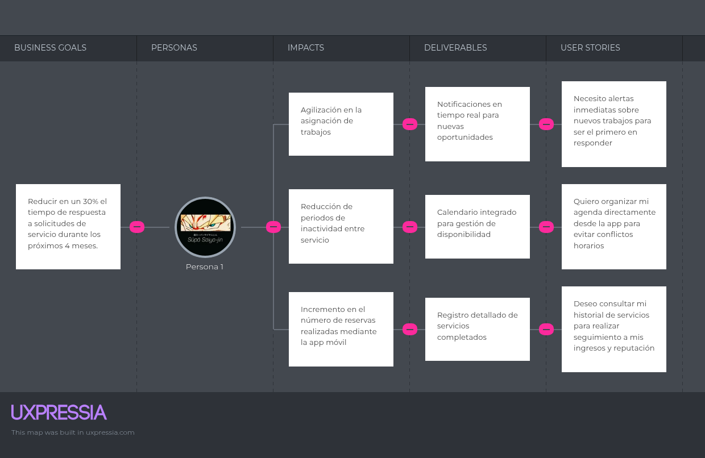

      **Segmento Objetivo 2: Clientes**

      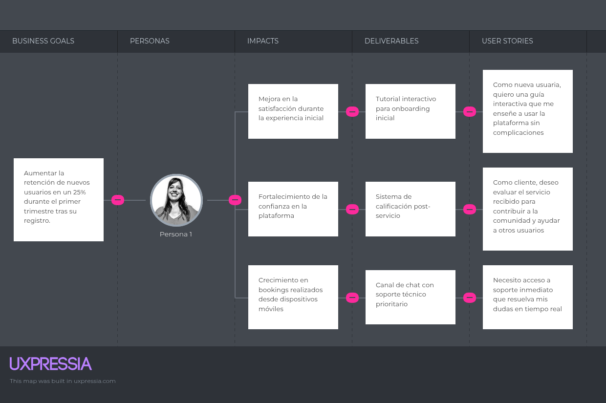

    - **2.4.3. Product Backlog**

      <table>
        <tr>
          <th>#</th>
          <th>Story ID</th>
          <th>Título</th>
          <th>Story Points</th>
        </tr>
        <tr><td>1</td><td>US01</td><td>Registro de Nuevo Usuario</td><td>3</td></tr>
        <tr><td>2</td><td>US02</td><td>Registro de Nuevo Profesional</td><td>5</td></tr>
        <tr><td>3</td><td>US03</td><td>Recuperación de Cuenta/Login</td><td>3</td></tr>
        <tr><td>4</td><td>US04</td><td>Editar Perfil de Usuario</td><td>2</td></tr>
        <tr><td>5</td><td>US05</td><td>Ver Perfil Detallado del Profesional</td><td>5</td></tr>
        <tr><td>6</td><td>US06</td><td>Contactar al Profesional</td><td>3</td></tr>
        <tr><td>7</td><td>US07</td><td>Buscar Profesionales por Especialidad y Ubicación</td><td>8</td></tr>
        <tr><td>8</td><td>US08</td><td>Solicitar Servicio al Profesional</td><td>5</td></tr>
        <tr><td>9</td><td>US09</td><td>Crear y Actualizar Servicios Ofrecidos</td><td>3</td></tr>
        <tr><td>10</td><td>US10</td><td>Gestionar Disponibilidad</td><td>3</td></tr>
        <tr><td>11</td><td>US11</td><td>Recibir Notificaciones de Solicitudes</td><td>5</td></tr>
        <tr><td>12</td><td>US12</td><td>Aceptar o Rechazar Solicitudes</td><td>2</td></tr>
        <tr><td>13</td><td>US13</td><td>Confirmar Finalización de Servicio</td><td>5</td></tr>
        <tr><td>14</td><td>US14</td><td>Notificación de Respuesta del Profesional</td><td>2</td></tr>
        <tr><td>15</td><td>US15</td><td>Visualizar Progreso y Puntos Acumulados</td><td>3</td></tr>
        <tr><td>16</td><td>US16</td><td>Recibir Recompensas por Logros</td><td>2</td></tr>
        <tr><td>17</td><td>US17</td><td>Crear Solicitud de Servicio</td><td>5</td></tr>
        <tr><td>18</td><td>US18</td><td>Ver Estado de la Solicitud</td><td>3</td></tr>
        <tr><td>19</td><td>US19</td><td>Realizar Pago del Servicio</td><td>8</td></tr>
        <tr><td>20</td><td>US20</td><td>Solicitar Reembolso o Disputa</td><td>3</td></tr>
        <tr><td>21</td><td>US21</td><td>Confirmación de Contratación por Profesional</td><td>5</td></tr>
        <tr><td>22</td><td>US22</td><td>Cancelar Solicitud de Servicio</td><td>2</td></tr>
        <tr><td>23</td><td>US23</td><td>Notificación de Nueva Solicitud de Servicio</td><td>3</td></tr>
        <tr><td>24</td><td>US24</td><td>Abrir Reclamo/Ticket</td><td>5</td></tr>
        <tr><td>25</td><td>US25</td><td>Calificar a un Profesional</td><td>3</td></tr>
        <tr><td>26</td><td>US26</td><td>Ver Calificaciones de Profesionales</td><td>2</td></tr>
        <tr><td>27</td><td>US27</td><td>Calificación Promedio del Profesional</td><td>2</td></tr>
        <tr><td>28</td><td>US28</td><td>Reseñas Anónimas</td><td>1</td></tr>
        <tr><td>29</td><td>US29</td><td>Ver Reseñas de Otros Clientes</td><td>3</td></tr>
        <tr><td>30</td><td>US30</td><td>Solicitar Actualización de Calificación</td><td>1</td></tr>
      </table>

      <h2>Technical Stories</h2>
      <table>
        <tr>
          <th>#</th>
          <th>Story ID</th>
          <th>Título</th>
          <th>Story Points</th>
        </tr>
        <tr><td>31</td><td>TS01</td><td>Crear API de Registro de Usuario</td><td>5</td></tr>
        <tr><td>32</td><td>TS02</td><td>Crear API para Editar Perfil de Usuario</td><td>3</td></tr>
        <tr><td>33</td><td>TS03</td><td>Crear API de Recuperación de Cuenta</td><td>3</td></tr>
        <tr><td>34</td><td>TS04</td><td>Crear API de Búsqueda de Profesionales</td><td>5</td></tr>
        <tr><td>35</td><td>TS05</td><td>Crear API para Contactar al Profesional</td><td>3</td></tr>
        <tr><td>36</td><td>TS06</td><td>Crear API para Gestión de Servicios</td><td>5</td></tr>
        <tr><td>37</td><td>TS07</td><td>Crear API de Notificaciones de Solicitudes</td><td>5</td></tr>
        <tr><td>38</td><td>TS08</td><td>Crear API para Gamificación y Niveles</td><td>3</td></tr>
        <tr><td>39</td><td>TS09</td><td>Crear API para Gestión de Solicitudes</td><td>5</td></tr>
        <tr><td>40</td><td>TS10</td><td>Crear API para Realizar Pagos</td><td>8</td></tr>
        <tr><td>41</td><td>TS11</td><td>Crear API para Calificaciones y Reseñas</td><td>3</td></tr>
      </table>

      <h2>Spike Stories</h2>
      <table>
        <tr>
          <th>#</th>
          <th>Story ID</th>
          <th>Título</th>
          <th>Story Points</th>
        </tr>
        <tr><td>42</td><td>SP-01</td><td>Investigar Registro de Usuarios y Autenticación</td><td>5</td></tr>
        <tr><td>43</td><td>SP-02</td><td>Investigar Búsqueda y Contacto de Técnicos</td><td>5</td></tr>
        <tr><td>44</td><td>SP-03</td><td>Investigar Gestión de Servicios y Disponibilidad de Técnicos</td><td>5</td></tr>
        <tr><td>45</td><td>SP-04</td><td>Investigar Gestión de Solicitudes y Pagos</td><td>5</td></tr>
        <tr><td>46</td><td>SP-05</td><td>Investigar Gamificación y Niveles de Usuario</td><td>3</td></tr>
        <tr><td>47</td><td>SP-06</td><td>Investigar Calificaciones y Reseñas de Técnicos</td><td>3</td></tr>
        <tr><td>48</td><td>SP-07</td><td>Investigar Notificaciones de Nueva Solicitud</td><td>5</td></tr>
      </table>

- **2.5. Strategic-Level Domain-Driven Design**
    - **2.5.1. EventStorming**

  Mediante la plataforma Miro, llevamos a cabo el proceso de EventStorming, lo que nos permitió identificar eventos, usuarios o agentes, comandos que desencadenan dichos eventos, agregados y bounded contexts.

  Para facilitar la comprensión, la información se presenta en distintos “post-its” de la siguiente manera:

  -Post-it anaranjado: Evento que ocurre.

  -Post-it azul: Comando que provoca el evento que está a su derecha.

  -Post-it amarillo: Usuario final que ejecuta el comando a su derecha.

  -Delimitaciones amarillas: Agrupan eventos y comandos relacionados a un mismo agregado.

  -Delimitaciones negras: Agrupan uno o varios agregados relacionados a un bounded context.

  -Flechas punteadas: Indican comandos que generan eventos en otros agregados o bounded contexts.

  Proceso:

  Identificación de eventos:
  El primer paso consiste en identificar los eventos y organizarlos siguiendo una línea de tiempo imaginaria de izquierda a derecha. Algunos eventos pueden aparecer en la misma columna si no tienen un orden consecutivo. Los eventos se representan con post-its anaranjados.
    

    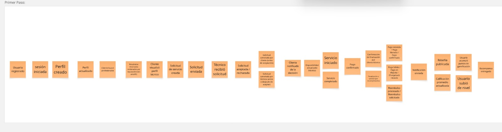

    

     
    Identificación de comandos:
    A continuación, se reconocen los comandos que disparan o ejecutan cada evento, representados con post-its azules

    

    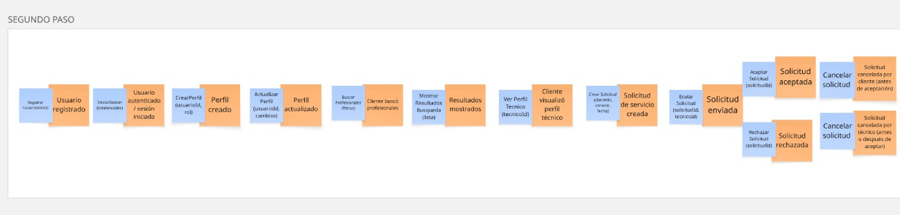
    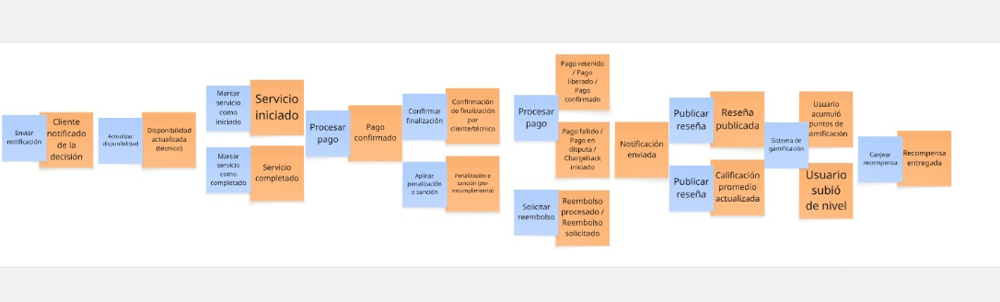

    

     

  Identificación de agentes:
  Después, se determinan los agentes o usuarios que realizan los comandos, representados con post-its amarillos.

    

    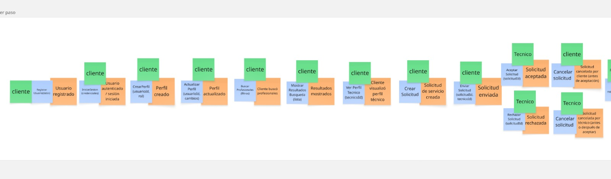
    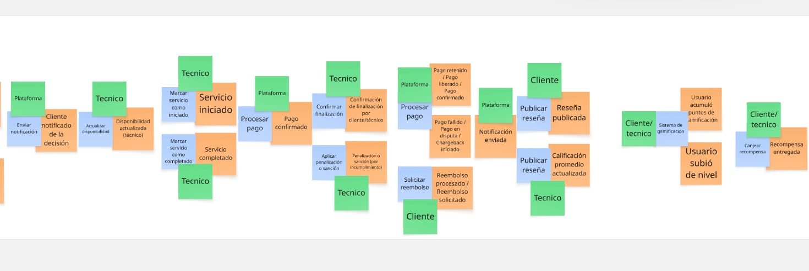
    

     

  Agrupación por agregados y bounded contexts:
  Finalmente, se relacionan los eventos entre sí mediante los agregados y entidades involucradas, agrupándolos en bounded contexts. También se trazan líneas punteadas para señalar la interacción de comandos con eventos en distintos bounded contexts.

    

    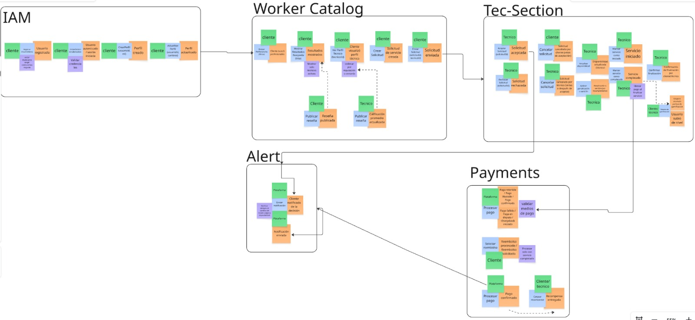
    

     

    - **2.5.1.1. Candidate Context Discovery**

      La técnica Start-With-Value, de DDD y diseño centrado en el usuario, propone modelar el dominio empezando por el valor que debe entregar. La usamos para definir los eventos clave de nuestros bounded contexts y el valor que espera el usuario.

      | **Bounded Context**                                   | **Valor esperado por el usuario**                                                                                         | **Eventos clave**                                                                              |
      |-------------------------------------------------------|---------------------------------------------------------------------------------------------------------------------------|------------------------------------------------------------------------------------------------|
      | **IAM (Accesos)**                                     | Permitir que el usuario se registre, inicie sesión y gestione su perfil en la aplicación                                  | Usuario registrado, usuario autenticado, acceso al perfil de usuario                           |
      | **Alerts (Notificaciones)**                           | Enviar notificaciones relevantes sobre el estado de las solicitudes, servicios o cambios en la plataforma                 | Notificación de solicitud aceptada, notificación de cambio de estado, alerta de disponibilidad |
      | **Payments (Pagos)**                                  | Realizar pagos de forma segura, confirmar transacciones y notificar al usuario sobre el estado de su pago                 | Pago realizado, pago fallido, confirmación de pago exitoso                                     |
      | **Technician Catalog (Catálogo de Profesionales)**    | Ver detalles de los profesionales y realizar solicitudes de servicios                                                     | Perfil profesional visualizado, solicitud de servicio enviada, perfil actualizado              |
      | **Tec-Section (Sección Técnica)**                     | Gestionar las solicitudes de servicio, la disponibilidad de los profesionales y confirmar la finalización de los trabajos | Solicitud de servicio confirmada, disponibilidad actualizada, servicio completado              |

    - **2.5.1.2. Domain Message Flows Modeling**
      El Domain Storytelling es una técnica visual y colaborativa que permite descubrir y compartir el conocimiento sobre un dominio de negocio. Su objetivo principal es generar una comprensión común del funcionamiento de un proceso empresarial específico entre las distintas partes involucradas, como los expertos del negocio y los equipos técnicos.

      Por esta razón, realizamos los domain storytelling enfocados en las conexiones entre los bounded contexts, con el fin de analizar y comprender de manera más profunda la lógica del negocio.
      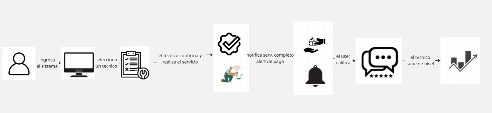

    - **2.5.1.3. Bounded Context Canvases**

      El Bounded Context Canvas es una herramienta visual usada en Diseño Dirigido por el Dominio (DDD) para definir los límites y relaciones entre los Contextos Delimitados dentro de un sistema. Facilita la comprensión compartida del nombre, propósito, entidades y políticas de negocio de cada contexto.

      A continuación, definiremos y desarrollaremos los Bounded Context Canvases de nuestros tres contextos delimitados.
      ## IAM:
       

        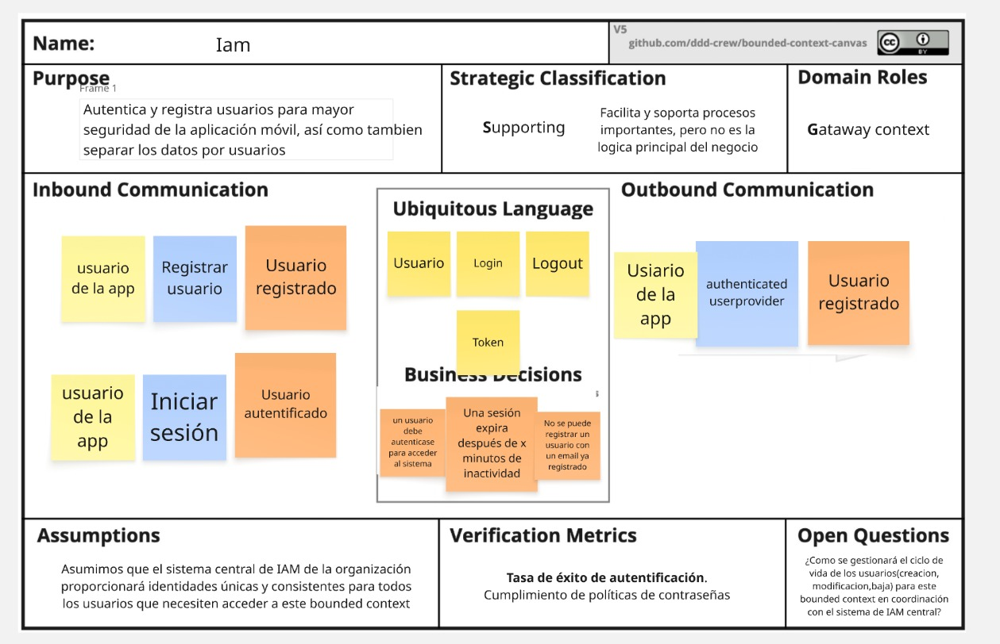
        

         

      ## Payment:
       

        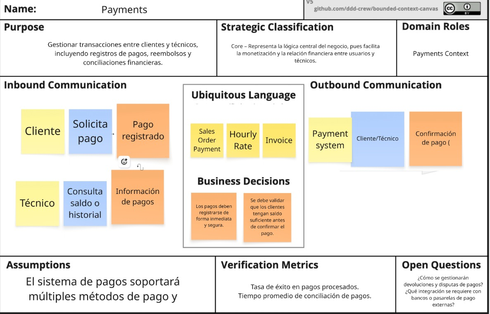
        

         

      ## Technician-Catalog:
        

        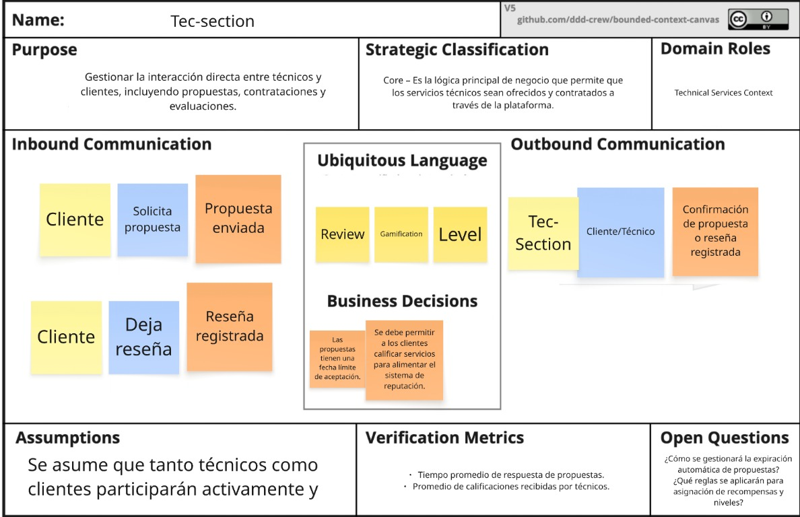
        

         

      ## Alerts:
        

        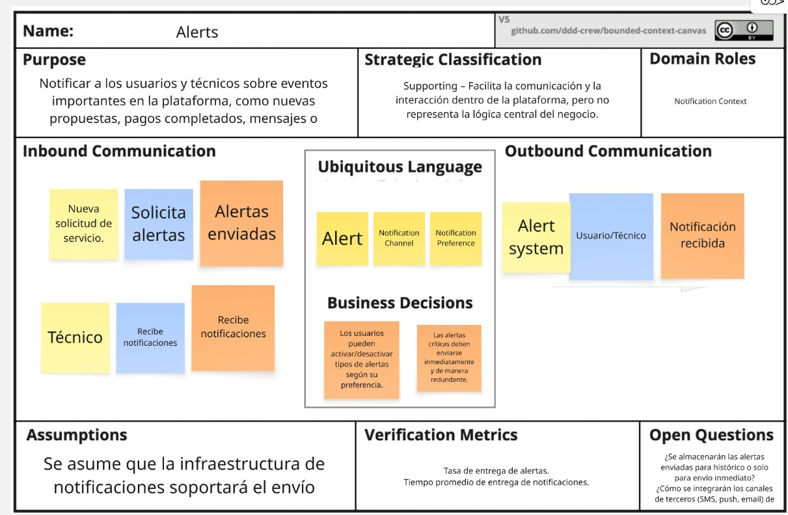
        

         

      ## Tec Section:
        

        
        

         

    - **2.5.2. Context Mapping**

      En esta sección se presenta el Context Map desarrollado para el negocio Alguien Dijo Chamba, el cual muestra las interacciones y relaciones estructurales entre los distintos Bounded Contexts identificados. El objetivo de este ejercicio es comprender cómo se comunican y dependen entre sí las diferentes partes del dominio, aplicando los patrones de Domain-Driven Design (DDD) pertinentes, tales como Upstream/Downstream y Conformist.

      Para la elaboración de los context maps, el equipo analizó la información obtenida durante las etapas previas de descubrimiento del dominio, especialmente los resultados del Domain Storytelling, y la utilizó para construir y refinar los diseños candidatos.
        

          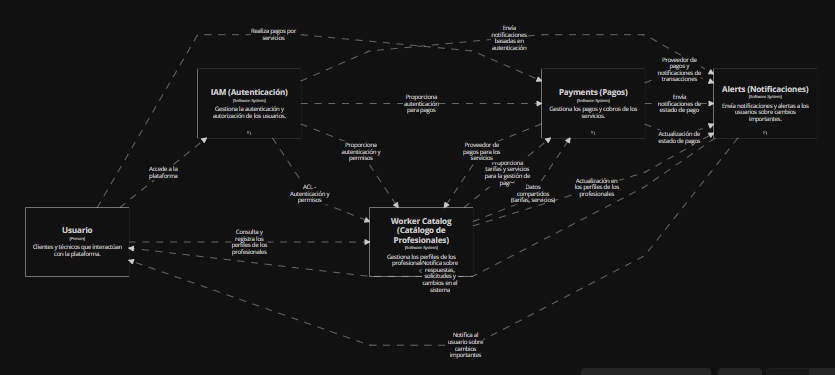
          

           

    - **2.5.3. Software Architecture**
        - **2.5.3.1. Software Architecture Context Level Diagrams**
          

          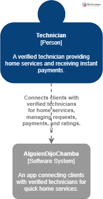
          

           
        - **2.5.3.2. Software Architecture Container Level Diagrams**
          

          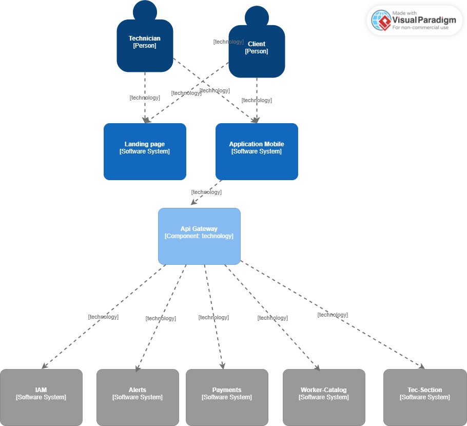
          

           
        - **2.5.3.3. Software Architecture Deployment Diagrams**
          

          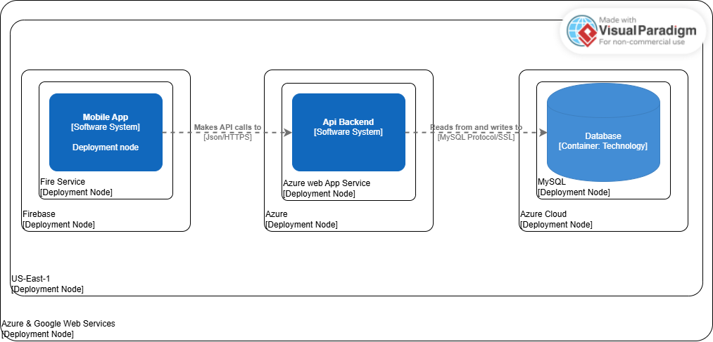
          

           
- **2.6. Tactical-Level Domain-Driven Design**

    - **2.6.1. Bounded Context: Technician-Catalog**
        - **2.6.1.1. Domain Layer**  
          **Sub-capa Model:**

          | Tipo         | Nombre                               | Descripción                                                                | Responsabilidad Principal                                                                                  | Relación con otros elementos                           |
          |--------------|--------------------------------------|----------------------------------------------------------------------------|------------------------------------------------------------------------------------------------------------|--------------------------------------------------------|
          | Aggregate    | TechnicianProfile                    | Entidad que representa la información profesional de un Technician         | Ser el punto de entrada para gestionar la información profesional (nombre, skills, experiencia, categoría) | Relacionado con Tec-Section (para asignar solicitudes) |
          | Value Object | TechnicianContact                    | Datos de contacto (teléfono, email, ubicación aproximada)                  | Mantener información de contacto inmutable                                                                 | Parte de TechnicianProfile                             |
          | Value Object | TechnicianSkill                      | Skill o habilidad específica de un Technician (ej: plomería, electricidad) | Representar de manera granular las competencias del Technician                                             | Parte de TechnicianProfile                             |
          | Value Object | TechnicianRating                     | Puntaje y métricas agregadas del Technician                                | Calcular reputación y promedio de reseñas                                                                  | Relacionado con Alerts para notificar cambios          |
          | Aggregate    | Category                             | Agrupación de Technicians por área de especialidad                         | Organizar Technicians en categorías (ej: electricidad, carpintería)                                        | Relacionado con TechnicianProfile                      |
          | Command      | RegisterTechnicianCommand            | Comando para registrar un nuevo Technician en el catálogo                  | Encapsular datos iniciales de registro                                                                     | Usado al crear TechnicianProfile                       |
          | Command      | UpdateTechnicianProfileCommand       | Comando para actualizar datos del perfil                                   | Modificar nombre, contacto, skills, disponibilidad                                                         | Usado por Technician                                   |
          | Command      | AddSkillToTechnicianCommand          | Comando para añadir un skill a un Technician                               | Enriquecer el perfil profesional                                                                           | Usado por Technician                                   |
          | Command      | RateTechnicianCommand                | Comando para asignar calificación a un Technician                          | Agregar reseña/calificación del cliente                                                                    | Usado por Customer                                     |
          | Query        | GetTechnicianProfilesByCategoryQuery | Consulta para obtener Technicians por categoría                            | Recuperar listado de Technicians en una categoría específica                                               | Usado en Technician-Catalog UI                         |
          | Query        | GetTechnicianProfileByIdQuery        | Consulta para obtener detalles de un Technician específico                 | Consultar perfil público completo                                                                          | Usado por Customers y Tec-Section                      |

          **Sub-capa Service:**

          | Tipo     | Nombre                     | Descripción                                                     | Responsabilidad Principal                          | Relación con otros elementos                                 |
          |----------|----------------------------|-----------------------------------------------------------------|----------------------------------------------------|--------------------------------------------------------------|
          | Service  | TechnicianCatalogService   | Servicio mock para listar y consultar perfiles de Technicians   | Simular catálogo de Technicians en la aplicación   | Usado en la capa Application                                 |
          | Service  | TechnicianApiService       | Servicio para integrar con el backend vía API REST              | Gestionar Technicians y categorías en BD           | Se comunica con `/api/v1/Technicians` y `/api/v1/categories` |

        - **2.6.1.2. Interface Layer**
      
          **Sub-capa Service:**

          | Tipo        | Nombre                                              | Descripción                                                         | Responsabilidad Principal                                 | Relación con otros elementos         |
          |-------------|-----------------------------------------------------|---------------------------------------------------------------------|-----------------------------------------------------------|--------------------------------------|
          | Controller  | TechnicianProfileController                         | Exponer endpoints para registrar, actualizar y consultar perfiles   | Gestionar TechnicianProfile vía comandos/queries          | Usa recursos y assemblers            |
          | Controller  | CategoryController                                  | Exponer endpoints para gestionar categorías de Technicians          | Crear y listar categorías                                 | Usa CategoryResource                 |
          | Resource    | TechnicianProfileResource                           | Representa petición de registro o actualización de Technician       | Recibir datos estructurados (skills, contacto, categoría) | Usado en TechnicianProfileController |
          | Resource    | TechnicianProfileResponseResource                   | Respuesta con información completa del Technician                   | Exponer perfil público/profesional                        | Usado en TechnicianProfileController |
          | Resource    | CategoryResource                                    | Representa petición/estructura de una categoría                     | Datos de categoría de Technician                          | Usado en CategoryController          |
          | Resource    | CategoryResponseResource                            | Respuesta con detalles de una categoría                             | Mostrar lista de categorías disponibles                   | Usado en CategoryController          |
          | Assembler   | RegisterTechnicianCommandFromResourceAssembler      | Convierte recurso en RegisterTechnicianCommand                      | Desacoplar REST de dominio                                | Usado en TechnicianProfileController |
          | Assembler   | UpdateTechnicianProfileCommandFromResourceAssembler | Convierte recurso en UpdateTechnicianProfileCommand                 | Igual que arriba                                          | Usado en TechnicianProfileController |
          | Assembler   | TechnicianProfileResourceFromEntityAssembler        | Convierte entidad TechnicianProfile en respuesta                    | Asegurar consistencia en API                              | Usado en TechnicianProfileController |

        - **2.6.1.3. Application Layer**
      
          **Sub-capa Internal:**

          | Tipo             | Nombre                                | Descripción                                       | Responsabilidad Principal                              | Relación con otros elementos           |
          |------------------|---------------------------------------|---------------------------------------------------|--------------------------------------------------------|----------------------------------------|
          | CommandHandler   | TechnicianProfileCommandServiceImpl   | Implementación de comandos de TechnicianProfile   | Crear, actualizar, agregar skills, registrar reseñas   | Usado por TechnicianProfileController  |
          | QueryHandler     | TechnicianProfileQueryServiceImpl     | Implementación de consultas de TechnicianProfile  | Consultar perfiles y categorías                        | Usado por TechnicianProfileController  |
          | CommandHandler   | CategoryCommandServiceImpl            | Implementación de comandos para categorías        | Crear/actualizar categorías                            | Usado por CategoryController           |
          | QueryHandler     | CategoryQueryServiceImpl              | Implementación de consultas para categorías       | Listar categorías disponibles                          | Usado por CategoryController           |

        - **2.6.1.4. Infrastructure Layer**
      
          **Sub-capa Repository:**

          | Tipo        | Nombre                        | Descripción                          | Responsabilidad Principal           | Relación con otros elementos |
          |-------------|-------------------------------|--------------------------------------|-------------------------------------|------------------------------|
          | Repository  | TechnicianProfileRepository   | Repositorio para TechnicianProfile   | Persistir perfiles y reseñas        | Usado en capa Application    |
          | Repository  | CategoryRepository            | Repositorio para Category            | Persistir categorías de Technicians | Usado en capa Application    |

        - **2.6.1.5. Bounded Context Software Architecture Component Level Diagrams**
           
          El flujo completo refleja una arquitectura cuidadosamente estructurada, donde cada capa tiene responsabilidades bien definidas: los controladores exponen los endpoints para la interacción externa, los servicios de aplicación gestionan la lógica de negocio y coordinan comandos y consultas, los comandos y consultas representan operaciones específicas sobre el dominio, los agregados y value objects encapsulan el comportamiento y los datos esenciales del dominio, y los repositorios se encargan de la persistencia e interacción con la base de datos. Este enfoque sigue los principios de Clean Architecture y Domain-Driven Design (DDD), garantizando un sistema modular, mantenible y fácilmente extensible.
          

          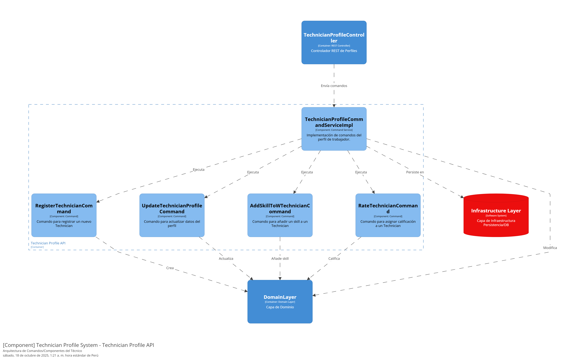
          

           
          
        - **2.6.1.6. Bounded Context Software Architecture Code Level Diagrams**    
            - **2.6.1.6.1. Bounded Context Domain Layer Class Diagrams** 
          
                
              El diagrama de clases del bounded context Technician-Catalog modela el catálogo de trabajadores bajo principios de DDD y Clean Architecture. La entidad principal es TechnicianProfile, como Aggregate Root, que concentra información profesional, contacto, habilidades, calificaciones y categoría, con trazabilidad mediante campos de auditoría.

              Los Value Objects (TechnicianContact, TechnicianSkill, TechnicianRating) encapsulan datos inmutables, mientras que Category organiza a los trabajadores por especialidad. Los Commands y Queries representan casos de uso explícitos, y los Servicios (TechnicianCatalogService, TechnicianApiService) orquestan operaciones y comunicación con infraestructura, garantizando un diseño cohesivo, escalable y mantenible.   
              

              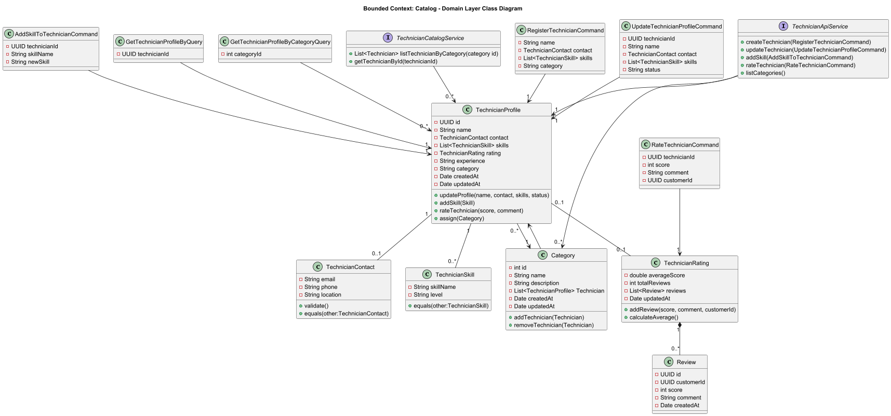
              

               
            - **2.6.1.6.2. Bounded Context Database Design Diagram**  
          
              

              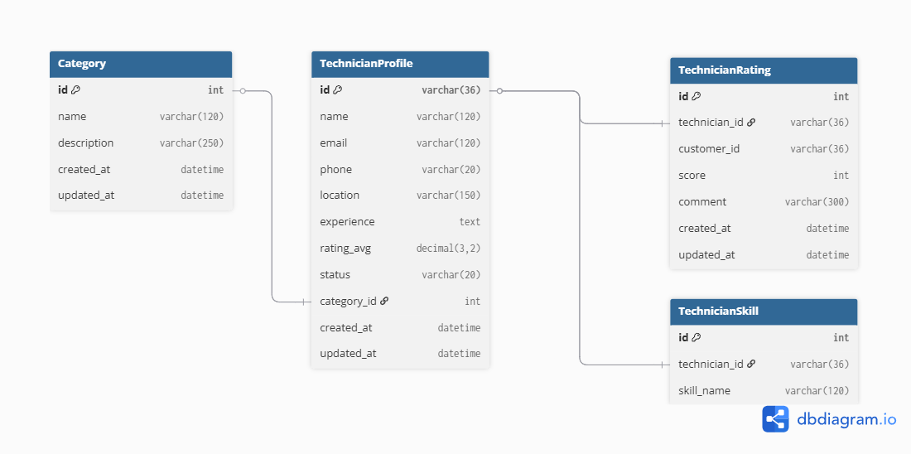
              

               

          **Tabla: TechnicianProfile**

          | Campo        | Tipo           | Descripción                                   |
          |--------------|----------------|-----------------------------------------------|
          | id           | varchar(36)    | Identificador único del Technician (PK)       |
          | name         | varchar(120)   | Nombre del Technician                         |
          | email        | varchar(120)   | Correo electrónico del Technician             |
          | phone        | varchar(20)    | Número de teléfono del Technician             |
          | location     | varchar(150)   | Ubicación aproximada del Technician           |
          | experience   | text           | Experiencia o biografía profesional           |
          | rating\_avg  | decimal(3,2)   | Promedio de calificaciones recibidas          |
          | status       | varchar(20)    | Estado del perfil (ACTIVE, INACTIVE, PENDING) |
          | category\_id | int            | ID de la categoría asociada (FK)              |
          | created\_at  | datetime       | Fecha de creación del perfil                  |
          | updated\_at  | datetime       | Fecha de última actualización del perfil      |

          **Tabla: TechnicianSkill**

          | Campo          | Tipo         | Descripción                                          |
          |----------------|--------------|------------------------------------------------------|
          | id             | int          | Identificador único de la habilidad (PK)             |
          | Technician\_id | varchar(36)  | ID del Technician al que pertenece la habilidad (FK) |
          | skill\_name    | varchar(120) | Nombre de la habilidad (ej: plomería, electricidad)  |

          **Tabla: Category**

          | Campo           | Tipo         | Descripción                                            |
          |-----------------|--------------|--------------------------------------------------------|
          | id              | int          | Identificador único de la categoría (PK)               |
          | name            | varchar(120) | Nombre de la categoría (ej: carpintería, electricidad) |
          | **Description** | varchar(250) | Descripción breve de la categoría                      |
          | created\_at     | datetime     | Fecha de creación del registro                         |
          | updated\_at     | datetime     | Fecha de última actualización del registro             |

          **Tabla: TechnicianRating**

          | Campo          | Tipo          | Descripción                                      |
          |----------------|---------------|--------------------------------------------------|
          | id             | int           | Identificador único de la calificación (PK).     |
          | technician\_id | varchar(36)   | ID del trabajador calificado (FK).               |
          | customer\_id   | varchar(36)   | ID del cliente que realizó la reseña.            |
          | score          | int           | Puntaje asignado (1–5).                          |
          | comment        | varchar(300)  | Comentario escrito por el cliente.               |
          | created\_at    | datetime      | Fecha y hora en que se registró la calificación. |

    - **2.6.2. Bounded Context: Payments**
        - **2.6.2.1. Domain Layer**  

          **Sub-capa Model:**

          | Tipo     | Nombre      | Descripción                                                               | Responsabilidad Principal                                    | Relación con otros elementos                      |
          |----------|-------------|---------------------------------------------------------------------------|--------------------------------------------------------------|---------------------------------------------------|
          | Entity   | Payment     | Representa un pago realizado por un cliente a un técnico.                 | Gestionar información del pago (monto, estado, fecha).       | Relación con `Customer`, `Technician`, `Order`.   |
          | Entity   | Transaction | Registro detallado de la operación financiera.                            | Validar y asegurar consistencia de la transacción.           | Asociado a `Payment`.                             |
          | ValueObj | Amount      | Valor del monto a pagar en una transacción.                               | Garantizar formato, precisión y reglas de negocio de dinero. | Parte de `Payment` y `Transaction`.               |
          | Entity   | Order       | Representa el servicio acordado entre cliente y técnico.                  | Conectar el servicio contratado con su pago.                 | Relación con `Customer` y `Technician`.           |

          **Sub-capa Services**

          | Tipo      | Nombre             | Descripción                                                     | Responsabilidad Principal                          | Relación con otros elementos            |
          |-----------|--------------------|-----------------------------------------------------------------|----------------------------------------------------|-----------------------------------------|
          | Service   | PaymentService     | Lógica de negocio para procesar pagos y actualizarlos.          | Ejecutar, confirmar o rechazar pagos.              | Usa `PaymentRepository`, `Transaction`. |
          | Service   | RefundService      | Gestiona devoluciones de pagos.                                 | Permitir reembolsos y actualizar estados.          | Relación con `Payment`, `Order`.        |
          | Service   | ValidationService  | Reglas de validación de datos en el proceso de pago.            | Validar montos, usuarios y métodos de pago.        | Usado por `PaymentService`.             |

        - **2.6.2.2. Interface Layer**  

          **Sub-capa REST**

          | Tipo     | Nombre             | Descripción                                               | Responsabilidad Principal                       | Relación con otros elementos   |
          |----------|--------------------|-----------------------------------------------------------|-------------------------------------------------|--------------------------------|
          | Endpoint | POST /payments     | Endpoint para crear un nuevo pago.                        | Registrar un pago asociado a una orden.         | Llama a `PaymentService`.      |
          | Endpoint | GET /payments/{id} | Obtiene detalles de un pago específico.                   | Consultar información del pago.                 | Usa `PaymentRepository`.       |
          | Endpoint | POST /refunds      | Procesa una solicitud de reembolso.                       | Ejecutar lógica de devolución de dinero.        | Llama a `RefundService`.       |

        - **2.6.2.3. Application Layer**  

          **Sub-capa Internal**

          | Tipo         | Nombre            | Descripción                                             | Responsabilidad Principal                            | Relación con otros elementos     |
          |--------------|-------------------|---------------------------------------------------------|------------------------------------------------------|----------------------------------|
          | Use Case     | ProcessPayment    | Caso de uso para gestionar un pago desde inicio a fin.  | Coordinar servicios de validación y repositorio.     | `PaymentService`, `Transaction`. |
          | Use Case     | IssueRefund       | Caso de uso para ejecutar devolución de dinero.         | Coordinar validación, ejecución y actualización.     | `RefundService`.                 |

          **Sub-capa External**

          | Tipo       | Nombre             | Descripción                                             | Responsabilidad Principal                       | Relación con otros elementos    |
          |------------|--------------------|---------------------------------------------------------|-------------------------------------------------|---------------------------------|
          | Gateway    | PaymentGateway     | Integración con pasarela de pago externa (ej. Stripe).  | Conectar con sistemas externos de cobro.        | Llamado por `PaymentService`.   |  

        - **2.6.2.4. Infrastructure Layer** 

          **Sub-capa Repository**

          | Tipo          | Nombre                | Descripción                                      | Responsabilidad Principal                         | Relación con otros elementos |
          |---------------|-----------------------|--------------------------------------------------|---------------------------------------------------|------------------------------|
          | Repository    | PaymentRepository     | Repositorio para CRUD de pagos.                  | Persistencia y consultas de la entidad `Payment`. | Relación con `Database`.     |
          | Repository    | TransactionRepository | Repositorio para registros de transacciones.     | Guardar y recuperar `Transaction`.                | Relación con `Database`.     |

        - **2.6.2.5. Bounded Context Software Architecture Component Level Diagrams**
      
          

          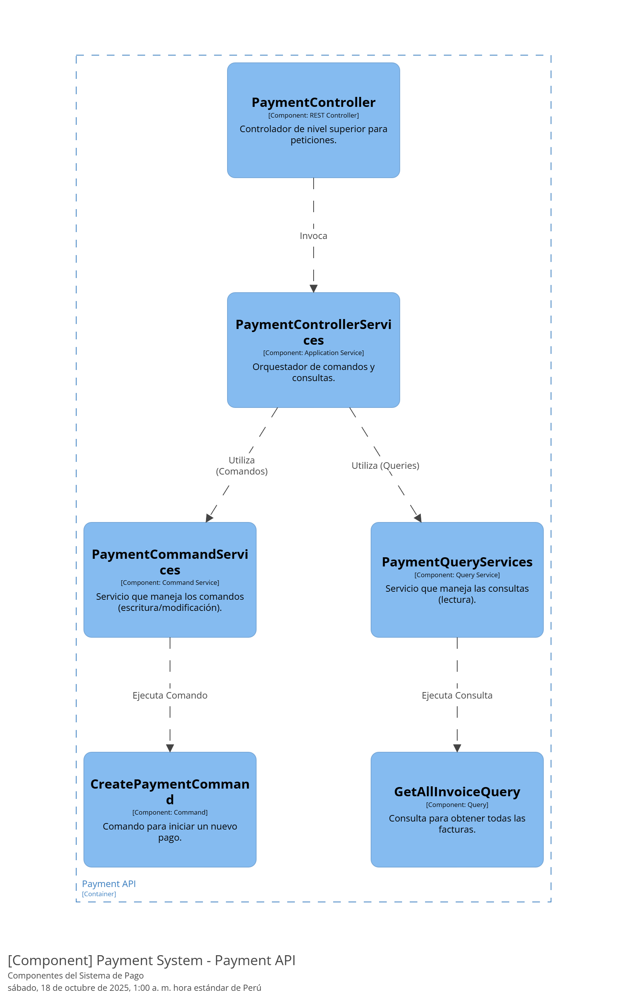
          

          
        - **2.6.2.6. Bounded Context Software Architecture Code Level Diagrams**
        - **2.6.2.6.1. Bounded Context Domain Layer Class Diagrams**

          

          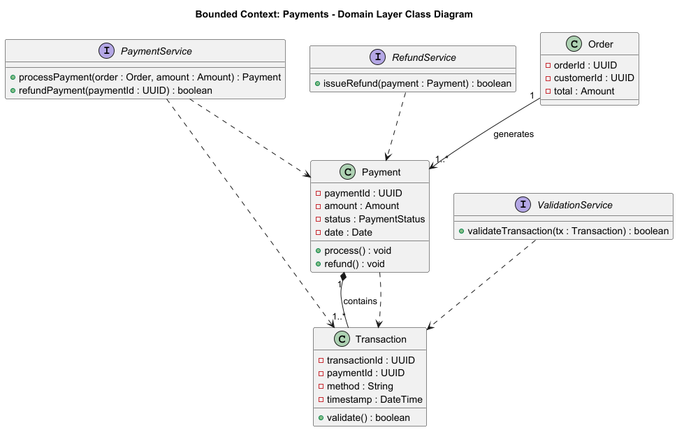
          

        - **2.6.2.6.2. Bounded Context Database Design Diagram**

          

          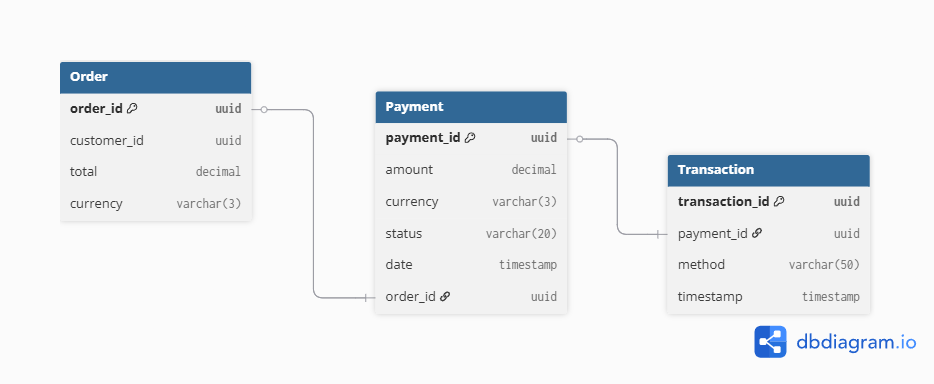
          

          
          **Tabla: Order**          
      
            | Campo               | Tipo       | Descripción                    |
            |---------------------|------------|--------------------------------|
            | **order_id** (PK)   | uuid       | Identificador único del pedido |
            | customer_id         | uuid       | ID del cliente                 |
            | total               | decimal    | Total del pedido               |
            | currency            | varchar(3) | Moneda del pedido              |
          
          **Tabla: Payments**          
      
            | Campo               | Tipo        | Descripción                  |
            |:--------------------|:------------|:-----------------------------|
            | **payment_id** (PK) | uuid        | Identificador único del pago |
            | amount              | decimal     | Cantidad del pago            |
            | currency            | varchar(3)  | Moneda del pago              |
            | status              | varchar(20) | Estado del pago              |
            | date                | timestamp   | Fecha del pago               |
            | order_id (FK)       | uuid        | ID del pedido relacionado    |
              
          **Tabla: Transaction** 
      
          | Campo                   | Tipo        | Descripción                           |
          |:------------------------|:------------|:--------------------------------------|
          | **transaction_id** (PK) | uuid        | Identificador único de la transacción |
          | payment_id (FK)         | uuid        | ID del pago relacionado               |
          | method                  | varchar(50) | Método de la transacción              |
          | timestamp               | timestamp   | Marca de tiempo de la transacción     |

    - **2.6.3. Bounded Context: Alerts**

        - **2.6.3.1. Domain Layer**
      
            **Sub-capa Model:**  
      
            | Tipo         | Nombre                      | Descripción                                               | Responsabilidad Principal                              | Relación con otros elementos                                                                                                                                    |
            |--------------|-----------------------------|-----------------------------------------------------------|--------------------------------------------------------|-----------------------------------------------------------------------------------------------------------------------------------------------------------------|
            | Aggregate    | Alert                       | Clase para definir una Alerta de la aplicación            | Ser el punto de entrada para la gestion de Alertas     | Relacionado con el boundedContext de pagos para generar Alertas y el boundedContext de Tec-Section para generar una Alerta al momento de llamar a un Technician |
            | Value Object | AlertType                   | Value object usado en el Aggregate Alert                  | Representa el tipo de Alerta                           | Relacionado con Alert                                                                                                                                           |
            | Value Object | AlertTittle                 | Value object usado en el Aggregate Alert                  | Representa el titulo de la Alerta                      | Relacionado con Alert                                                                                                                                           |
            | Value Object | AlertMessage                | Value object usado en el Aggregate Alert                  | Representa el contenido de la Alerta                   | Relacionado con Alert                                                                                                                                           |
            | Command      | CreateAlertCommand          | Comando para crear una Alerta                             | Encapsular los datos requeridos para crear una alerta  | Usado cuando se quiere crear una alerta para el Technician y el Customer                                                                                        |
            | Command      | DeleteAlertCommand          | Comando para eliminar una Alert                           | Encapsular los datos para crear eliminar una alerta    | Verifica si el Technician  o el Customer  eliminan la alerta. Tambien si el Technician  rechaza una alerta esta se eliminara luego para este mismo.             |
            | Command      | AcceptAlertCommand          | Comando para aceptar una Alert                            | Modificar informacion para aceptar una alerta          | Usado cuando el Technician  acepta el trabajo pedido por el Customer                                                                                            |
            | Command      | DeclineAlertCommand         | Comando para rechazar una Alert                           | Modificar informacion para rechazar una alerta         | Usado cuando el Technician  acepta el trabajo pedido por el Customer                                                                                            |
            | Query        | GetAlertByCustomerQuery     | Consulta para obtener todas las alertas del Customer      | Recuperar las alertas del Usuario                      | Usado en la seccion de Alertas del Customer                                                                                                                     |
            | Query        | GetAlertByTechnicianQuery   | Consulta para obtener todas las alertas del Technician    | Recuperar las alertas del Technician                   | Usado en la seccion de Alertas del Technician                                                                                                                   |
           
           **Sub-capa Service:**    
      
            | Tipo      | Nombre              | Descripción                                     | Responsabilidad Principal                                        | Relación con otros elementos                                           |
            |-----------|---------------------|-------------------------------------------------|------------------------------------------------------------------|------------------------------------------------------------------------|
            | Interface | AlertCommandService | Servicio para comandos relacionados con Alert   | Declara métodos para crear, aceptar, rechazar o eliminar alertas | Implementado por  `AlertCommandServiceImp`. Usado en capa Application  |
            | Interface | AlertQueryService   | Servicio para consultas relacionadas con Alert  | Declarar métodos para filtrar por Customer o técnico             | Implementado por `AlertQueryServiceImpl`. Usado en capa de Application |

        - **2.6.3.2. Interface Layer**
          **Sub-capa REST**

          | Tipo       | Nombre                                    | Descripción                                                  | Responsabilidad Principal                                                                                                                      | Relación con otros elementos                                                             |
          |------------|-------------------------------------------|--------------------------------------------------------------|------------------------------------------------------------------------------------------------------------------------------------------------|------------------------------------------------------------------------------------------|
          | Controller | AlertController                           | Controlador REST para gestionar Alertas                      | Recibir solicitudes tanto de Customer como de Technician sobre alertas, coordina los comandos correspondiente y devuelve la respuesta adecuada | Utiliza `AlertRequestResource`, `AlerResponseResource` y los assemblers correspondientes |
          | Resource   | AlertRequestResource                      | Estructura de una peticion para crear o modificar Alertas    | Representar y exponer datos del dominio de forma accesible y estructurada para el Cliente                                                      | Uso en `AlertController` para enviar datos estructurados al sistema                      |
          | Resource   | AlertResponseResource                     | Estructura de una respuesta con información de una alerta    | Representar y exponer datos del dominio de forma accesible y estructurada para el Cliente                                                      | Uso en `AlertController` para responder con datos del sistema                            |
          | Assembler  | CreateAlertCommandFromResourceAssembler   | Convierte un recurso de peticion en un `CreateAlertCommand`  | Evitar el acoplamiento entre la interfaz REST y la capa de aplicación                                                                          | Usado en `AlertController` para traducir la petición a `CreateAlertCommand`              |
          | Assembler  | DeleteAlertCommandFromResourceAssembler   | Convierte un recurso de petición en un `DeleteAlertCommand`  | Evitar el acoplamiento entre la interfaz REST y la capa de aplicación                                                                          | Usado en `AlertController` para traducir la petición a `DeleteAlertCommand`              |
          | Assembler  | AcceptAlertCommandFromResourceAssembler   | Convierte un recurso de petición en un `AcceptAlertCommand`  | Evitar el acoplamiento entre la interfaz REST y la capa de aplicación                                                                          | Usado en `AlertController` para traducir la petición a `AceceptAlertCommand`             |
          | Assembler  | DeclineAlertCommandFromResourceAssembler  | Convierte un recurso de petición en un `DeclineAlertCommand` | Evitar el acoplamiento entre la interfaz REST y la capa de aplicación                                                                          | Usado en `AlertController` para traducir la petición a `DeclineAlertCommand`             |
          | Assembler  | AlertResourceFromEntityAssembler          | Convierte una entidad Alert en un recurso de respuesta       | Asegura una respuesta consistent para el cliente                                                                                               | Usado en `AlertController` para retornar `AlertResponseResource`                         |

        - **2.6.3.3. Application Layer**
          **Sub-capa Internal**

          | Tipo           | Nombre                  | Descripción                              | Responsabilidad Principal                                                                              | Relación con otros elementos                                                                    |
          |----------------|-------------------------|------------------------------------------|--------------------------------------------------------------------------------------------------------|-------------------------------------------------------------------------------------------------|
          | CommandHandler | AlertCommandServiceImpl | Implementación de los comandos de Alert  | Implementar los métodos de crear, aceptar, rechazar y eliminar Alertas                                 | Implementa la interfaz `AlertCommandService`. `AlertController` y `CommandHandlers` del dominio |
          | QueryHandler   | AlertQueryServiceImpl   | Implementación de las consultas de Alert | Implementar métodos para obtener alertas por ` GetAlertByCustomerQuery` y `GetAlertByTechnicianQuery ` | Implementa la interfaz `AlerQueryService`. Usado por `AlertController` y lo Query  del dominio  |

        - **2.6.3.4. Infrastructure Layer**
          **Sub-capa Repository**

          | Tipo       | Nombre          | Descripción                            | Responsabilidad Principal                        | Relación con otros elementos                                                             |
          |------------|-----------------|----------------------------------------|--------------------------------------------------|------------------------------------------------------------------------------------------|
          | Repository | AlertRepository | Repositorio a usar del modelo "Alert"  | Acceder y manipular datos persistidos de Alertas | Usado en la capa Application para crear, aceptar, rechazar, eliminar y consultar alertas |

        - **2.6.3.5. Bounded Context Software Architecture Component Level Diagrams**
            
          El diagrama de componentes del Alert System muestra una arquitectura modular y bien definida. Los controladores gestionan la comunicación con los usuarios Customer y Technician, delegando la ejecución en los servicios de aplicación. Las entidades de dominio encapsulan la lógica central, mientras que los repositorios manejan la persistencia de datos. Este enfoque sigue los principios de DDD y Clean Architecture, garantizando separación de responsabilidades, mantenibilidad y facilidad de extensión del sistema.   
          

          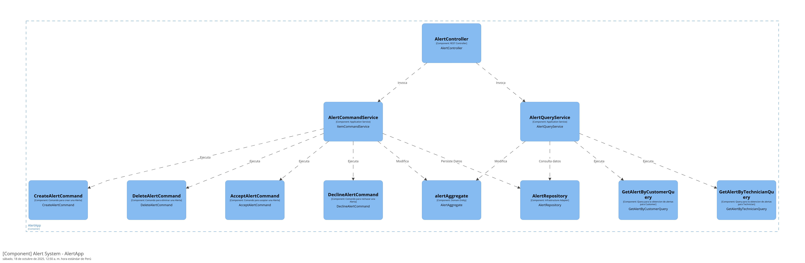
          

           
        - **2.6.3.6. Bounded Context Software Architecture Code Level Diagrams**

            - **2.6.3.6.1. Bounded Context Domain Layer Class Diagrams**
                
              Este diagrama UML representa la arquitectura de un sistema de gestión de alertas centrado en la administración de notificaciones entre Customers y Technicians. La estructura está basada en principios de diseño orientado a objetos y se organiza en capas de comandos y consultas, siguiendo un enfoque CQRS . A lo largo del análisis, se describirán los principales componentes del sistema, como los servicios de comandos y consultas, la entidad central Alert, así como los value objects, los comandos y consultas asociados. También se explicará cómo estas clases interactúan entre sí mediante relaciones de herencia, interfaces, asociación y dependencia para mantener una lógica de negocio clara, desacoplada y mantenible.   
          
              

              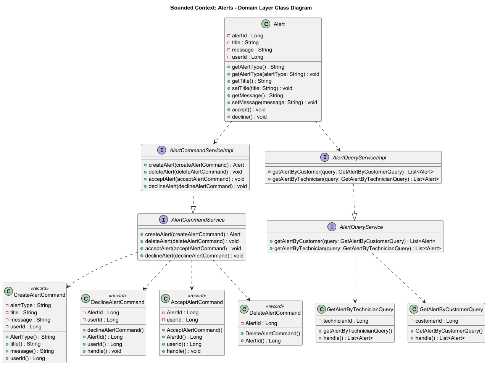
              

               

            - **2.6.3.6.2. Bounded Context Database Design Diagram**
                

                

                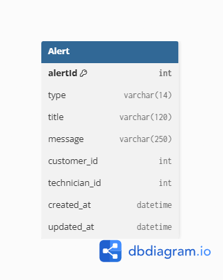
                

                 
    
            **Tabla: Appointments**   
      
            | Campo          | Tipo          | Descripción                       |
            |----------------|---------------|-----------------------------------|
            | id             | int           | Identificador único de la alerta  |
            | type           | varchar(14)   | Tipo de alerta                    |
            | title          | varchar(120)  | Título de la alerta               |
            | message        | varchar(250)  | Contenido de la alerta            |
            | customer_id    | int           | ID del Customer relacionado       |
            | Technician_id  | int           | ID del Technician relacionado     |
            | created_at     | datetime      | Fecha de creación de la alerta    |
            | updated_at     | datetime      | Fecha de última actualización     |

    - **2.6.4. Bounded Context: Tec-Section** 

        - **2.6.4.1. Domain Layer**

             **Sub-capa Model:**
      
          | Tipo         | Nombre                           | Descripción                                          | Responsabilidad Principal                                        | Relación con otros elementos                                                                        |
          |--------------|----------------------------------|------------------------------------------------------|------------------------------------------------------------------|-----------------------------------------------------------------------------------------------------|
          | Aggregate    | WorkRequest                      | Entidad que representa una solicitud de trabajo      | Ser el punto de entrada para gestionar trabajos solicitados      | Relacionado con TechnicianProfile para asignar técnicos y con los servicios que manejan solicitudes |
          | Value Object | WorkStatus                       | Value object dentro de WorkRequest                   | Representa el estado del trabajo (pending, accepted, etc.)       | Relacionado con WorkRequest                                                                         |
          | Value Object | WorkDetails                      | Value object dentro de WorkRequest                   | Representa descripción final, monto y horario                    | Relacionado con WorkRequest                                                                         |
          | Aggregate    | TechnicianProfile                | Entidad que representa el perfil del técnico         | Ser el punto de entrada para gestionar información de Technician | Relacionado con WorkRequest, ya que es quien recibe o acepta las solicitudes de trabajo             |
          | Value Object | TechnicianStatus                 | Value object dentro de TechnicianProfile             | Representa el estado del técnico (PENDING_APPROVAL, ACTIVE)      | Relacionado con TechnicianProfile                                                                   |
          | Value Object | TechnicianContact                | Value object dentro de TechnicianProfile             | Contiene información de contacto como email y teléfono           | Relacionado con TechnicianProfile                                                                   |
          | Command      | CreateWorkRequestCommand         | Comando para crear una solicitud de trabajo          | Encapsular datos requeridos para generar un nuevo WorkRequest    | Usado cuando un Customer registra un nuevo trabajo                                                  |
          | Command      | UpdateWorkRequestCommand         | Comando para actualizar datos de un WorkRequest      | Modificar datos como fecha, dirección o descripción              | Usado por el Customer antes de que un Technician lo acepte                                          |
          | Command      | AcceptWorkRequestCommand         | Comando para aceptar un trabajo solicitado           | Modificar estado de WorkRequest a "accepted"                     | Usado cuando un Technician acepta el trabajo                                                        |
          | Command      | CompleteWorkRequestCommand       | Comando para marcar un trabajo como completado       | Modificar estado y registrar monto y descripción final           | Usado por el Technician al finalizar el servicio                                                    |
          | Query        | GetWorkRequestsByTechnicianQuery | Consulta para obtener solicitudes por Technician     | Recuperar las solicitudes asignadas a un Technician              | Usado en la sección de solicitudes del Technician                                                   |
          | Query        | GetWorkRequestsByCustomerQuery   | Consulta para obtener solicitudes por Customer       | Recuperar las solicitudes hechas por un Customer                 | Usado en la sección de solicitudes del Customer                                                     |

             **Sub-capa Service:**
      
          | Tipo      | Nombre               | Descripción                                                    | Responsabilidad Principal                                                      | Relación con otros elementos                                                                                         |
          |-----------|----------------------|----------------------------------------------------------------|--------------------------------------------------------------------------------|----------------------------------------------------------------------------------------------------------------------|
          | Service   | WorkRequestService   | Servicio simulado para manejar solicitudes de trabajo (mock).  | Retornar listado de solicitudes para un Technician o Customer (Observable).    | Usado en capa Application para renderizar en vistas de Technician y Customer                                         |
          | Service   | TechnicianApiService | Servicio para integrar con el backend vía API REST             | Gestionar Technicians, Customers, categorías y solicitudes en la base de datos | Se comunica con la API (`/api/v1/Technicians`, `/api/v1/users`, `/api/v1/categories`). Consumido en capa Application |

        - **2.6.4.2. Interface Layer**

           **Sub-capa REST**

          | Tipo       | Nombre                                          | Descripción                                                           | Responsabilidad Principal                                                                                              | Relación con otros elementos                                                                               |
          |------------|-------------------------------------------------|-----------------------------------------------------------------------|------------------------------------------------------------------------------------------------------------------------|------------------------------------------------------------------------------------------------------------|
          | Controller | WorkRequestController                           | Controlador REST para gestionar solicitudes de trabajo                | Recibir solicitudes de Customer (crear, actualizar, listar) y de Technician (aceptar, completar), y coordinar comandos | Utiliza `WorkRequestResource`, `WorkRequestResponseResource` y los assemblers correspondientes             |
          | Controller | TechnicianProfileController                     | Controlador REST para gestionar perfiles de técnicos                  | Exponer endpoints para registrar, actualizar y consultar información de Technician                                     | Utiliza `TechnicianProfileResource`, `TechnicianProfileResponseResource` y los assemblers correspondientes |
          | Resource   | WorkRequestResource                             | Estructura de una petición para crear o modificar un WorkRequest      | Representar datos del dominio (dirección, fecha, descripción, categoría, etc.) de forma accesible al Cliente           | Usado en `WorkRequestController` para recibir datos estructurados del Customer                             |
          | Resource   | WorkRequestResponseResource                     | Estructura de respuesta para un WorkRequest                           | Exponer estado, técnico asignado y detalles del trabajo en formato accesible                                           | Usado en `WorkRequestController` para responder con datos procesados                                       |
          | Resource   | TechnicianProfileResource                       | Estructura de petición para crear o modificar un perfil de Technician | Representar datos como nombre, experiencia, contacto, categoría                                                        | Usado en `TechnicianProfileController` para recibir información del Technician                             |
          | Resource   | TechnicianProfileResponseResource               | Estructura de respuesta para un perfil de Technician                  | Exponer datos del técnico en formato accesible (estado, disponibilidad, contacto)                                      | Usado en `TechnicianProfileController` para responder con datos procesados                                 |
          | Assembler  | CreateWorkRequestCommandFromResourceAssembler   | Convierte un recurso de petición en un `CreateWorkRequestCommand`     | Evitar acoplamiento entre la interfaz REST y la capa de aplicación                                                     | Usado en `WorkRequestController` para traducir la petición a comando                                       |
          | Assembler  | UpdateWorkRequestCommandFromResourceAssembler   | Convierte un recurso de petición en un `UpdateWorkRequestCommand`     | Evitar acoplamiento entre REST y la capa de aplicación                                                                 | Usado en `WorkRequestController`                                                                           |
          | Assembler  | AcceptWorkRequestCommandFromResourceAssembler   | Convierte un recurso de petición en un `AcceptWorkRequestCommand`     | Traducir acción del Technician al comando correspondiente                                                              | Usado en `WorkRequestController`                                                                           |
          | Assembler  | CompleteWorkRequestCommandFromResourceAssembler | Convierte un recurso de petición en un `CompleteWorkRequestCommand`   | Traducir acción de finalizar trabajo al comando correspondiente                                                        | Usado en `WorkRequestController`                                                                           |
          | Assembler  | WorkRequestResourceFromEntityAssembler          | Convierte una entidad WorkRequest en un recurso de respuesta          | Asegurar respuesta consistente para el cliente                                                                         | Usado en `WorkRequestController` para retornar `WorkRequestResponseResource`                               |
          | Assembler  | TechnicianProfileResourceFromEntityAssembler    | Convierte una entidad TechnicianProfile en un recurso de respuesta    | Asegurar respuesta consistente para el cliente                                                                         | Usado en `TechnicianProfileController` para retornar `TechnicianProfileResponseResource`                   |

        - **2.6.4.3. Application Layer**

           **Sub-capa Internal**
      
            | Tipo           | Nombre                              | Descripción                                           | Responsabilidad Principal                                                                | Relación con otros elementos                                                                                                        |
            |----------------|-------------------------------------|-------------------------------------------------------|------------------------------------------------------------------------------------------|-------------------------------------------------------------------------------------------------------------------------------------|
            | CommandHandler | WorkRequestCommandServiceImpl       | Implementación de los comandos de WorkRequest         | Implementar métodos para crear, actualizar, aceptar y completar solicitudes de trabajo   | Implementa la interfaz `WorkRequestCommandService`. Usado por `WorkRequestController` y los CommandHandlers del dominio             |
            | QueryHandler   | WorkRequestQueryServiceImpl         | Implementación de las consultas de WorkRequest        | Implementar métodos para obtener solicitudes por estado, cliente o técnico               | Implementa la interfaz `WorkRequestQueryService`. Usado por `WorkRequestController` y los QueryHandlers del dominio                 |
            | CommandHandler | TechnicianProfileCommandServiceImpl | Implementación de los comandos de TechnicianProfile   | Implementar métodos para registrar y actualizar perfiles de técnicos                     | Implementa la interfaz `TechnicianProfileCommandService`. Usado por `TechnicianProfileController` y los CommandHandlers del dominio |
            | QueryHandler   | TechnicianProfileQueryServiceImpl   | Implementación de las consultas de TechnicianProfile  | Implementar métodos para consultar perfiles por categoría, disponibilidad, experiencia   | Implementa la interfaz `TechnicianProfileQueryService`. Usado por `TechnicianProfileController` y los QueryHandlers del dominio     |
      
        - **2.6.4.4. Infrastructure Layer**
      
          **Sub-capa Repository**  
      
          | Tipo       | Nombre                      | Descripción                                        | Responsabilidad Principal                                              | Relación con otros elementos                                                                                 |
          |------------|-----------------------------|----------------------------------------------------|------------------------------------------------------------------------|--------------------------------------------------------------------------------------------------------------|
          | Repository | WorkRequestRepository       | Repositorio para el modelo `WorkRequest`           | Acceder y manipular datos persistidos de solicitudes de trabajo        | Usado en la capa Application por `WorkRequestCommandServiceImpl` y `WorkRequestQueryServiceImpl`             |
          | Repository | TechnicianProfileRepository | Repositorio para el modelo `TechnicianProfile`     | Acceder y manipular datos persistidos de perfiles de técnicos          | Usado en la capa Application por `TechnicianProfileCommandServiceImpl` y `TechnicianProfileQueryServiceImpl` |

        - **2.6.4.5. Bounded Context Software Architecture Component Level Diagrams**
            
          El diagrama de componentes de Tec Section muestra la organización del sistema en dos módulos principales: WorkRequest y TechnicianProfile, cada uno compuesto por cuatro elementos con responsabilidades específicas. Los Controllers cumplen el rol de exponer datos, actuando como interfaz REST para que los actores externos (Customer y Technician) interactúen con la aplicación. Los Services se encargan de ejecutar datos, orquestando la lógica de negocio mediante la creación, actualización y finalización de solicitudes. Los Resources permiten consultar datos, garantizando que la información del dominio se estructure y presente de manera consistente para su consumo. Finalmente, los Repositories se responsabilizan de modificar datos, encapsulando la persistencia y asegurando independencia entre el dominio y la infraestructura. Esta división modular garantiza claridad en las responsabilidades, bajo acoplamiento y facilidad de mantenimiento, siguiendo los principios de DDD y Clean Architecture.
            

            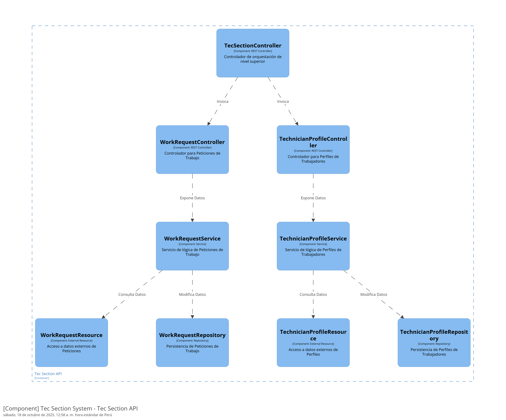
            

             
          
        - **2.6.4.6. Bounded Context Software Architecture Code Level Diagrams**
           
          - **2.6.4.6.1. Bounded Context Domain Layer Class Diagrams**
              
            Este diagrama UML representa la arquitectura de un sistema de gestión técnica centrado en la administración de secciones de trabajo, solicitudes de servicio y la interacción entre clientes (Customers) y técnicos (Technicians), teniendo como entidad principal a TecSection, la cual coordina la relación entre técnicos, solicitudes y servicios. Los principales componentes incluyen: Technician y Customer como actores principales, ServiceRequest como núcleo de la interacción entre cliente y técnico, Invoice y Payment para la gestión de facturación y cobros, Category para agrupar técnicos por especialidad, Review para la retroalimentación del cliente y Admin como supervisor del sistema. Las relaciones reflejan la lógica del dominio, donde un Customer puede generar múltiples solicitudes que se asignan a un Technician dentro de una TecSection, cada solicitud puede generar facturas y pagos, y los clientes pueden dejar reseñas sobre el servicio recibido. En conjunto, este diseño permite un sistema modular, escalable y mantenible, con una clara separación de responsabilidades que facilita su evolución futura.   
               

               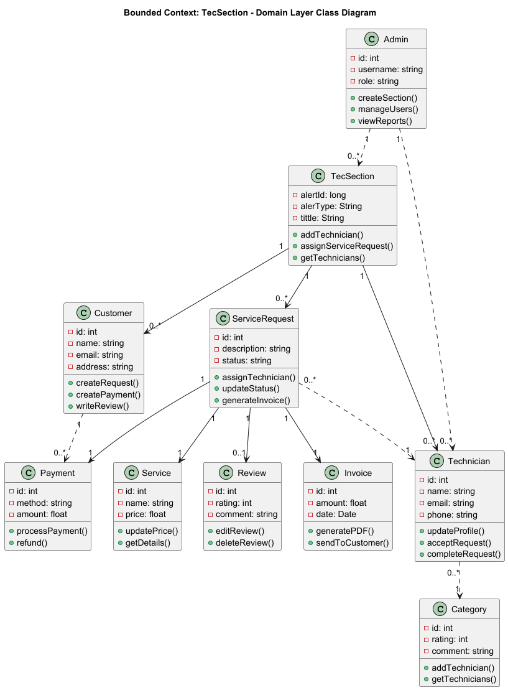
               

                
          - **2.6.4.6.2. Bounded Context Database Design Diagram**
              
              

              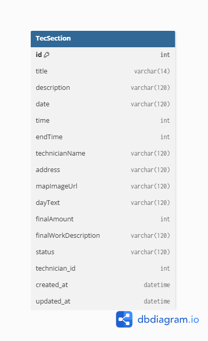
              

               
            
            **Tabla: WorkRequest**
          
            | Campo                    | Tipo          | Descripción                                      |
            |--------------------------|---------------|--------------------------------------------------|
            | id                       | varchar(36)   | Identificador único de la solicitud (PK)         |
            | title                    | varchar(120)  | Título de la solicitud de trabajo                |
            | **Description**          | varchar(300)  | Detalle de la solicitud                          |
            | date                     | datetime      | Fecha en la que se realizará el servicio         |
            | time                     | varchar(20)   | Hora programada del inicio del servicio          |
            | endTime                  | varchar(20)   | Hora estimada de finalización                    |
            | technicianName           | varchar(120)  | Nombre del técnico asignado o del cliente        |
            | address                  | varchar(200)  | Dirección donde se realizará el trabajo          |
            | mapImageUrl              | varchar(250)  | URL del mapa de referencia                       |
            | dayText                  | varchar(20)   | Texto descriptivo del día (Hoy, Mañana, etc.)    |
            | finalAmount              | decimal(10,2) | Monto final del servicio acordado                |
            | finalWork**Description** | varchar(250)  | Descripción final del trabajo realizado          |
            | status                   | varchar(15)   | Estado de la solicitud (pending, accepted, etc.) |
            | Technician_id            | int           | ID del Technician relacionado (FK)               |
            | created_at               | datetime      | Fecha de creación de la solicitud                |
            | updated_at               | datetime      | Fecha de última actualización de la solicitud    |

    - **2.6.5. Bounded Context: IAM**
        - **2.6.5.1. Domain Layer**
          **Sub-capa Model:**

          | Tipo          | Nombre          | Descripción                                        | Responsabilidad Principal                                                 | Relación con otros elementos                                 |
          |---------------|-----------------|----------------------------------------------------|---------------------------------------------------------------------------|--------------------------------------------------------------|
          | Aggregate     | User            | Entidad que modela a un usuario en la aplicación   | Gestionar la lógica de negocio del usuario y garantizar su consistencia   | Relacionado con otros contextos, encapsula reglas de negocio |
          | Command       | SignInCommand   | Comando para iniciar sesión                        | Encapsular los datos necesarios para autenticar a un usuario              | Usado por el servicio de autenticación                       |
          | Command       | SignUpCommand   | Comando para registrar un nuevo usuario            | Encapsular los datos requeridos para crear un nuevo usuario               | Usado por el servicio de autenticación                       |
          | Value Object  | EmailAddress    | Value object dentro de User                        | Representa y valida el correo electrónico                                 | Relacionado con User                                         |
          | Value Object  | PersonName      | Value object dentro de User                        | Encapsula el nombre completo y valida formato                             | Relacionado con User                                         |
          | Domain Event  | UserRegistered  | Evento emitido al registrar un nuevo usuario       | Notificar a otros contextos sobre el registro de un usuario               | Usado por servicios de aplicación e infraestructura          |
          | Domain Event  | UserSignedIn    | Evento disparado al iniciar sesión un usuario      | Informar a otros sistemas sobre el inicio de sesión                       | Usado por servicios de aplicación e infraestructura          |

          **Sub-capa Service:**

          | Tipo        | Nombre              | Descripción                          | Responsabilidad Principal                                | Relación con otros elementos                        |
          |-------------|---------------------|--------------------------------------|----------------------------------------------------------|-----------------------------------------------------|
          | Interface   | AuthCommandService  | Interfaz para manejar autenticación  | Establecer contrato para la lógica de autenticación      | Implementado en la capa de aplicación               |
          | Interface   | TokenService        | Interfaz para manejo de tokens       | Definir operaciones de generación y validación de tokens | Implementado en infraestructura como JwtServiceImpl |

        - **2.6.5.2. Interface Layer**
          **Sub-capa REST**
      
          | Tipo       | Nombre                             | Descripción                                        | Responsabilidad Principal                                                | Relación con otros elementos                |
          |------------|------------------------------------|----------------------------------------------------|--------------------------------------------------------------------------|---------------------------------------------|
          | Resource   | AuthRequestResource                | Estructura para solicitudes de autenticación       | Exponer los datos de autenticación de forma estructurada para el cliente | Usado por AuthController                    |
          | Resource   | AuthResponseResource               | Estructura para respuestas de autenticación        | Proveer datos estructurados tras un inicio de sesión exitoso             | Usado por AuthController                    |
          | Resource   | RegisterRequestResource            | Estructura para solicitudes de registro            | Representar los datos necesarios para registrar un usuario               | Usado por AuthController                    |
          | Resource   | RegisterResponseResource           | Estructura para respuestas de registro             | Entregar datos estructurados tras un registro exitoso                    | Usado por AuthController                    |
          | Resource   | ErrorResponseResource              | Estructura para manejar respuestas de error        | Estandarizar mensajes de error enviados al cliente                       | Usado por AuthController en caso de errores |
          | Validator  | AuthRequestValidator               | Valida los datos de entrada de las solicitudes     | Garantizar que los datos recibidos cumplen con las reglas del dominio    | Usado por AuthController                    |
          | Controller | AuthController                     | Gestiona las solicitudes HTTP de los clientes      | Recibir solicitudes, coordinar su procesamiento y devolver respuestas    | Usa recursos, validadores y ensambladores   |
          | Assembler  | SignInCommandFromResourceAssembler | Convierte AuthRequestResource en SignInCommand     | Asegurar una transformación limpia entre recursos y comandos             | Usado por AuthController                    |
          | Assembler  | SignUpCommandFromResourceAssembler | Convierte RegisterRequestResource en SignUpCommand | Prevenir inconsistencias al transformar datos de recursos a comandos     | Usado por AuthController                    |

        - **2.6.5.3. Application Layer**
          **Sub-capa Internal**
      
          | Tipo            | Nombre                | Descripción                      | Responsabilidad Principal                           | Relación con otros elementos       |
          |-----------------|-----------------------|----------------------------------|-----------------------------------------------------|------------------------------------|
          | CommandHandler  | SignInCommandHandler  | Maneja el comando SignInCommand  | Ejecutar la lógica de autenticación de un usuario   | Usa UserRepository y TokenService  |
          | CommandHandler  | SignUpCommandHandler  | Maneja el comando SignUpCommand  | Ejecutar la lógica de registro de un usuario        | Usa UserRepository                 |
          | EventPublisher  | DomainEventPublisher  | Publica eventos de dominio       | Notificar cambios en el dominio a sistemas externos | Usado por CommandHandlers          |

        - **2.6.5.4. Infrastructure Layer**
          **Sub-capa Repository**

          | Tipo        | Nombre             | Descripción                                    | Responsabilidad Principal                                      | Relación con otros elementos             |
          |-------------|--------------------|------------------------------------------------|----------------------------------------------------------------|------------------------------------------|
          | Interface   | UserRepository     | Interfaz para acceder a los datos del User     | Definir métodos para manipular datos del usuario               | Definida en dominio, implementada aquí   |
          | Class       | UserRepositoryImpl | Implementación del repositorio UserRepository  | Conectar con la base de datos para operaciones de persistencia | Usado por CommandHandlers                |

          **Sub-capa Security**

          | Tipo     | Nombre          | Descripción                                   | Responsabilidad Principal                              | Relación con otros elementos |
          |----------|-----------------|-----------------------------------------------|--------------------------------------------------------|------------------------------|
          | Config   | SecurityConfig  | Configura reglas de autorización y permisos   | Establecer políticas de seguridad para la aplicación   | Aplicada globalmente         |

          **Sub-capa JWT**
      
          | Tipo    | Nombre          | Descripción                                                     | Responsabilidad Principal                                                   | Relación con otros elementos                  |
          |---------|-----------------|-----------------------------------------------------------------|-----------------------------------------------------------------------------|-----------------------------------------------|
          | Class   | JwtAuthFilter   | Filtro que valida tokens JWT en solicitudes HTTP                | Verificar la autenticidad de las solicitudes antes de llegar al controlador | Relacionado con la seguridad de la aplicación |
          | Class   | JwtServiceImpl  | Gestiona la creación, validación y decodificación de tokens JWT | Encapsular toda la lógica relacionada con tokens JWT                        | Implementa TokenService                       |

          **Sub-capa Event Handling**
      
          | Tipo           | Nombre                       | Descripción                        | Responsabilidad Principal                                                | Relación con otros elementos                |
          |----------------|------------------------------|------------------------------------|--------------------------------------------------------------------------|---------------------------------------------|
          | EventHandler   | UserRegisteredEventHandler   | Procesa el evento UserRegistered   | Gestionar integraciones o notificaciones tras el registro de un usuario  | Usa sistemas de mensajería o APIs externas  |

          **Sub-capa Audit**
      
          | Tipo      | Nombre         | Descripción                                         | Responsabilidad Principal                             | Relación con otros elementos               |
          |-----------|----------------|-----------------------------------------------------|-------------------------------------------------------|--------------------------------------------|
          | Service   | AuditService   | Registra eventos críticos (ej. intentos de login)   | Mantener un registro de auditoría para trazabilidad   | Usado por CommandHandlers o JwtAuthFilter  |

    - **2.6.5.5. Bounded Context Software Architecture Component Level Diagrams**
      
      El diagrama muestra la estructura interna del contenedor IAM Application, que forma parte del bounded context de identidad y autenticación (IAM) del sistema. Este backend está construido siguiendo los principios de Clean Architecture y Domain-Driven Design (DDD)
        
      

      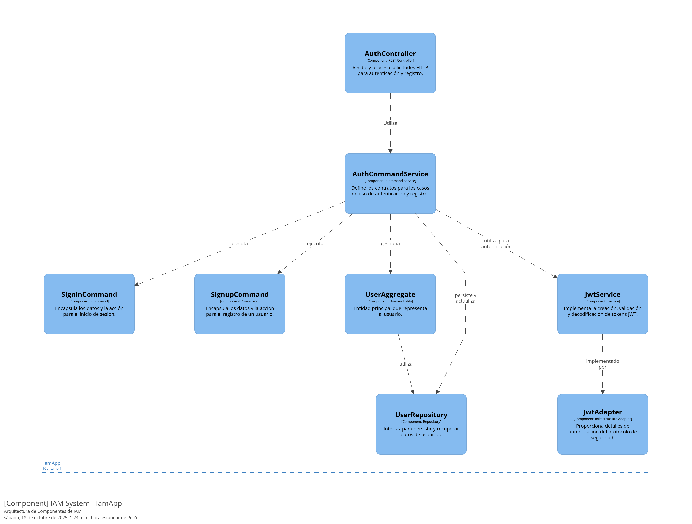
      

       

    - **2.6.5.6. Bounded Context Software Architecture Code Level Diagrams**
  
    - **2.6.5.6.1. Bounded Context Domain Layer Class Diagrams**

      En esta imagen, la clase User cumple un rol central al gestionar los atributos predeterminados del usuario, asegurando la integridad de la información básica como identificadores, credenciales y datos personales necesarios para el sistema
        
      

      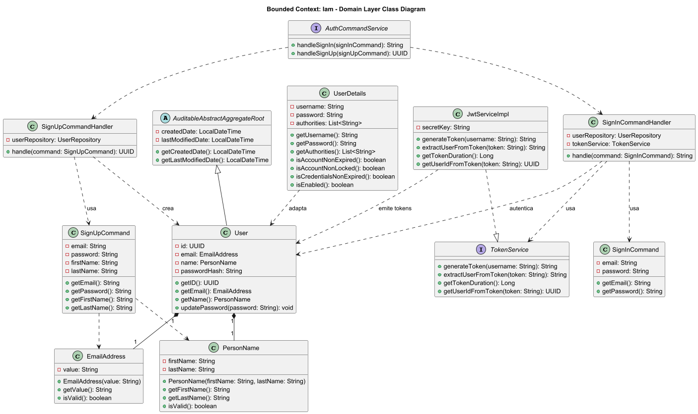
      

       

    - **2.6.5.6.2. Bounded Context Database Design Diagram**
  
         
       

       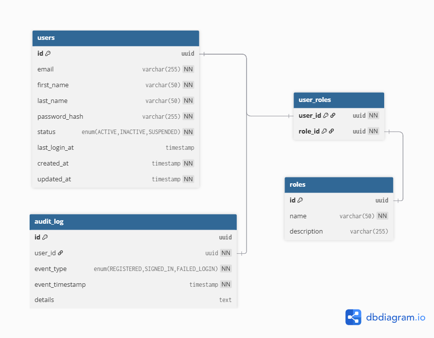
       

        
    
        **Tabla: users**

        | Nombre          | Descripción                                                        |
        |-----------------|--------------------------------------------------------------------|
        | id              | Identificador único del usuario (UUID), clave primaria.            |
        | email           | Dirección de correo electrónico del usuario, único y obligatorio.  |
        | first\_name     | Primer nombre del usuario.                                         |
        | last\_name      | Apellido del usuario.                                              |
        | password\_hash  | Contraseña del usuario, almacenada de forma segura (encriptada).   |
        | status          | Estado del usuario (ACTIVE, INACTIVE, SUSPENDED).                  |
        | last\_login\_at | Fecha y hora del último inicio de sesión.                          |
        | created\_at     | Fecha y hora en que se creó el registro.                           |
        | updated\_at     | Fecha y hora de la última actualización del registro.              |
        
        **Tabla: roles**
        
        | Nombre      | Descripción                                                     |
        |-------------|-----------------------------------------------------------------|
        | id          | Identificador único del rol (UUID), clave primaria.             |
        | name        | Nombre del rol, único y obligatorio (ej. ADMIN, USER, AUDITOR). |
        | description | Descripción opcional del rol.                                   |
        
        **Tabla: user_roles**
        
        | Nombre                 | Descripción                                                        |
        |------------------------|--------------------------------------------------------------------|
        | user\_id               | Identificador del usuario, clave foránea hacia `users`.            |
        | role\_id               | Identificador del rol, clave foránea hacia `roles`.                |
        | PK(user\_id, role\_id) | Llave primaria compuesta que asegura que un usuario no repita rol. |
        
        **Tabla: audit_log**
        
        | Nombre           | Descripción                                                                |
        |------------------|----------------------------------------------------------------------------|
        | id               | Identificador único del evento (UUID), clave primaria.                     |
        | user\_id         | Identificador del usuario asociado al evento, clave foránea hacia `users`. |
        | event\_type      | Tipo de evento (REGISTERED, SIGNED\_IN, FAILED\_LOGIN).                    |
        | event\_timestamp | Fecha y hora en que ocurrió el evento.                                     |
        | details          | Detalles adicionales del evento (ej. IP, descripción del error, etc.).     |

