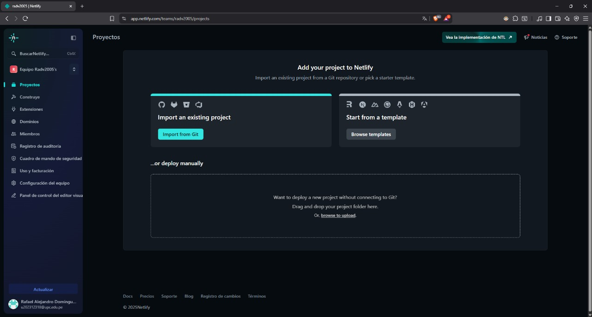

## **Capítulo IV: Product Implementation & Validation**
- **4.1. Software Configuration Management** 
  En esta sección se definen las convenciones que garantizan la coherencia del proyecto a lo largo de su ciclo de vida.
    - **4.1.1. Software Development Environment Configuration**
      Para el desarrollo del AlguienDijoChamba usamos las siguientes herramientas:
      #### Requirements Management:
        - **UxPressia** 
          Plataforma especializada en el desarrollo y gestión de componentes de experiencia de usuario. Mediante esta herramienta se elaboraron los artefactos de Needfinding, incluyendo User Personas, Journey Maps, Empathy Maps e Impact Maps.
            
        

        
        

        - **Miro** 
          Herramienta de colaboración visual que facilitó la creación de diagramas, flujos de trabajo y especialmente el desarrollo de sesiones de EventStorming.
            
        

        
        

      #### Product UX/UI Design:

        - **Figma** 
          Plataforma de diseño colaborativa empleada para el desarrollo de la capa de presentación de la aplicación móvil, landing page y prototipos interactivos. Permite simular y validar la navegación e interacciones planteadas para la experiencia de usuario.
            
        

        
        

      #### Software Development

        - **Visual Studio Code** 
          Editor de código fuente desarrollado por Microsoft, utilizado para la implementación del frontend mediante HTML, CSS y JavaScript en la landing page del proyecto.
            
        

        
        

         

        - **Android Studio** 
          Entorno de desarrollo oficial para Android, basado en IntelliJ IDEA. Empleado para el desarrollo nativo de la aplicación móvil propuesta en el proyecto.
            
        

        
        

         

      #### Software Deployment

        - **Git**
          Sistema de control de versiones distribuido que permite mantener un historial detallado de modificaciones y facilitar la colaboración entre los miembros del equipo.
            
        

        
        

         

        - **GitHub**
          Plataforma de alojamiento que optimiza la colaboración mediante gestión de ramas e integración continua. Adicionalmente, se utiliza GitHub Pages para el despliegue automatizado de la landing page.
            
        

        
        

    - **4.1.2. Source Code Management**
      La gestión del proyecto de la aplicación móvil, landing page y aplicación Backend, siguen los principios del modelo "Git Branch Model" en la cual se define como una estrategia para administrar y organizar un trabajo en un repositorio de Github mediante la creación de ramas con distintas funcionalidades. Uno de los modelos que usaremos es el "Git Flow", la cual define como crear ramas para mantener el control del ciclo de vida del desarrollo del software.
   ---   
  **Repositorio de Landing Page:** [https://github.com/1ACC0238-2520-1798-G3-AlguienDijoChamba/AlguienDijoChamba---Landing_Page](https://github.com/1ACC0238-2520-1798-G3-AlguienDijoChamba/AlguienDijoChamba---Landing_Page)

  **Repositorio de Aplicación Móvil:** [https://github.com/1ACC0238-2520-1798-G3-AlguienDijoChamba/AlguienDijoChamba---Fronted](https://github.com/1ACC0238-2520-1798-G3-AlguienDijoChamba/AlguienDijoChamba---Fronted)

  **Repositorio de Backend:** [https://github.com/1ACC0238-2520-1798-G3-AlguienDijoChamba/AlguienDijoChamba---Backend](https://github.com/1ACC0238-2520-1798-G3-AlguienDijoChamba/AlguienDijoChamba---Backend)

   ---

  **Estructura de ramas**

    1. Rama main(Rama Principal): Esta rama mantiene las versiones definitivas del código. Toda modificación debe ser previamente validada y probada en otras ramas antes de su incorporación.  

    1. Rama develop(Rama de Desarrollo): En esta rama se centraliza el desarrollo colaborativo, integrando progresivamente cada funcionalidad hasta estabilizarlas para su posterior merge a main.  

    1. Rama feature(Rama de Caracteristicas): Estas ramas, derivadas de `develop`, tienen como propósito exclusivo el desarrollo de nuevas características. Una vez implementadas y validadas, se fusionan nuevamente con la rama de desarrollo. Aunque por naturaleza son temporales, en el caso específico de la Landing Page se conservarán con fines documentales.  

    4. Convenciones de Commits: Para los mensajes de commit, seguimos la especificación Conventional Commits con la siguiente estructura:

              "(tipo):(titulo)" y "(descripcion)"

    - **4.1.3. Source Code Style Guide & Conventions**

  Para el desarrollo de AlguienDijoChamba, hemos empleado los siguientes lenguajes y tecnologías:

  **Next.js** 
  Como framework full-stack hemos implementado Next.js con las siguientes prácticas:

    - **Estructura de proyecto:**
      Organización estándar con directorios app/ para routing, components/ para componentes reutilizables y lib/ para utilidades y configuraciones.

    - **Renderizado híbrido:**
      Combinación de Server-Side Rendering (SSR) para contenido dinámico y Static Site Generation (SSG) para páginas estáticas optimizando el SEO y performance.

      **React** 
      Para el desarrollo de la interfaz de usuario hemos utilizado React con las siguientes convenciones:

        - **Componentes funcionales:**
          Implementación de componentes basados en funciones con Hooks para el manejo de estado y efectos secundarios.

        - **Estructura de componentes:**
          Organización modular con componentes reutilizables, separación de lógica de presentación y custom hooks para funcionalidades compartidas.

      **CSS** 
      Hemos adoptado la metodología BEM y guías de estilo establecidas:

        - **Nomenclatura descriptiva:**
          Las clases siguen el formato "kebab-case" en inglés, facilitando la identificación de su propósito.

        - **Mejoras de experiencia de usuario:**
          Implementación de transiciones suaves en interacciones y efectos de botones.

        - **Recursos tipográficos:**
          Carga optimizada de fuentes personalizadas mediante `@font-face`, siguiendo mejores prácticas de rendimiento.

      **.NET** 
      Para el desarrollo del API Restful hemos seguido las convenciones estándar de Microsoft:

        - **Convenciones de nomenclatura:**
          Uso de PascalCase para clases y métodos, y lowerCamelCase para parámetros y variables.

        - **Arquitectura limpia:**
          Implementación de Clean Architecture y principios Domain Driven Design, organizando el proyecto en capas diferenciadas (Aplicación, Infraestructura, Dominio y Presentación).

      **Kotlin (Android Studio)**
      Desarrollo móvil bajo las guías de estilo de Kotlin:

        - **Arquitectura escalable:**
          Implementación de Clean Architecture con separación por capas (Repositorios, UI, Casos de Uso y Dominios) siguiendo principios DDD.
    - **4.1.4. Software Deployment Configuration**

      **Landing Page:** 
      Para el despliegue de la Landing Page, utilizaremos **Netlify**, usando el servico integrado de enlace con GitHub.

        1. Ingresamos a netlify, y seleccionamos import git
             
        1. Elegimos importar de github un proyecto
             
        1. Configuramos o enlazamos netlify con github
             
        1. Seleccionamos nuestro repositorio
             
        1. Seleccionamos el repositorio del landing page
             
        1. Definimos el nombre de nuestro link
             
        1. Definimos variables y le damos a deploy
             
        1. Esperamos que termine el proceso
             
        1. Ingresamos a nuestro link
             
        1. Ingresamos a nuestra pag
             

      **Enlace del Landing Page:** [https://alguiendijochamba-landingpage.netlify.app/](https://alguiendijochamba-landingpage.netlify.app/)
- **4.2. Landing Page & Mobile Application Implementation**
   Esta sección detalla la Implementación técnica de la Landing Page y las Aplicaciones Móviles, describiendo las herramientas, tecnologías y el proceso ágil ejecutado a través de sprints para cada entrega del producto.  
    - **4.2.1. Sprint 1** 
      La siguiente sección detalla los resultados del Sprint #1, correspondiente a la entrega inicial del proyecto. Se presentan los avances organizativos, la distribución de trabajo y los productos desarrollados: la landing page operativa, el progreso del Web Service y la versión preliminar de la Mobile Application.
        - **4.2.1.1. Sprint Planning 1** 
           A continuación, se detalla la Planificación del Sprint 1, donde se definieron los objetivos iniciales, se seleccionaron las tareas prioritarias del backlog y se asignaron las responsabilidades del equipo para el primer ciclo de desarrollo.  
      
          <table>
            <tr>
              <th> Sprint # </th>
              <th> Sprint 1 </th>
            </tr>
            <tr>
              <td style="font-weight: bold;" colspan="2"> Sprint Planning Background </td>
            </tr>
            <tr>
              <td style="font-weight: bold;"> Date </td>
              <td> 29/09/2025 </td>
            </tr>
            <tr>
              <td style="font-weight: bold;"> Time </td>
              <td> 00:38 horas (GMT-5) </td>
            </tr>
            <tr>
              <td style="font-weight: bold;"> Location </td>
              <td> Virtual (Google Meet) </td>
            </tr>
            <tr>
              <td style="font-weight: bold;"> Prepared By </td>
              <td> Bastidas Bastidas, Diego Martin </td>
            </tr>
            <tr>
              <td style="font-weight: bold;"> Attendees (to planning meeting) </td>
              <td>
                Bastidas Bastidas, Diego Martin 
                Belahonia Miranda, Fabrisio 
                Dominguez Vargas, Rafael Alexander 
                Escobar Palomino, Sebastian Matias 
                Muñiz Huayanca, Percy Alonso	
              </td>
            </tr>
            <tr>
              <td style="font-weight: bold;"> Sprint 1 Review Summary </td>
              <td> Dado que este es el primer sprint de desarrollo, no contamos con un review summary previo. </td>
            </tr>
            <tr>
              <td style="font-weight: bold;"> Sprint 1 Retrospective Summary </td>
              <td> Al ser el primer sprint, aún no hemos identificado áreas específicas de mejora para el proceso. </td>
            </tr>
            <tr>
              <td style="font-weight: bold;" colspan="2"> Sprint Goal & User Stories </td>
            </tr>
            <tr>
              <td style="font-weight: bold;"> Sprint 1 Goal </td>
              <td>Nuestro objetivo es crear una landing page que muestre de manera clara y atractiva todas las funcionalidades y ventajas de AlguienDijoChamba, ofreciendo a los visitantes una primera impresión sólida de la plataforma y su propuesta de valor. La página permitirá que los usuarios exploren las distintas secciones y comprendan cómo nuestra solución conecta de manera efectiva a empresas y profesionales. Paralelamente, queremos resaltar la app móvil, que ofrece una experiencia práctica y accesible, permitiendo a los usuarios interactuar con la plataforma desde cualquier lugar. Este enfoque integral se validará observando cómo los visitantes navegan por la landing page y aprovechan la conexión fluida con la app móvil.</td>
            </tr>
            <tr>
              <td style="font-weight: bold;"> Sprint 1 Velocity </td>
              <td>20</td>
            </tr>
            <tr>
              <td style="font-weight: bold;"> Sum of Story Points </td>
              <td>  20</td>
            </tr>
          </table>
        - **4.2.1.2. Sprint Backlog 1**
            En el primer sprint, el equipo enfocó su trabajo en crear una landing page que fuera tanto funcional como atractiva, asignando las tareas en el tablero de Sprint según las habilidades de cada miembro.

      | *id*    | *Title*                             | *Description*                                                                                                                                                                   | *Estimations(Hours)*   | *Assigned To*                        | *Status(To-do/InProcess/ToReview/Done)* |
              |---------|-------------------------------------|---------------------------------------------------------------------------------------------------------------------------------------------------------------------------------|------------------------|--------------------------------------|-----------------------------------------|
      | *LPS01* | Navigation                          | Implementación de la barra de navegación con enlaces a "¿Cómo funciona?", "Casos de éxito", "Planes" y "Contactos".                                                             | 4                      | *Bastidas Bastidas, Diego Martin*    | Done                                    |
      | *LPS01* | Hero Section                        | Implementacion de "Hero Section", donde se buscara llamar la atencion del usuarios sobre nuestra app movil.                                                                     | 2                      | *Bastidas Bastidas, Diego Martin*    | Done                                    |
      | *LPS02* | About the product                   | Desarrollo de la seccion "About the product", donde se describira brevemente nuestro productos y sus beneficios.                                                                | 2                      | *Bastidas Bastidas, Diego Martin*    | Done                                    |
      | *LPS03* | Services and Technicals Workers     | Desarrollo de la sección "Services and Technicals Workers", donde se mostrara los servicios que ofrecen nuestros tecnicos calificados.                                          | 3                      | *Bastidas Bastidas, Diego Martin*    | Done                                    |
      | *LPS04* | Gamification                        | Desarrollo de la sección "Gamification", donde se mostrara los Sistemas de nivel de los Usuarios y la forma en la que se pueda subir de nivel.                                  | 3                      | *Bastidas Bastidas, Diego Martin*    | Done                                    |
      | *LPS05* | Testimonials                        | Desarrollo de la seccion "Testimonials", donde se mostrara los testimonios de usuarios que usaron nuestra app.                                                                  | 3                      | *Bastidas Bastidas, Diego Martin*    | Done                                    |
      | *LPS06* | Contact                             | Desarrollo de la sección "Contact", donde se mostrara la forma en que los usuarios puedan contactar con el equipo detras de AlguienDijoChamba.                                  | 2                      | *Bastidas Bastidas, Diego Martin*    | Done                                    |
      | *LPS07* | Footer                              | Desarrollo de la seccion "Footer", donde se msotrar la forma en que los usuarios puedan redirigirse a cualquier seccion de la pagina y acceder a las redes sociales del equipo. | 2                      | *Bastidas Bastidas, Diego Martin*    | Done                                    |

        - *4.2.1.3. Development Evidence for Sprint Review*  
           Esta sección se presenta la Evidencia de Desarrollo completada durante el sprint, demostrando el trabajo funcional realizado y los incrementos del producto listos para ser inspeccionados y validados en la Sprint Review.  

          | *Repository*                                                             | *Branch*      | *Commit Id*                               | *Commit Message*                                                                                                                         | *Committed By*    | *Committed On* |
                  |--------------------------------------------------------------------------|---------------|-------------------------------------------|------------------------------------------------------------------------------------------------------------------------------------------|-------------------|----------------|
          | 1ACC0238-2520-1798-G3-AlguienDijoChamba/AlguienDijoChamba-Report         | chapter-1     | e24070bfb6eee873f1f838c2e65c913c7ab8028b  | Initial commit                                                                                                                           | ghostnotfound404  | Sep 08, 2025   |
          | 1ACC0238-2520-1798-G3-AlguienDijoChamba/AlguienDijoChamba-Report         | chapter-1     | e4daaa743de9a29709041949cb8dc0188e81163e  | Feat: update readme                                                                                                                      | ghostnotfound404  | Sep 08, 2025   |
          | 1ACC0238-2520-1798-G3-AlguienDijoChamba/AlguienDijoChamba-Report         | chapter-1     | bda5d55e80d7ed66115d24f6c54cb0be793af8f8  | feat: update point of the report                                                                                                         | ghostnotfound404  | Sep 08, 2025   |
          | 1ACC0238-2520-1798-G3-AlguienDijoChamba/AlguienDijoChamba-Report         | chapter-1     | 014a60dc712fad3715fde318a76df9fa40285825  | feat: chapter 01                                                                                                                         | ghostnotfound404  | Sep 08, 2025   |
          | 1ACC0238-2520-1798-G3-AlguienDijoChamba/AlguienDijoChamba-Report         | chapter-1     | 8519a69634e435e92cc45b197619d2b81f812b39  | feat: perfil de integrante Rafael                                                                                                        | radv2005          | Sep 09, 2025   |
          | 1ACC0238-2520-1798-G3-AlguienDijoChamba/AlguienDijoChamba-Report         | chapter-2     | ab9513074d7ee0cf4776a956764822d0d13c9930  | feat: update chapter 2 lack User Journey Mapping                                                                                         | ghostnotfound404  | Sep 11, 2025   |
          | 1ACC0238-2520-1798-G3-AlguienDijoChamba/AlguienDijoChamba-Report         | chapter-2     | 91c494577672f203916155d0a1f2e8a02306e3f2  | docs(domain): add Alert tables Model and Service in Domain Layer                                                                         | radv2005          | Sep 13, 2025   |
          | 1ACC0238-2520-1798-G3-AlguienDijoChamba/AlguienDijoChamba-Report         | chapter-2     | b85dc2d271ba6a40520b9ed93fa6a303eb196adf  | docs(BoundedAlert): add Alert tables REST resources, controller and assemblers                                                           | radv2005          | Sep 13, 2025   |
          | 1ACC0238-2520-1798-G3-AlguienDijoChamba/AlguienDijoChamba-Report         | chapter-2     | 236dbdb8d3e87ce68686acc68346d9c427430fef  | docs(BoundedAlert): add AlertCommandServiceImpl and AlertQueryServiceImpl tables                                                         | radv2005          | Sep 13, 2025   |
          | 1ACC0238-2520-1798-G3-AlguienDijoChamba/AlguienDijoChamba-Report         | chapter-2     | 247c483d062d63b6ed8e4b0e5c26465d1ffda5cc  | docs(BoundedAlert): add AlertRepository table in Infrastructure Layer                                                                    | radv2005          | Sep 13, 2025   |
          | 1ACC0238-2520-1798-G3-AlguienDijoChamba/AlguienDijoChamba-Report         | chapter-2     | 83197eee233610241796c191e998d89a488321e9  | docs(BoundedAlert): add AlertComponent Diagram                                                                                           | radv2005          | Sep 13, 2025   |
          | 1ACC0238-2520-1798-G3-AlguienDijoChamba/AlguienDijoChamba-Report         | chapter-2     | 9ed556c03dde8aed35bccef39cdb92f298c2dfb0  | docs(BoundedAlert): add Architecture Code Level Diagram                                                                                  | radv2005          | Sep 13, 2025   |
          | 1ACC0238-2520-1798-G3-AlguienDijoChamba/AlguienDijoChamba-Report         | chapter-2     | 4bec31847f00b82d0fe6c1e284a1b15c665a8bb9  | docs(BoundedAlert): add Database Design Diagram                                                                                          | radv2005          | Sep 14, 2025   |
          | 1ACC0238-2520-1798-G3-AlguienDijoChamba/AlguienDijoChamba-Report         | chapter-2     | 7c9007e5e797782b49a5acbe308e6cb53297ddda  | docs(BoundedAlert): fix images                                                                                                           | radv2005          | Sep 14, 2025   |
          | 1ACC0238-2520-1798-G3-AlguienDijoChamba/AlguienDijoChamba-Report         | chapter-2     | 0995e54433c9a38cf8c64e7201496a5c466e8dfb  | feat : add user stories                                                                                                                  | sebasepe          | Sep 15, 2025   |
          | 1ACC0238-2520-1798-G3-AlguienDijoChamba/AlguienDijoChamba-Report         | chapter-2     | 8ba16fc9e71c45045b7ba6a3c7df7ce173d94c2d  | feat : add user stories                                                                                                                  | sebasepe          | Sep 15, 2025   |
          | 1ACC0238-2520-1798-G3-AlguienDijoChamba/AlguienDijoChamba-Report         | chapter-2     | 343182df99841e690972dc17d58a663a522c1b67  | feat : change position for points                                                                                                        | sebasepe          | Sep 15, 2025   |
          | 1ACC0238-2520-1798-G3-AlguienDijoChamba/AlguienDijoChamba-Report         | chapter-2     | 599ce3159f040307b7146be1b38386b99c41e221  | feat : add Chapter_02.md                                                                                                                 | sebasepe          | Sep 15, 2025   |
          | 1ACC0238-2520-1798-G3-AlguienDijoChamba/AlguienDijoChamba-Report         | chapter-2     | 12afce992f9abdff4f7566ee06c0ceb52e6f20f2  | Update Chapter_02.md                                                                                                                     | sebasepe          | Sep 15, 2025   |
          | 1ACC0238-2520-1798-G3-AlguienDijoChamba/AlguienDijoChamba-Report         | chapter-2     | 31cf019964b0ed502e667ccc9a283a5ec385f719  | feat : add product backlog                                                                                                               | sebasepe          | Sep 15, 2025   |
          | 1ACC0238-2520-1798-G3-AlguienDijoChamba/AlguienDijoChamba-Report         | chapter-2     | 0ad35c2850f46de4d9b21340c2770d961209a901  | feat: added Diseño de entrevistas                                                                                                        | alomsoo           | Sep 15, 2025   |
          | 1ACC0238-2520-1798-G3-AlguienDijoChamba/AlguienDijoChamba-Report         | chapter-2     | 2073f4050c0681323bce08049ac7c3f3f9439564  | feat: sinttaxys fixed                                                                                                                    | alomsoo           | Sep 15, 2025   |
          | 1ACC0238-2520-1798-G3-AlguienDijoChamba/AlguienDijoChamba-Report         | chapter-2     | 6b8f4fb1c8aaa779bf785e54fa7000bb97495296  | feat: Registro de entrevistas added                                                                                                      | alomsoo           | Sep 15, 2025   |
          | 1ACC0238-2520-1798-G3-AlguienDijoChamba/AlguienDijoChamba-Report         | chapter-2     | 7dcc7174c024b135fef6cbd9ac05ad820f62a29e  | feat: fixed sintaxys                                                                                                                     | alomsoo           | Sep 15, 2025   |
          | 1ACC0238-2520-1798-G3-AlguienDijoChamba/AlguienDijoChamba-Report         | chapter-2     | d4ccdc77bee9e634a011d8c39e9d602737a3dd45  | feat: added Domain Layer tec section                                                                                                     | alomsoo           | Sep 15, 2025   |
          | 1ACC0238-2520-1798-G3-AlguienDijoChamba/AlguienDijoChamba-Report         | chapter-2     | bd2a5c8a07681040de0381923c4ef2663550326d  | feat: added dinterace layer                                                                                                              | alomsoo           | Sep 16, 2025   |
          | 1ACC0238-2520-1798-G3-AlguienDijoChamba/AlguienDijoChamba-Report         | chapter-2     | 74ae8af597d3402bad6953613a1b56f90ad7bbfb  | feat: added Application and Infrastuucture Layer                                                                                         | alomsoo           | Sep 16, 2025   |
          | 1ACC0238-2520-1798-G3-AlguienDijoChamba/AlguienDijoChamba-Report         | chapter-2     | 061e4fc4f6414a203e3479c30dc2ab15258a6b7d  | Tec SectionComponent                                                                                                                     | alomsoo           | Sep 16, 2025   |
          | 1ACC0238-2520-1798-G3-AlguienDijoChamba/AlguienDijoChamba-Report         | chapter-2     | 0acd75e27d9c6773698045b078430e70ec93c0ba  | feat: added c4 diagram                                                                                                                   | alomsoo           | Sep 16, 2025   |
          | 1ACC0238-2520-1798-G3-AlguienDijoChamba/AlguienDijoChamba-Report         | chapter-2     | 2c8be7b7207ef16722910d66ffd18dd3f9559e7f  | Add files via upload                                                                                                                     | alomsoo           | Sep 16, 2025   |
          | 1ACC0238-2520-1798-G3-AlguienDijoChamba/AlguienDijoChamba-Report         | chapter-2     | be6c29455cddbb4c104641edddd727e54b9a94f9  | feat: added Diagrama_de_Datos_Bounded_TecSection                                                                                         | alomsoo           | Sep 16, 2025   |
          | 1ACC0238-2520-1798-G3-AlguienDijoChamba/AlguienDijoChamba-Report         | chapter-2     | 6acbb3a5cfcdb95174153a406586d4082d9c089e  | Add files via upload                                                                                                                     | alomsoo           | Sep 16, 2025   |
          | 1ACC0238-2520-1798-G3-AlguienDijoChamba/AlguienDijoChamba-Report         | chapter-2     | 840c31ebd8304863233c3a15d906e46021811eaa  | feat: added Bounded Context Database Design Diagram                                                                                      | alomsoo           | Sep 16, 2025   |
          | 1ACC0238-2520-1798-G3-AlguienDijoChamba/AlguienDijoChamba-Report         | chapter-2     | 6a7c0c18dee24fec1fc9fd5aa372938243400bdc  | Delete feature/Diagrama_de_Datos_Bounded_TecSection_Diagrama_Base_Datos.jpg                                                              | alomsoo           | Sep 16, 2025   |
          | 1ACC0238-2520-1798-G3-AlguienDijoChamba/AlguienDijoChamba-Report         | chapter-2     | 185cf80169fc738b94bea91468aa38eea4d197da  | Add files via upload                                                                                                                     | alomsoo           | Sep 16, 2025   |
          | 1ACC0238-2520-1798-G3-AlguienDijoChamba/AlguienDijoChamba-Report         | chapter-2     | e3e4f44acc7c5ba500f857ac7ffed6d88a37fe9a  | feat: sintaxys fixed                                                                                                                     | alomsoo           | Sep 16, 2025   |
          | 1ACC0238-2520-1798-G3-AlguienDijoChamba/AlguienDijoChamba-Report         | chapter-2     | 081855d92ccfd64c7989db73c67653a039040300  | Feat: add payments                                                                                                                       | ghostnotfound404  | Sep 16, 2025   |
          | 1ACC0238-2520-1798-G3-AlguienDijoChamba/AlguienDijoChamba-Report         | chapter-2     | 03304d2938fd3294f0135f67814e9bc1124bb532  | Merge branch 'feat/chapter-2' of https://github.com/1ACC0238-2520-1798-G3/AlguienDijoChamba-Report into feat/chapter-2                   | ghostnotfound404  | Sep 16, 2025   |
          | 1ACC0238-2520-1798-G3-AlguienDijoChamba/AlguienDijoChamba-Report         | chapter-2     | 815bb5d4152608c1c8d79ee682827c9b2fd9c3ce  | feat: update of payments                                                                                                                 | ghostnotfound404  | Sep 16, 2025   |
          | 1ACC0238-2520-1798-G3-AlguienDijoChamba/AlguienDijoChamba-Report         | chapter-1     | 311a1e8001b35c63523a2f5b083441698403f140  | feat update chapter 1                                                                                                                    | ghostnotfound404  | Sep 16, 2025   |
          | 1ACC0238-2520-1798-G3-AlguienDijoChamba/AlguienDijoChamba-Report         | chapter-1     | 9a96eea57f0ec5a8d78a438d781ec779c23e483f  | Merge branch 'feat/chapter-1' of https://github.com/1ACC0238-2520-1798-G3/AlguienDijoChamba-Report into feat/chapter-1                   | ghostnotfound404  | Sep 16, 2025   |
          | 1ACC0238-2520-1798-G3-AlguienDijoChamba/AlguienDijoChamba-Report         | chapter-2     | 9b1598ff721bc44b2ec6c79fe0836dab42d894b1  | feat : add user stories                                                                                                                  | sebasepe          | Sep 16, 2025   |
          | 1ACC0238-2520-1798-G3-AlguienDijoChamba/AlguienDijoChamba-Report         | chapter-2     | 12f467be3bb803951189c39a6a71da32c83ee5a8  | Merge branch 'feat/chapter-2' of https://github.com/1ACC0238-2520-1798-G3/AlguienDijoChamba-Report into feat/chapter-2                   | sebasepe          | Sep 16, 2025   |
          | 1ACC0238-2520-1798-G3-AlguienDijoChamba/AlguienDijoChamba-Report         | chapter-1     | 191bc669d272502c370c7ddbeef03a799bc41396  | docs: add Solution Profile, Lean UX Assumptions and Hypothesis Statements                                                                | devfab17          | Sep 17, 2025   |
          | 1ACC0238-2520-1798-G3-AlguienDijoChamba/AlguienDijoChamba-Report         | chapter-2     | 191bc669d272502c370c7ddbeef03a799bc41396  | docs: add Solution Profile, Lean UX Assumptions and Hypothesis Statements                                                                | devfab17          | Sep 17, 2025   |
          | 1ACC0238-2520-1798-G3-AlguienDijoChamba/AlguienDijoChamba-Report         | chapter-2     | 3c5a2afb58bddf1a832ae31ad4de14636f6a2107  | docs: edit document                                                                                                                      | devfab17          | Sep 17, 2025   |
          | 1ACC0238-2520-1798-G3-AlguienDijoChamba/AlguienDijoChamba-Report         | chapter-2     | db4b61034172881ac02f9bd16c1b2d06d65f8360  | docs(competition): edit user task matrix                                                                                                 | devfab17          | Sep 17, 2025   |
          | 1ACC0238-2520-1798-G3-AlguienDijoChamba/AlguienDijoChamba-Report         | chapter-2     | 973a1dec4848c591fa5c9d3a06768571ef73d6d4  | Add files via upload                                                                                                                     | devfab17          | Sep 17, 2025   |
          | 1ACC0238-2520-1798-G3-AlguienDijoChamba/AlguienDijoChamba-Report         | chapter-2     | 5847090aaab422373aa158be59896fb08dc67d27  | docs: update ubiquitous language with gamification terms                                                                                 | devfab17          | Sep 17, 2025   |
          | 1ACC0238-2520-1798-G3-AlguienDijoChamba/AlguienDijoChamba-Report         | chapter-2     | 1d9be11a354337419d3bd76590145094167b7895  | feat : add change user stories                                                                                                           | sebasepe          | Sep 17, 2025   |
          | 1ACC0238-2520-1798-G3-AlguienDijoChamba/AlguienDijoChamba-Report         | chapter-2     | 312ad8bcce7c6ab17adefa498f6b5685498ff0ec  | Merge branch 'feat/chapter-2' of https://github.com/1ACC0238-2520-1798-G3/AlguienDijoChamba-Report into feat/chapter-2                   | sebasepe          | Sep 17, 2025   |
          | 1ACC0238-2520-1798-G3-AlguienDijoChamba/AlguienDijoChamba-Report         | chapter-2     | 20099d39c2813c33cb605c34b0ca226799ecae8b  | docs: add bounded context Worker-Catalog                                                                                                 | devfab17          | Sep 17, 2025   |
          | 1ACC0238-2520-1798-G3-AlguienDijoChamba/AlguienDijoChamba-Report         | chapter-2     | 3f0f2937ede1210a949af16715b8514d4785dd0a  | Add files via upload                                                                                                                     | devfab17          | Sep 17, 2025   |
          | 1ACC0238-2520-1798-G3-AlguienDijoChamba/AlguienDijoChamba-Report         | chapter-2     | 4b7d61dfcf07631ab7ba08f40936c27967b78910  | Docs: put img                                                                                                                            | devfab17          | Sep 17, 2025   |
          | 1ACC0238-2520-1798-G3-AlguienDijoChamba/AlguienDijoChamba-Report         | chapter-2     | 3902666c069d5b9414f4aabb9945eea5d76d36f7  | Merge pull request #1 from 1ACC0238-2520-1798-G3-AlguienDijoChamba/feat/chapter-1                                                        | ghostnotfound404  | Sep 17, 2025   |
          | 1ACC0238-2520-1798-G3-AlguienDijoChamba/AlguienDijoChamba-Report         | chapter-2     | d32913fbc1cc23246d9f8b1bb4042b28477b7021  | feat : add product backlog                                                                                                               | sebasepe          | Sep 17, 2025   |
          | 1ACC0238-2520-1798-G3-AlguienDijoChamba/AlguienDijoChamba-Report         | chapter-2     | bbc86c52ee30cb6d877d4b489a7e5b4b3662a867  | Merge branch 'feat/chapter-2' of https://github.com/1ACC0238-2520-1798-G3/AlguienDijoChamba-Report into feat/chapter-2                   | sebasepe          | Sep 17, 2025   |
          | 1ACC0238-2520-1798-G3-AlguienDijoChamba/AlguienDijoChamba-Report         | chapter-2     | 8f6060a87ab048d8c95ad372032d0af4708d876e  | Add files via upload                                                                                                                     | alomsoo           | Sep 17, 2025   |
          | 1ACC0238-2520-1798-G3-AlguienDijoChamba/AlguienDijoChamba-Report         | chapter-2     | adc6183a0b58a443b54e3c9f918de7f2bb84e0d3  | Rename Entrevista user 1 .png to Entrevista user1 .png                                                                                   | alomsoo           | Sep 17, 2025   |
          | 1ACC0238-2520-1798-G3-AlguienDijoChamba/AlguienDijoChamba-Report         | chapter-2     | d7d317fd286e967c66835c6d32a10971f097d906  | Rename Entrevista user1 .png to Entrevista user1.png                                                                                     | alomsoo           | Sep 17, 2025   |
          | 1ACC0238-2520-1798-G3-AlguienDijoChamba/AlguienDijoChamba-Report         | chapter-2     | 9bb7278ed271179ea59a490aaccb2b9fc7863ed8  | feat: added interview                                                                                                                    | alomsoo           | Sep 17, 2025   |
          | 1ACC0238-2520-1798-G3-AlguienDijoChamba/AlguienDijoChamba-Report         | chapter-2     | 1fe3f41d000deed25454e66c33f2b23ffbd1a1a3  | Update Chapter_02.md                                                                                                                     | alomsoo           | Sep 17, 2025   |
          | 1ACC0238-2520-1798-G3-AlguienDijoChamba/AlguienDijoChamba-Report         | chapter-2     | f2f35e2a21a6078068d05d1a8bfdda9e3e1f17c8  | feat : add conclusiones ,blibliografia and anexo                                                                                         | sebasepe          | Sep 17, 2025   |
          | 1ACC0238-2520-1798-G3-AlguienDijoChamba/AlguienDijoChamba-Report         | chapter-2     | ed7a594ee50dbd5fcdfd1d085e1f98e816acf92a  | Merge branch 'feat/chapter-2' of https://github.com/1ACC0238-2520-1798-G3/AlguienDijoChamba-Report into feat/chapter-2                   | sebasepe          | Sep 17, 2025   |
          | 1ACC0238-2520-1798-G3-AlguienDijoChamba/AlguienDijoChamba-Report         | chapter-2     | b9c173389547806d699f3a514412882a7c916961  | docs: add WorkerProfile database diagram                                                                                                 | devfab17          | Sep 17, 2025   |
          | 1ACC0238-2520-1798-G3-AlguienDijoChamba/AlguienDijoChamba-Report         | chapter-2     | 92448be2216db0451149eb7d1ea348c62c37a0ba  | feat: update Project Report                                                                                                              | ghostnotfound404  | Sep 17, 2025   |
          | 1ACC0238-2520-1798-G3-AlguienDijoChamba/AlguienDijoChamba-Report         | chapter-2     | 7ddca8a9b7a58cd1dfb7b09f68c8d643dd697e0b  | Update format Epic Story                                                                                                                 | ghostnotfound404  | Sep 17, 2025   |
          | 1ACC0238-2520-1798-G3-AlguienDijoChamba/AlguienDijoChamba-Report         | chapter-2     | 47c9e3acce2e54a6991fe56b78ff249079f907ab  | feat: reorganize and expand user stories                                                                                                 | ghostnotfound404  | Sep 17, 2025   |
          | 1ACC0238-2520-1798-G3-AlguienDijoChamba/AlguienDijoChamba-Report         | chapter-2     | 5d6c6ea0b9866aa1cf43be54aa647e573b91359f  | feat: improve user story formatting for registration process                                                                             | ghostnotfound404  | Sep 17, 2025   |
          | 1ACC0238-2520-1798-G3-AlguienDijoChamba/AlguienDijoChamba-Report         | chapter-2     | 653eb3edd49340565459933954d07579acd4fd81  | Add files via upload                                                                                                                     | devfab17          | Sep 17, 2025   |
          | 1ACC0238-2520-1798-G3-AlguienDijoChamba/AlguienDijoChamba-Report         | chapter-2     | 987e771ccffafb3349d586bdfcdb41be7419d8ac  | feat: enhance user story formatting for new user registration                                                                            | ghostnotfound404  | Sep 17, 2025   |
          | 1ACC0238-2520-1798-G3-AlguienDijoChamba/AlguienDijoChamba-Report         | chapter-2     | cc472cc301eecfe04de19d756e243682f1f090a2  | docs: put Bounded Context Software Architecture Component Level Diagrams                                                                 | devfab17          | Sep 17, 2025   |
          | 1ACC0238-2520-1798-G3-AlguienDijoChamba/AlguienDijoChamba-Report         | chapter-2     | c536f98f339f348f6a8183e1e31a753fee1148ab  | feat: standardize description formatting in user stories                                                                                 | ghostnotfound404  | Sep 17, 2025   |
          | 1ACC0238-2520-1798-G3-AlguienDijoChamba/AlguienDijoChamba-Report         | chapter-2     | 0174bade8717b125e0ca76f5af6949fb6b746a19  | Merge branch 'feat/chapter-2' of https://github.com/1ACC0238-2520-1798-G3-AlguienDijoChamba/AlguienDijoChamba-Report into feat/chapter-2 | ghostnotfound404  | Sep 17, 2025   |
          | 1ACC0238-2520-1798-G3-AlguienDijoChamba/AlguienDijoChamba-Report         | chapter-2     | d485157399116be70d73e48cb93cc2159720d3a3  | feat: enhance Student Outcome section with detailed contributions from team members                                                      | ghostnotfound404  | Sep 17, 2025   |
          | 1ACC0238-2520-1798-G3-AlguienDijoChamba/AlguienDijoChamba-Report         | chapter-2     | ab187d57f01845908c90b6cb9bb81bd97c262f2f  | feat: refactor code structure for improved readability and maintainability                                                               | ghostnotfound404  | Sep 17, 2025   |
          | 1ACC0238-2520-1798-G3-AlguienDijoChamba/AlguienDijoChamba-Report         | chapter-2     | e52da2f62a2791a468e8efbb766d875e91d6ff5f  | feat : add interview                                                                                                                     | sebasepe          | Sep 17, 2025   |
          | 1ACC0238-2520-1798-G3-AlguienDijoChamba/AlguienDijoChamba-Report         | chapter-2     | a5a44ebaff2ebbf798dfc39fe70860967f78478c  | feat : add name for interview                                                                                                            | sebasepe          | Sep 17, 2025   |
          | 1ACC0238-2520-1798-G3-AlguienDijoChamba/AlguienDijoChamba-Report         | chapter-2     | d61e7ee076c50d932d2b19b9a269957a9f41422a  | feat : add change Chapter_02.md                                                                                                          | sebasepe          | Sep 17, 2025   |
          | 1ACC0238-2520-1798-G3-AlguienDijoChamba/AlguienDijoChamba-Report         | chapter-2     | 350f65836a6ae2fa034df6f1a7920299c1815afc  | feat : add technical stories                                                                                                             | sebasepe          | Sep 17, 2025   |
          | 1ACC0238-2520-1798-G3-AlguienDijoChamba/AlguienDijoChamba-Report         | chapter-2     | 06672b1ff2bc8e34fefd4194ad380513b8d006dc  | feat : add technicla stories                                                                                                             | sebasepe          | Sep 17, 2025   |
          | 1ACC0238-2520-1798-G3-AlguienDijoChamba/AlguienDijoChamba-Report         | chapter-2     | 87002f97db11de471c6b3a5b6d099d39377f3f2d  | feat : add images                                                                                                                        | sebasepe          | Sep 17, 2025   |
          | 1ACC0238-2520-1798-G3-AlguienDijoChamba/AlguienDijoChamba-Report         | chapter-2     | c788fb8e92b6b792c773f470fea6a0d756b45a65  | feat: update technical stories section                                                                                                   | ghostnotfound404  | Sep 17, 2025   |
          | 1ACC0238-2520-1798-G3-AlguienDijoChamba/AlguienDijoChamba-Report         | chapter-2     | 526a833df68c0619da3d625a35444baf4b4e3055  | Merge branch 'feat/chapter-2' of https://github.com/1ACC0238-2520-1798-G3-AlguienDijoChamba/AlguienDijoChamba-Report into feat/chapter-2 | ghostnotfound404  | Sep 17, 2025   |
          | 1ACC0238-2520-1798-G3-AlguienDijoChamba/AlguienDijoChamba-Report         | chapter-2     | 5ecb6af3447183bb6c9dcbdff3eeaa0607de6932  | feat: add product backlog                                                                                                                | sebasepe          | Sep 17, 2025   |
          | 1ACC0238-2520-1798-G3-AlguienDijoChamba/AlguienDijoChamba-Report         | chapter-2     | 31f1a8566188fadce78472ca27e7eae36e390ea0  | docs(iam): add domain, interface, app and infra layers                                                                                   | devfab17          | Sep 17, 2025   |
          | 1ACC0238-2520-1798-G3-AlguienDijoChamba/AlguienDijoChamba-Report         | chapter-2     | 3601b23f0722a99ae7daad502b77b855a769d212  | Add files via upload                                                                                                                     | devfab17          | Sep 17, 2025   |
          | 1ACC0238-2520-1798-G3-AlguienDijoChamba/AlguienDijoChamba-Report         | chapter-2     | 8de654a528154734b40ab480b082af91b261c356  | docs(readme): add database design diagram for IAM bounded context                                                                        | devfab17          | Sep 17, 2025   |
          | 1ACC0238-2520-1798-G3-AlguienDijoChamba/AlguienDijoChamba-Report         | chapter-2     | bda3d10866272ee56654406563a8c8e10fb8b4b1  | docs: add description of IAM Application component diagram                                                                               | devfab17          | Sep 17, 2025   |
          | 1ACC0238-2520-1798-G3-AlguienDijoChamba/AlguienDijoChamba-Report         | chapter-2     | 8f2ad4fd88eceefa94caf380aa6ede982fe0f632  | feat : add c4                                                                                                                            | sebasepe          | Sep 17, 2025   |
          | 1ACC0238-2520-1798-G3-AlguienDijoChamba/AlguienDijoChamba-Report         | chapter-2     | a7bcc831132faf78297548797802bfe89e266225  | Merge branch 'feat/chapter-2' of https://github.com/1ACC0238-2520-1798-G3/AlguienDijoChamba-Report into feat/chapter-2                   | sebasepe          | Sep 17, 2025   |
          | 1ACC0238-2520-1798-G3-AlguienDijoChamba/AlguienDijoChamba-Report         | chapter-2     | 772dd5e632ea3f754bc3129127b973c1ad122947  | feat : add spiker story                                                                                                                  | sebasepe          | Sep 17, 2025   |
          | 1ACC0238-2520-1798-G3-AlguienDijoChamba/AlguienDijoChamba-Report         | chapter-2     | f56142d479ff53bd112481d5dc9b217ef490d355  | fe                                                                                                                                       | sebasepe          | Sep 17, 2025   |
          | 1ACC0238-2520-1798-G3-AlguienDijoChamba/AlguienDijoChamba-Report         | chapter-2     | 87e1b263edaf21df1660672382d837a9e425c9ef  | feat : add bounded context                                                                                                               | sebasepe          | Sep 17, 2025   |
          | 1ACC0238-2520-1798-G3-AlguienDijoChamba/AlguienDijoChamba-Report         | chapter-2     | b3b17920955d2de28734a98563d240a0c49b3447  | Add files via upload                                                                                                                     | devfab17          | Sep 17, 2025   |
          | 1ACC0238-2520-1798-G3-AlguienDijoChamba/AlguienDijoChamba-Report         | chapter-2     | ac192f8f7bd57d5d18647b96eaa30b95c9952877  | eat: update IAM System DSL                                                                                                               | devfab17          | Sep 17, 2025   |
          | 1ACC0238-2520-1798-G3-AlguienDijoChamba/AlguienDijoChamba-Report         | chapter-2     | 1d8a5fa004c1b8bb3bad8db01b40a5c7ced5f040  | doc: put conclusion                                                                                                                      | devfab17          | Sep 17, 2025   |
          | 1ACC0238-2520-1798-G3-AlguienDijoChamba/AlguienDijoChamba-Report         | chapter-2     | dae2d27538c4e28c396e32c5704be5d8d33df19e  | Add files via upload                                                                                                                     | alomsoo           | Sep 17, 2025   |
          | 1ACC0238-2520-1798-G3-AlguienDijoChamba/AlguienDijoChamba-Report         | chapter-2     | b26b8982c2a6114a56bce65460cd34703476b659  | Rename TEC 1.png to TEC 2.png                                                                                                            | alomsoo           | Sep 17, 2025   |
          | 1ACC0238-2520-1798-G3-AlguienDijoChamba/AlguienDijoChamba-Report         | chapter-2     | 750a416aaa6eb7eefbcd31523c3f9a13ed0633af  | feat: added lasts interviews                                                                                                             | alomsoo           | Sep 17, 2025   |
          | 1ACC0238-2520-1798-G3-AlguienDijoChamba/AlguienDijoChamba-Report         | chapter-2     | 87eb24e2a7bfbaaa66ef283b7936414dd458c78a  | feat : add Bounded Context Canvases                                                                                                      | sebasepe          | Sep 17, 2025   |
          | 1ACC0238-2520-1798-G3-AlguienDijoChamba/AlguienDijoChamba-Report         | chapter-2     | f53efd8afd1f340c81533659188da71a02cc52c7  | Merge branch 'feat/chapter-2' of https://github.com/1ACC0238-2520-1798-G3/AlguienDijoChamba-Report into feat/chapter-2                   | sebasepe          | Sep 17, 2025   |
          | 1ACC0238-2520-1798-G3-AlguienDijoChamba/AlguienDijoChamba-Report         | chapter-2     | 60f6c6e16f25dcf551ce2c75148ad4e426a16686  | feat : add evenstorming                                                                                                                  | sebasepe          | Sep 17, 2025   |
          | 1ACC0238-2520-1798-G3-AlguienDijoChamba/AlguienDijoChamba-Report         | chapter-2     | 56f654c9af9d30808ed11e57aade2a890b73c510  | feat: add Bounded Context IAM                                                                                                            | ghostnotfound404  | Sep 17, 2025   |
          | 1ACC0238-2520-1798-G3-AlguienDijoChamba/AlguienDijoChamba-Report         | chapter-2     | f27f804deb04a145495a941fdea6a08966f232ca  | feat : add candidate context discovery                                                                                                   | sebasepe          | Sep 17, 2025   |
          | 1ACC0238-2520-1798-G3-AlguienDijoChamba/AlguienDijoChamba-Report         | chapter-2     | c12c4e79f9e12878b80e3ecb5d2928c0ac3be278  | Add files via upload                                                                                                                     | alomsoo           | Sep 17, 2025   |
          | 1ACC0238-2520-1798-G3-AlguienDijoChamba/AlguienDijoChamba-Report         | chapter-2     | 4a37ee9a4d846191a2f9a5e79e08a1352dfa3b26  | feat : order images                                                                                                                      | sebasepe          | Sep 17, 2025   |
          | 1ACC0238-2520-1798-G3-AlguienDijoChamba/AlguienDijoChamba-Report         | chapter-2     | 6c55f82171b1f014e2e8b1f3394cba3575e63ace  | Merge branch 'feat/chapter-2' of https://github.com/1ACC0238-2520-1798-G3/AlguienDijoChamba-Report into feat/chapter-2                   | sebasepe          | Sep 17, 2025   |
          | 1ACC0238-2520-1798-G3-AlguienDijoChamba/AlguienDijoChamba-Report         | chapter-2     | d70ab914ec011a0f1327bd23275e90c09da690f7  | feat : add order                                                                                                                         | sebasepe          | Sep 17, 2025   |
          | 1ACC0238-2520-1798-G3-AlguienDijoChamba/AlguienDijoChamba-Report         | chapter-2     | 560ec5a24f76441cdc7bf02f5cb10c0bac6ab930  | feat: added last interview                                                                                                               | alomsoo           | Sep 17, 2025   |
          | 1ACC0238-2520-1798-G3-AlguienDijoChamba/AlguienDijoChamba-Report         | chapter-2     | 5239ff84f4a2dcc63c5feff251cc9054337ab72e  | Merge branch 'feat/chapter-2' of https://github.com/1ACC0238-2520-1798-G3/AlguienDijoChamba-Report into feat/chapter-2                   | sebasepe          | Sep 17, 2025   |
          | 1ACC0238-2520-1798-G3-AlguienDijoChamba/AlguienDijoChamba-Report         | chapter-2     | 6dbea3fa78d4f41e0e453d421bb34bb93ecfcb20  | feat: add image                                                                                                                          | ghostnotfound404  | Sep 17, 2025   |
          | 1ACC0238-2520-1798-G3-AlguienDijoChamba/AlguienDijoChamba-Report         | chapter-2     | a45c8a25262eba0eaa6c0cb7f1f0aa19c5ce8e71  | doc:put eventstorming                                                                                                                    | devfab17          | Sep 17, 2025   |
          | 1ACC0238-2520-1798-G3-AlguienDijoChamba/AlguienDijoChamba-Report         | chapter-2     | 7747e0e912b985063e63f5cad7461ff2745a6172  | feat: add anexo                                                                                                                          | ghostnotfound404  | Sep 17, 2025   |
          | 1ACC0238-2520-1798-G3-AlguienDijoChamba/AlguienDijoChamba-Report         | chapter-2     | 8d61af3f0f9ad6a50efc2698e3d76a65c1e5e837  | feat : add git fecth                                                                                                                     | sebasepe          | Sep 17, 2025   |
          | 1ACC0238-2520-1798-G3-AlguienDijoChamba/AlguienDijoChamba-Report         | chapter-2     | 746e84c012c9667e10f9d608ae1b80831a8aeecb  | Merge branch 'feat/chapter-2' of https://github.com/1ACC0238-2520-1798-G3/AlguienDijoChamba-Report into feat/chapter-2                   | sebasepe          | Sep 17, 2025   |
          | 1ACC0238-2520-1798-G3-AlguienDijoChamba/AlguienDijoChamba-Report         | chapter-2     | 5df72b4afbf5372330787b599a4305a553202540  | feat: bibliografia                                                                                                                       | sebasepe          | Sep 17, 2025   |
          | 1ACC0238-2520-1798-G3-AlguienDijoChamba/AlguienDijoChamba-Report         | chapter-2     | 393237d22fd3182e9d2a40b47a8e6c8dc1b39a59  | Update Chapter_02.md                                                                                                                     | sebasepe          | Sep 17, 2025   |
          | 1ACC0238-2520-1798-G3-AlguienDijoChamba/AlguienDijoChamba-Report         | chapter-2     | 8aa50cc824e2fce0d9dbbcc146c124a35be2c876  | Update Chapter_02.md                                                                                                                     | sebasepe          | Sep 17, 2025   |
          | 1ACC0238-2520-1798-G3-AlguienDijoChamba/AlguienDijoChamba-Report         | chapter-2     | 9ae7b42e5ea8a049e81502228003b1df8bdc2a46  | feat : add insights1                                                                                                                     | sebasepe          | Sep 17, 2025   |
          | 1ACC0238-2520-1798-G3-AlguienDijoChamba/AlguienDijoChamba-Report         | chapter-2     | 8a38b453cafe729112fb907241d1116d35382ae9  | Merge branch 'develop' of https://github.com/1ACC0238-2520-1798-G3/AlguienDijoChamba-Report into develop                                 | sebasepe          | Sep 17, 2025   |
          | 1ACC0238-2520-1798-G3-AlguienDijoChamba/AlguienDijoChamba-Report         | chapter-2     | e49d97561578f1c6957d3e5c701359b503a0884a  | fix: update wording for project report link in README                                                                                    | ghostnotfound404  | Sep 17, 2025   |
          | 1ACC0238-2520-1798-G3-AlguienDijoChamba/AlguienDijoChamba-Report         | chapter-2     | 55490a021b4fa6b7f6ca6e64dbd2538f8a8359ec  | Merge develop into feat/chapter-2                                                                                                        | ghostnotfound404  | Sep 17, 2025   |
          | 1ACC0238-2520-1798-G3-AlguienDijoChamba/AlguienDijoChamba-Report         | chapter-2     | faddbdf4627593a8f890274ad0ed3d4ec89466b6  | Merge pull request #3 from 1ACC0238-2520-1798-G3-AlguienDijoChamba/feat/chapter-2                                                        | ghostnotfound404  | Sep 17, 2025   |
          | 1ACC0238-2520-1798-G3-AlguienDijoChamba/AlguienDijoChamba-Report         | chapter-2     | b6f1e1812334d5c120ce9f428675b2b5c53c1d03  | Merge branch 'main' into develop                                                                                                         | ghostnotfound404  | Sep 18, 2025   |
          | 1ACC0238-2520-1798-G3-AlguienDijoChamba/AlguienDijoChamba-Report         | chapter-2     | 2f2d5fd82db3ca04117555d3d34400ab1aba2a62  | feat: expand project report structure with detailed chapter outlines                                                                     | ghostnotfound404  | Sep 18, 2025   |
          | 1ACC0238-2520-1798-G3-AlguienDijoChamba/AlguienDijoChamba-Report         | chapter-4     | 2577dac1529bad6ba064d171b5b7acaa075dffd5  | feat: update Chapter IV to reflect Product Implementation & Validation                                                                   | ghostnotfound404  | Oct 01, 2025   |
          | 1ACC0238-2520-1798-G3-AlguienDijoChamba/AlguienDijoChamba-Report         | chapter-3     | 742a863132607593202b99c1b78dfc5793c3c379  | feat: upadte changes                                                                                                                     | ghostnotfound404  | Oct 01, 2025   |
          | 1ACC0238-2520-1798-G3-AlguienDijoChamba/AlguienDijoChamba-Report         | chapter-3     | 06f1bbd5ee8bdd4c7d278d2cd979fe3d8d6880d4  | feat: add General Styles Guidelines                                                                                                      | radv2005          | Oct 02, 2025   |
          | 1ACC0238-2520-1798-G3-AlguienDijoChamba/AlguienDijoChamba-Report         | chapter-3     | d8252f1727e040d31eadf726c2f3f6af1d5cecdb  | feat: add Information Architecture for Style Guidelines                                                                                  | radv2005          | Oct 03, 2025   |
          | 1ACC0238-2520-1798-G3-AlguienDijoChamba/AlguienDijoChamba-Report         | chapter-3     | 6175d90c379618a4d15f0f17881a318952c9f2a6  | feat: add Landing Page UI Design                                                                                                         | radv2005          | Oct 04, 2025   |
          | 1ACC0238-2520-1798-G3-AlguienDijoChamba/AlguienDijoChamba-Report         | chapter-3     | 9f42266aabd9f302c95d4c6a9225ef8617b06043  | feat: add Landing Page UI Design 2                                                                                                       | radv2005          | Oct 04, 2025   |
          | 1ACC0238-2520-1798-G3-AlguienDijoChamba/AlguienDijoChamba-Report         | chapter-3     | 06836cf1397c50efaccf424b7b791b2a179ce9d3  | feat: add Landing Page UI Design 3                                                                                                       | radv2005          | Oct 06, 2025   |
          | 1ACC0238-2520-1798-G3-AlguienDijoChamba/AlguienDijoChamba-Report         | chapter-4     | 761a11c6d009d6ce9f2f6b7a9b8578b2284c4ee4  | feat: add General Style Guidelines images                                                                                                | radv2005          | Oct 07, 2025   |
          | 1ACC0238-2520-1798-G3-AlguienDijoChamba/AlguienDijoChamba-Report         | chapter-4     | 9c1d1b2700238615c036a54ccc956f0e6d0c1d6a  | Refactor code structure and remove redundant sections for improved readability and maintainability                                       | ghostnotfound404  | Apr 26, 2025   |
          | 1ACC0238-2520-1798-G3-AlguienDijoChamba/AlguienDijoChamba---Landing_Page | main          | 292b99c39849529de0612ce0197e330a4188ba55  | Initial commit from Create Next App                                                                                                      | ghostnotfound404  | Oct 01, 2025   |
          | 1ACC0238-2520-1798-G3-AlguienDijoChamba/AlguienDijoChamba---Landing_Page | main          | 7fbc1ad6bc968a17aea6ad4b4838958d1dcb4f7f  | feat: landing page AlguienDijoChamba                                                                                                     | ghostnotfound404  | Oct 03, 2025   |
          | 1ACC0238-2520-1798-G3-AlguienDijoChamba/AlguienDijoChamba---Landing_Page | main          | 54bb3cb39ca18eebde06cc32e4b1af8f098d45e7  | fix: update text encoding for special characters in Contact and Testimonials components                                                  | ghostnotfound404  | Oct 03, 2025   |
          | 1ACC0238-2520-1798-G3-AlguienDijoChamba/AlguienDijoChamba---Landing_Page | main          | 6859a65b180aa35d80d854e3576e74f453e27be8  | feat: Add next export for Netlify deployment                                                                                             | radv2005          | Oct 03, 2025   |
          | 1ACC0238-2520-1798-G3-AlguienDijoChamba/AlguienDijoChamba---Landing_Page | main          | f518aa742bd90baaf86caf70af03708e915575bb  | Fix: build script for Next.js                                                                                                            | radv2005          | Oct 03, 2025   |
          | 1ACC0238-2520-1798-G3-AlguienDijoChamba/AlguienDijoChamba---Fronted      | main          | 73623acf9f02be313db1bfecbbb62386c297eabd  | Primer commit: proyecto inicial                                                                                                          | sebasepe          | Oct 06, 2025   |
          | 1ACC0238-2520-1798-G3-AlguienDijoChamba/AlguienDijoChamba---Fronted      | main          | 73623acf9f02be313db1bfecbbb62386c297eabd  | feat : delete comments                                                                                                                   | sebasepe          | Oct 06, 2025   |
          | 1ACC0238-2520-1798-G3-AlguienDijoChamba/AlguienDijoChamba---Fronted      | technicians   | 73623acf9f02be313db1bfecbbb62386c297eabd  | Primer commit: proyecto inicial                                                                                                          | sebasepe          | Oct 06, 2025   |
          | 1ACC0238-2520-1798-G3-AlguienDijoChamba/AlguienDijoChamba---Fronted      | technicians   | 42d42ade19edc2a21e3d79ecd6c7627cbb8ec3d3  | feat : delete comments                                                                                                                   | sebasepe          | Oct 06, 2025   |
          | 1ACC0238-2520-1798-G3-AlguienDijoChamba/AlguienDijoChamba---Fronted      | technicians   | 40d9bd8cb5f5a22efbbb463271080aab786c272c  | feat : add comments                                                                                                                      | sebasepe          | Oct 06, 2025   |
          | 1ACC0238-2520-1798-G3-AlguienDijoChamba/AlguienDijoChamba---Fronted      | technicians   | 8eb8b49ff916112849d89b5075523a132415f4c3  | feat : add core                                                                                                                          | sebasepe          | Oct 06, 2025   |
          | 1ACC0238-2520-1798-G3-AlguienDijoChamba/AlguienDijoChamba---Fronted      | technicians   | 23770dd4599e2597766abd4278292465299e395c  | feat :add signin                                                                                                                         | sebasepe          | Oct 06, 2025   |
          | 1ACC0238-2520-1798-G3-AlguienDijoChamba/AlguienDijoChamba---Fronted      | mainStructure | 38dd1421f6c51d468b8b15a70494d93e494a47a9  | Initialize project structure                                                                                                             | radv2005          | Oct 07, 2025   |
          | 1ACC0238-2520-1798-G3-AlguienDijoChamba/AlguienDijoChamba---Fronted      | mainStructure | 46bc5faeb496454b7346ff0306b1035e34b1c20d  | feat: initialize main project structure and dependencies                                                                                 | radv2005          | Oct 07, 2025   |
          | 1ACC0238-2520-1798-G3-AlguienDijoChamba/AlguienDijoChamba---Fronted      | mainStructure | c9a2e89ff9a2c39053714129890cbcea687401a8  | feat: initialize main project structure and dependencies                                                                                 | radv2005          | Oct 07, 2025   |
          | 1ACC0238-2520-1798-G3-AlguienDijoChamba/AlguienDijoChamba---Fronted      | mainStructure | 7a5a7026a6babf7346d619441a17208911a05339  | feat(auth): add login and register screens with navigation                                                                               | radv2005          | Oct 07, 2025   |

        - **4.2.1.4. Testing Suite Evidence for Sprint Review**

            En este primer Sprint, veremos los archivos .feature relacionados a los user tasks que hemos desarrollado, subidos en el repositorio.

          <table><thead>
          <tr>
            <th>&nbsp;&nbsp;&nbsp; Repository&nbsp;&nbsp;&nbsp;</th>
            <th>&nbsp;&nbsp;&nbsp; Branch&nbsp;&nbsp;&nbsp;</th>
            <th>&nbsp;&nbsp;&nbsp; Commit ID&nbsp;&nbsp;&nbsp;</th>
            <th>&nbsp;&nbsp;&nbsp; Commit &nbsp;&nbsp;&nbsp; Message&nbsp;&nbsp;&nbsp;</th>
            <th>&nbsp;&nbsp;&nbsp; Commit &nbsp;&nbsp;&nbsp; Message Body&nbsp;&nbsp;&nbsp;</th>
            <th>&nbsp;&nbsp;&nbsp; Committed on&nbsp;&nbsp;&nbsp;(Date)&nbsp;&nbsp;&nbsp;</th>
          </tr></thead>
          <tbody>
          <tr>
          <td rowspan="10"><a href="https://github.com/1ACC0238-2520-1798-G3-AlguienDijoChamba/AlguienDijoChamba-Features" target="_blank" rel="noopener noreferrer">https://github.com/1ACC0238-2520-1798-G3-AlguienDijoChamba/AlguienDijoChamba-Features</a></td>
            <td>&nbsp;&nbsp;&nbsp; main&nbsp;&nbsp;&nbsp;</td>
            <td>&nbsp;&nbsp;&nbsp; a094e59</td>
            <td>&nbsp;&nbsp;&nbsp; docs: updating report and add new files .feature of EPIC 06</td>
            <td>&nbsp;&nbsp;&nbsp; updating report and add new files .feature of EPIC 06</td>
            <td>&nbsp;&nbsp;&nbsp; 14/05/2025</td>
          </tr>

          <tr>
            <td>&nbsp;&nbsp;&nbsp; main&nbsp;&nbsp;&nbsp;</td>
            <td>&nbsp;&nbsp;&nbsp; 9987165</td>
            <td>&nbsp;&nbsp;&nbsp; docs: updating features files from Epic 01</td>
            <td>&nbsp;&nbsp;&nbsp; updating features files from Epic 01</td>
            <td>&nbsp;&nbsp;&nbsp; 14/05/2025</td>
          </tr>

          <tr>
            <td>&nbsp;&nbsp;&nbsp; main&nbsp;&nbsp;&nbsp;</td>
            <td>&nbsp;&nbsp;&nbsp; 60164f9</td>
            <td>&nbsp;&nbsp;&nbsp; docs: updating features files from Epic 03</td>
            <td>&nbsp;&nbsp;&nbsp; updating features files from Epic 03</td>
            <td>&nbsp;&nbsp;&nbsp; 14/05/2025</td>
          </tr>

          </tbody></table>

    - **4.2.1.5. Execution Evidence for Sprint Review**
       En esta sección se presenta la Evidencia de Ejecución del sprint, la cual muestra el producto funcional o el incremento de valor desarrollado, listo para la inspección y validación durante la Sprint Review.  

      ### LANDING PAGE:

      A continuación, se muestran las evidencias de la ejecución de la landing page hecha en HTML, CSS y JS usando la biblioteca Bootstrap.

      #### LPS 01:

      Ver Hero Section

      

      
      

      #### LPS 02:

      Ver sección sobre el producto

      

      
      

      #### LPS 03:

      Ver sección de servicios y características

      

      
      

      #### LPS 04:

      Consultar gamificacion y beneficios

      

      
      

      #### LPS 05:

      Ver testimonios de usuarios

      

      
      

      #### LPS 06:

      Acceder a sección de contacto

      

      
      

      #### LPS 07:

      Ver sección Footer con enlaces útiles

      

      
      

      ### MOBILE APPLICATION:
      

      
       

      

       
      

      

      
       

      

      
      

      

       
      

      

       
       

      

      
      

       

      
       

      Link del video: <a href="https://acortar.link/se3cmV">Video </a>

        - **4.2.1.6. Services Documentation Evidence for Sprint Review**
            En este Sprint se logró documentar con OpenAPI los endpoints correspondientes a las funcionalidades implementadas. La documentación incluye detalles técnicos de los servicios consumidos por la aplicación móvil, como los verbos HTTP, parámetros de entrada y respuestas esperadas, permitiendo una mejor comprensión e integración de la app con la API.

  | *Endpoint*                          | *Accion*                            | *Verbo HTTP* | *Sintaxis de llamada*              | *Parámetros o Peticiones*                                                                                                                             | *Ejemplo de Response*                                                                                                                                                                             | *URL de Documentacion*                                   |
  |-------------------------------------|-------------------------------------|--------------|------------------------------------|-------------------------------------------------------------------------------------------------------------------------------------------------------|---------------------------------------------------------------------------------------------------------------------------------------------------------------------------------------------------|----------------------------------------------------------| 
  | /api/auth/login                     | Autenticación                       | POST         | api/auth/login                     | {"email": "string", "password": "string"}                                                                                                             | {"accessToken": "string", "refreshToken": "string"}                                                                                                                                               | http://localhost:8080/api/auth/login                     |
  | /api/auth/register                  | Registro de usuario                 | POST         | api/auth/register                  | {"email": "string", "firstName": "string", "lastName": "string", "password": "string"}                                                                | {"userId": "string", "message": "Usuario registrado exitosamente"}                                                                                                                                | http://localhost:8080/api/auth/register                  |
  | /api/v1/workers                     | Registrar Worker                    | POST         | api/v1/workers                     | {"name": "string", "email": "string", "phone": "string", "location": "string", "experience": "string", "categoryId": "integer", "skills": ["string"]} | {"workerId": "string", "message": "Worker registrado"}                                                                                                                                            | http://localhost:8080/api/v1/workers                     |
  | /api/v1/workers/{id}                | Actualizar perfil de Worker         | PUT          | api/v1/workers/{id}                | {"name": "string", "email": "string", "phone": "string", "location": "string", "experience": "string"}                                                | {"workerId": "string", "message": "Perfil actualizado"}                                                                                                                                           | http://localhost:8080/api/v1/workers/{id}                |
  | /api/v1/workers/{id}                | Obtener perfil de Worker por ID     | GET          | api/v1/workers/{id}                | none                                                                                                                                                  | {"name": "string", "email": "string", "phone": "string", "location": "string", "experience": "string", "ratingAvg": "decimal", "status": "string", "skills": ["string"], "categoryId": "integer"} | http://localhost:8080/api/v1/workers/{id}                |
  | /api/v1/workers                     | Obtener Workers por categoría       | GET          | api/v1/workers                     | none (query params: ?category=string)                                                                                                                 | [{"workerId": "string", "name": "string", "ratingAvg": "decimal", "skills": ["string"]}]                                                                                                          | http://localhost:8080/api/v1/workers                     |
  | /api/v1/workers/{id}/skills         | Añadir skill a Worker               | POST         | api/v1/workers/{id}/skills         | {"skillName": "string"}                                                                                                                               | {"message": "Skill añadido"}                                                                                                                                                                      | http://localhost:8080/api/v1/workers/{id}/skills         |
  | /api/v1/workers/{id}/ratings        | Calificar Worker                    | POST         | api/v1/workers/{id}/ratings        | {"score": "integer", "comment": "string"}                                                                                                             | {"message": "Calificación registrada"}                                                                                                                                                            | http://localhost:8080/api/v1/workers/{id}/ratings        |
  | /api/v1/categories                  | Crear categoría                     | POST         | api/v1/categories                  | {"name": "string", "description": "string"}                                                                                                           | {"categoryId": "integer", "message": "Categoría creada"}                                                                                                                                          | http://localhost:8080/api/v1/categories                  |
  | /api/v1/categories                  | Listar categorías                   | GET          | api/v1/categories                  | none                                                                                                                                                  | [{"categoryId": "integer", "name": "string", "description": "string"}]                                                                                                                            | http://localhost:8080/api/v1/categories                  |
  | /api/v1/categories/{id}             | Obtener categoría por ID            | GET          | api/v1/categories/{id}             | none                                                                                                                                                  | {"categoryId": "integer", "name": "string", "description": "string"}                                                                                                                              | http://localhost:8080/api/v1/categories/{id}             |
  | /api/v1/payments                    | Crear pago                          | POST         | api/v1/payments                    | {"orderId": "string", "amount": "decimal", "method": "string"}                                                                                        | {"paymentId": "string", "status": "string"}                                                                                                                                                       | http://localhost:8080/api/v1/payments                    |
  | /api/v1/payments/{id}               | Obtener pago por ID                 | GET          | api/v1/payments/{id}               | none                                                                                                                                                  | {"paymentId": "string", "amount": "decimal", "status": "string", "date": "datetime"}                                                                                                              | http://localhost:8080/api/v1/payments/{id}               |
  | /api/v1/refunds                     | Solicitar reembolso                 | POST         | api/v1/refunds                     | {"paymentId": "string", "reason": "string"}                                                                                                           | {"refundId": "string", "status": "string"}                                                                                                                                                        | http://localhost:8080/api/v1/refunds                     |
  | /api/v1/alerts                      | Crear alerta                        | POST         | api/v1/alerts                      | {"type": "string", "title": "string", "message": "string", "customerId": "integer", "workerId": "integer"}                                            | {"alertId": "integer", "message": "Alerta creada"}                                                                                                                                                | http://localhost:8080/api/v1/alerts                      |
  | /api/v1/alerts/{id}                 | Eliminar alerta                     | DELETE       | api/v1/alerts/{id}                 | none                                                                                                                                                  | {"message": "Alerta eliminada"}                                                                                                                                                                   | http://localhost:8080/api/v1/alerts/{id}                 |
  | /api/v1/alerts/{id}/accept          | Aceptar alerta                      | PUT          | api/v1/alerts/{id}/accept          | none                                                                                                                                                  | {"message": "Alerta aceptada"}                                                                                                                                                                    | http://localhost:8080/api/v1/alerts/{id}/accept          |
  | /api/v1/alerts/{id}/decline         | Rechazar alerta                     | PUT          | api/v1/alerts/{id}/decline         | none                                                                                                                                                  | {"message": "Alerta rechazada"}                                                                                                                                                                   | http://localhost:8080/api/v1/alerts/{id}/decline         |
  | /api/v1/alerts                      | Obtener alertas por Customer        | GET          | api/v1/alerts                      | none (query params: ?customerId=integer)                                                                                                              | [{"alertId": "integer", "type": "string", "title": "string", "message": "string"}]                                                                                                                | http://localhost:8080/api/v1/alerts                      |
  | /api/v1/alerts                      | Obtener alertas por Worker          | GET          | api/v1/alerts                      | none (query params: ?workerId=integer)                                                                                                                | [{"alertId": "integer", "type": "string", "title": "string", "message": "string"}]                                                                                                                | http://localhost:8080/api/v1/alerts                      |
  | /api/v1/work-requests               | Crear solicitud de trabajo          | POST         | api/v1/work-requests               | {"title": "string", "description": "string", "date": "datetime", "time": "string", "address": "string", "category": "string"}                         | {"requestId": "string", "message": "Solicitud creada"}                                                                                                                                            | http://localhost:8080/api/v1/work-requests               |
  | /api/v1/work-requests/{id}          | Actualizar solicitud de trabajo     | PUT          | api/v1/work-requests/{id}          | {"title": "string", "description": "string", "date": "datetime", "time": "string", "address": "string"}                                               | {"requestId": "string", "message": "Solicitud actualizada"}                                                                                                                                       | http://localhost:8080/api/v1/work-requests/{id}          |
  | /api/v1/work-requests/{id}/accept   | Aceptar solicitud de trabajo        | PUT          | api/v1/work-requests/{id}/accept   | none                                                                                                                                                  | {"message": "Solicitud aceptada"}                                                                                                                                                                 | http://localhost:8080/api/v1/work-requests/{id}/accept   |
  | /api/v1/work-requests/{id}/complete | Completar solicitud de trabajo      | PUT          | api/v1/work-requests/{id}/complete | {"finalAmount": "decimal", "finalWorkDescription": "string"}                                                                                          | {"message": "Solicitud completada"}                                                                                                                                                               | http://localhost:8080/api/v1/work-requests/{id}/complete |
  | /api/v1/work-requests               | Obtener solicitudes por Worker      | GET          | api/v1/work-requests               | none (query params: ?workerId=integer)                                                                                                                | [{"requestId": "string", "title": "string", "status": "string"}]                                                                                                                                  | http://localhost:8080/api/v1/work-requests               |
  | /api/v1/work-requests               | Obtener solicitudes por Customer    | GET          | api/v1/work-requests               | none (query params: ?customerId=integer)                                                                                                              | [{"requestId": "string", "title": "string", "status": "string"}]                                                                                                                                  | http://localhost:8080/api/v1/work-requests               |
  | /api/v1/work-requests/{id}          | Obtener solicitud de trabajo por ID | GET          | api/v1/work-requests/{id}          | none                                                                                                                                                  | {"title": "string", "description": "string", "date": "datetime", "status": "string", "workerId": "integer"}                                                                                       | http://localhost:8080/api/v1/work-requests/{id}          |

    - **4.2.1.7. Software Deployment Evidence for Sprint Review**
       En esta sección se presenta la Evidencia de Despliegue del Software, verificando que el incremento desarrollado durante el sprint ha sido implementado y se encuentra accesible en el entorno de destino para su revisión final.  

      ### LANDING PAGE:

      A continuación, se muestran las evidencias del despliegue del landing page hecha en HTML, CSS y JS usando la biblioteca Bootstrap usando funcionalidades de GitHubPage.

      #### Hero Section:

      Vista representativa que busca llamar la atencion al usuario

        

        
        

      #### About The Product:

      Ver seccion donde describimos nuestro producto

        

        
        

      #### SERVICES:

      Seccion donde se veran los servicios que ofrecen nuestros tecnicos cualificados

        

        
        

      #### GAMIFICATION:

      Seccion donde se veran la gamificacion y los diferentes niveles de esta, a su vez la explicacion de como conseguir puntos

        

        
        

      #### TESTIMONIALS:

      Seccion donde se veran testimonios de usuarios reales

        

        
        

      #### CONTACT:

      Seccion en la cual el usuario puede contactar con el equipo de AlguienDijoChamba

        

        
        

      #### FOOTER:

      Seccion donde se veran enlaces rapidos y redes sociales

        

        
        

      ### MOBILE APPLICATION:
      A continuación, se muestran las evidencias de la ejecución de la aplicación móvil desarrollada en Android Studio.

        

        
        

        

        
        

        

        
        

        

        
        

        

        
        

        

        
        

        

        
        

        

        
        

    - **4.2.1.8. Team Collaboration Insights during Sprint**
       En esta sección se exponen las Reflexiones sobre la Colaboración del Equipo durante el sprint, detallando las dinámicas de trabajo y las lecciones clave identificadas para la mejora continua del proceso.  

      | *Alumno*                            | *Actividad*                                |
            |-------------------------------------|--------------------------------------------|
      | Bastidas Bastidas, Diego Martin     | Landing Page Deployment, Backend           |
      | Belahonia Miranda, Fabrisio         | Figma Design, Prototyping, Frontend        |
      | Dominguez Vargas, Rafael Alexander  | iam(Login,Signup), Figma Design, Frontend  |
      | Escobar Palomino, Sebastian Matias  | Frontend                                   |
      | Muñiz Huayanca, Percy Alonso        | Backend                                    |

      ## Report:

      

          
          

      

          
          

      

          
          

      ## Landing Page:

      

          
          

      

          
          

      

          
          

      ## Mobile Application:

      

          
          

      

          
          

      

          
          

## **Conclusiones**
En este primer entregable, el equipo de Thedraws ha logrado cumplir con los objetivos planteados, elaborando un informe detallado que refleja los avances del proyecto. Gracias a un enfoque cuidadoso y bien organizado, se ha conseguido comunicar de manera efectiva los beneficios de la app “Alguien dijo Chamba” a los usuarios, estableciendo una base sólida para las etapas futuras del proyecto. Este primer paso garantiza que la estructura y visión de Thedraws se transmitan con claridad, facilitando la transición hacia fases más complejas del desarrollo.

La integración de herramientas modernas, buenas prácticas de desarrollo y una colaboración efectiva permitió al equipo avanzar de manera significativa en la implementación y validación del producto. Se logró desplegar tanto la landing page como la aplicación móvil, documentar los servicios y establecer una base sólida para los siguientes sprints, asegurando la calidad y coherencia del proyecto.

## **Bibliografía**
 A continuación, se listan las fuentes de información y referencias académicas utilizadas para fundamentar la investigación, el diseño y la implementación del proyecto, de acuerdo con el formato de citación pertinente.  
1. Google. (s.f.). *Google HTML/CSS Style Guide*. Recuperado de [https://google.github.io/styleguide/htmlcssguide.html](https://google.github.io/styleguide/htmlcssguide.html)

2. Mendel, J. (s.f.). Seriously, what’s your (startup’s) problem? *Medium*. Recuperado de [https://medium.com/@jakemendel/seriously-whats-your-startup-s-problemb3a884c54ab4](https://medium.com/@jakemendel/seriously-whats-your-startup-s-problemb3a884c54ab4)

3. ProgresSA Lean. (s.f.). 5W+2H - Técnica de análisis de problemas. *ProgresSA Lean*. Recuperado de [https://www.progressalean.com/5w2h-tecnica-de-analisis-de-problemas/](https://www.progressalean.com/5w2h-tecnica-de-analisis-de-problemas/)

4. SpecFlow. (s.f.). *Gherkin Conventions for Readable Specifications*. Recuperado de [https://specflow.org/gherkin/gherkin-conventions-for-readable-specifications/](https://specflow.org/gherkin/gherkin-conventions-for-readable-specifications/)

5. Structurizr. (s.f.). *Embedding diagrams*. Recuperado de [https://docs.structurizr.com/cloud/embed](https://docs.structurizr.com/cloud/embed)

6. Tamim, N. (s.f.). How to use PlantUML with Markdown \[Gist]. *GitHub*. Recuperado de [https://gist.github.com/noamtamim/f11982b28602bd7e604c233fbe9d910f](https://gist.github.com/noamtamim/f11982b28602bd7e604c233fbe9d910f)

7. The Markdown Guide. (s.f.). *The Markdown Guide*. Recuperado de [https://www.markdownguide.org/](https://www.markdownguide.org/)

8. Tune, N. (s.f.). Domain-Driven Architecture Diagrams. *Medium*. Recuperado de [https://medium.com/nick-tune-tech-strategy-blog/domain-driven-architecture](https://medium.com/nick-tune-tech-strategy-blog/domain-driven-architecture)

9. W3Schools. (s.f.). *HTML Style Guide and Coding Conventions*. Recuperado de [https://www.w3schools.com/html/html5\_syntax.asp](https://www.w3schools.com/html/html5_syntax.asp)

10. Instituto Nacional de Estadística e Informática. (2023). Empleo informal en el Perú: Reporte técnico trimestral. Recuperado de [https://m.inei.gob.pe/biblioteca-virtual/boletines/informe-de-empleo/1/#lista](https://m.inei.gob.pe/biblioteca-virtual/boletines/informe-de-empleo/1/#lista)

11. Osiptel. (2024). Informe sobre el estado de la conectividad móvil en el Perú 2023. Recuperado de [https://www.osiptel.gob.pe/portal-del-usuario/noticias/peru-mercado-movil-crecio-3-28-al-cierre-de-2024-y-alcanzo-las-42-70-millones-de-lineas/](https://www.osiptel.gob.pe/portal-del-usuario/noticias/peru-mercado-movil-crecio-3-28-al-cierre-de-2024-y-alcanzo-las-42-70-millones-de-lineas/)

12. Pujol, M. (2022). Freemium models in digital startups: Conversion strategies and user retention. Journal of Business and Innovation, 15(2), 45–60. Recuperado de [https://www.sciencedirect.com/science/article/pii/S2405844024011800#:~:text=Freemium%20models%20increase%20a%20company's,effects%20to%20increase%20user%20size.](https://www.sciencedirect.com/science/article/pii/S2405844024011800#:~:text=Freemium%20models%20increase%20a%20company's,effects%20to%20increase%20user%20size.)

13. Statista. (2024). Home services app usage in Latin America. Recuperado de [https://www.technavio.com/report/online-on-demand-home-services-market-industry-in-latin-america-analysis#:~:text=Latin%20America%20%2D%20Online%20On%2Ddemand%20Home%20Services%20Market%202024%2D,for%20all%20the%20mentioned%20segments.](https://www.technavio.com/report/online-on-demand-home-services-market-industry-in-latin-america-analysis#:~:text=Latin%20America%20%2D%20Online%20On%2Ddemand%20Home%20Services%20Market%202024%2D,for%20all%20the%20mentioned%20segments.)

14. Werbach, K., & Hunter, D. (2020). For the Win: How Game Thinking Can Revolutionize Your Business. Wharton Digital Press. Recuperado de
   [https://www.researchgate.net/publication/273946893_For_the_Win_How_Game_Thinking_can_Revolutionize_your_Business](https://www.researchgate.net/publication/273946893_For_the_Win_How_Game_Thinking_can_Revolutionize_your_Business)

## **Anexos**
 Esta sección contiene los documentos de soporte, materiales complementarios y evidencias detalladas que respaldan la información presentada en los capítulos anteriores del informe.  

**Eventstorming:** [https://acortar.link/cUUGdN](https://acortar.link/cUUGdN) 

**PPT del Proyecto:** ^[https://acortar.link/8CJQm9](https://acortar.link/8CJQm9)

**Video del aplicativo movil:** [https://acortar.link/se3cmV](https://acortar.link/se3cmV)

**Link del Landing Page:** [https://alguiendijochamba-landingpage.netlify.app/](https://alguiendijochamba-landingpage.netlify.app/)