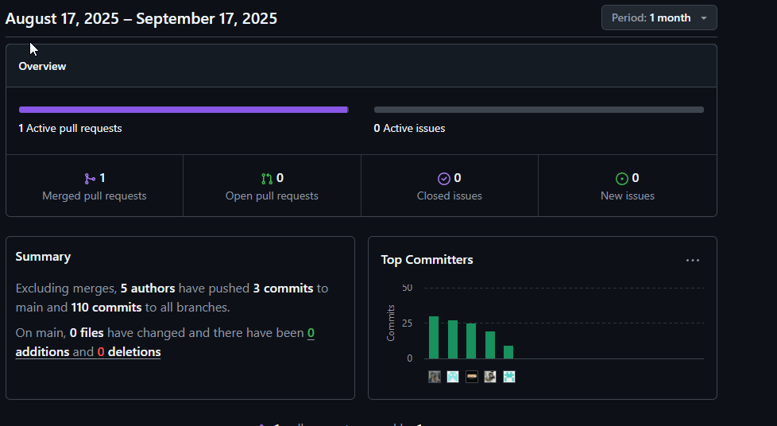
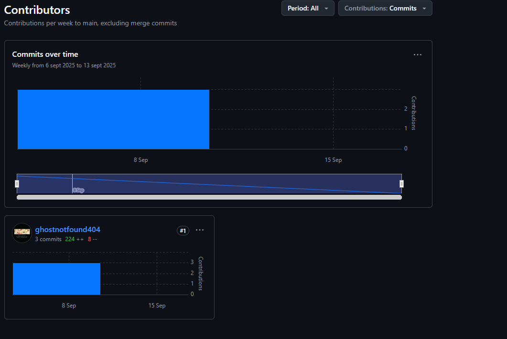
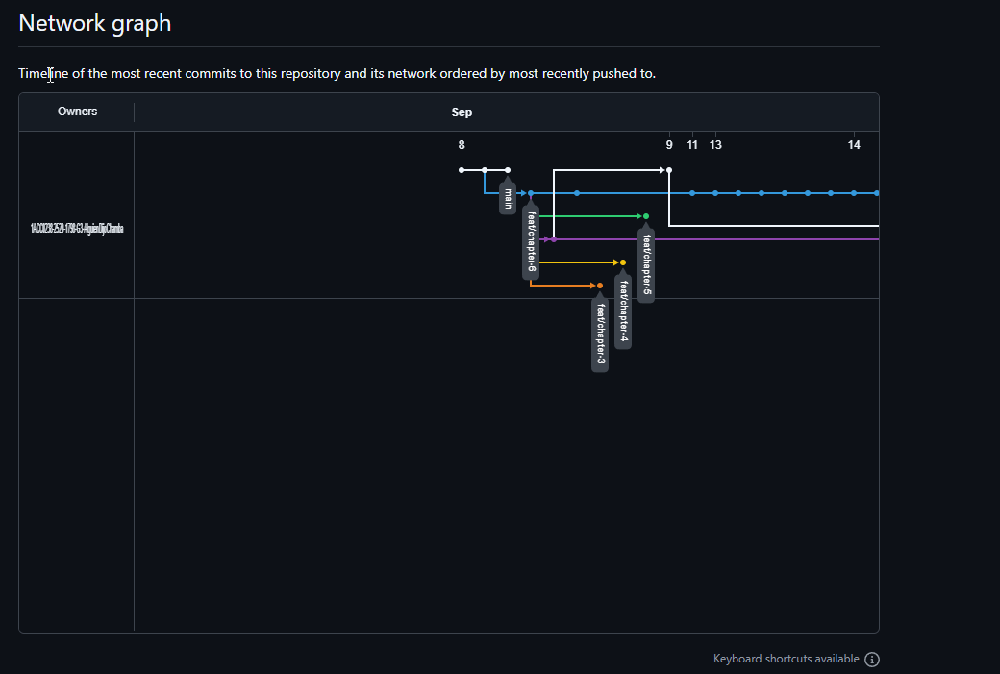

# COURSE PROJECT

---

    <strong>Universidad Peruana de Ciencias Aplicadas (UPC)</strong>     
    </img> 
    <strong>Carrera de Ingeniería de Software - Ciclo VI</strong>  
    <strong>Aplicaciones para Dispositivos Móviles - 1798</strong> 
     <strong>Profesor: Jorge Luis Mayta Guillermo</strong> 
     <strong><b>INFORME DEL TRABAJO FINAL</strong></b> 

    <strong>Startup del Proyecto: The Draws</strong> 
    <strong>Producto: AlguienDijoChamba</strong> 

    <h3 align="center">Team Members:</h3>

    <table align="center">
        <tr>
            <th style="text-align:center;">Member</th>
            <th style="text-align:center;">Code</th>
        </tr>
        <tr>
            <td>Bastidas Bastidas, Diego Martin</td>
            <td>U20221A301</td>
        </tr>
        <tr>
            <td>Belahonia Miranda, Fabrisio  </td>
            <td>U202220219</td>
        </tr>
        <tr>
            <td>Dominguez Vargas, Rafael Alexander</td>
            <td>u202312318</td>
        </tr>
        <tr>
            <td>Escobar Palomino, Sebastian Matias</td>
            <td>U202220219</td>
        </tr>
        <tr>
            <td>Muñiz Huayanca, Percy Alonso</td>
            <td>u202319563</td>
        </tr>
    </table>
    

</body>

 <strong>2025-02</strong>

 

---

# Registro de Versiones del Informe

| Versión | Fecha | Autor | Descripción de la modificación |
|----|----|----|----|
| TB1 | 17/09/2025 | Diego Bastidas, Fabrisio Belahonia, Rafael Dominguez, Sebastian Escobar, Alonso Muñiz | Redacción de los Capítulos I: Presentación, II: Requirements Development and Software Solution Design |
| TP1 | 7/10/2025 | Diego Bastidas, Fabrisio Belahonia, Rafael Dominguez, Sebastian Escobar, Alonso Muñiz | Corrección de los Capítulos I: Presentación, II: Requirements Development and Software Solution Design. Redacción del Capítulo III: Solution UI/UX Design y Capítulo IV: Product Implementation & Validation|

# Project Report Collaboration Insights

Enlace de la organización para el reporte del proyecto: [https://github.com/1ACC0238-2520-1798-G3-AlguienDijoChamba ](https://github.com/1ACC0238-2520-1798-G3-AlguienDijoChamba)

TB1:

TP1:

TB1:

# Contenido
## Tabla de contenidos
- [**Registro de Versiones del Informe**](#registro-de-versiones-del-informe)
- [**Project Report Collaboration Insights**](#project-report-collaboration-insights)
- [**Contenido**](#contenido)
    - [Tabla de contenidos](#tabla-de-contenidos)
- [**Student Outcome**](#student-outcome)
- ## [ **Capítulo I:  Presentación** ](#-capítulo-i-introducción-)
    - [**1.1. Startup Profile**]()
        - [**1.1.1. Descripción de la Startup**]()
        - [**1.1.2. Perfiles de integrantes del equipo**]()
    - [**1.2. Solution Profile**]()
        - [**1.2.1 Antecedentes y problemática**]()
            - [What (¿Qué?)]()
            - [Who (¿Quién?)]()
            - [Where (¿Dónde?)]()
            - [When (¿Cuándo?)]()
            - [Why (¿Por qué?)]()
            - [How (¿Cómo?)]()
            - [How much (¿Cuánto?)]()
        - [**1.2.2 Lean UX Process**]()
        - [**1.2.2.1. Lean UX Problem Statements**]()
        - [**1.2.2.2. Lean UX Assumptions**]()
        - [**1.2.2.3. Lean UX Hypothesis Statements**]()
        - [**1.2.2.4. Lean UX Canvas**]()
    - [**1.3. Segmentos objetivo**]()
- ## [ **Capítulo II: Requirements Development and Software Solution Design**]()
    - [**2.1. Competidores**]()
        - [**2.1.1. Análisis competitivo**]()
        - [**2.1.2. Estrategias y tácticas frente a competidores**]()
    - [**2.2. Entrevistas**]()
        - [**2.2.1. Diseño de entrevistas**]()
        - [**2.2.2. Registro de entrevistas**]()
        - [**2.2.3. Análisis de entrevistas**]()
    - [**2.3. Needfinding**]()
        - [**2.3.1. User Personas**]()
        - [**2.3.2. User Task Matrix**]()
        - [**2.3.3. User Journey Mapping**]()
        - [**2.3.4. Empathy Mapping**]()
        - [**2.3.5. Ubiquitous Language**]()
    - [**2.4. Requirements specification**]()
        - [**2.4.1. User Stories**]()
        - [**2.4.2. Impact Mapping**]()
        - [**2.4.3. Product Backlog**]()
    - [**2.5. Strategic-Level Domain-Driven Design**]()
        - [**2.5.1. EventStorming**]()
            - [**2.5.1.1. Candidate Context Discovery**]()
            - [**2.5.1.2. Domain Message Flows Modeling**]()
            - [**2.5.1.3. Bounded Context Canvases**]()
        - [**2.5.2. Context Mapping**]()
        - [**2.5.3. Software Architecture**]()
            - [**2.5.3.1. Software Architecture Context Level Diagrams**]()
            - [**2.5.3.2. Software Architecture Container Level Diagrams**]()
            - [**2.5.3.3. Software Architecture Deployment Diagrams**]()
    - [**2.6. Tactical-Level Domain-Driven Design**]()
        - [**2.6.1. Bounded Context: Worker-Catalog**]()
            - [**2.6.1.1. Domain Layer**]()
            - [**2.6.1.2. Interface Layer**]()
            - [**2.6.1.3. Application Layer**]()
            - [**2.6.1.4. Infrastructure Layer**]()
            - [**2.6.1.5. Bounded Context Software Architecture Component Level Diagrams**]()
            - [**2.6.1.6. Bounded Context Software Architecture Code Level Diagrams**]()
                - [**2.6.1.6.1. Bounded Context Domain Layer Class Diagrams**]()
                - [**2.6.1.6.2. Bounded Context Database Design Diagram**]()
        - [**2.6.2. Bounded Context: Payments**]()
            - [**2.6.2.1. Domain Layer**]()
            - [**2.6.2.2. Interface Layer**]()
            - [**2.6.2.3. Application Layer**]()
            - [**2.6.2.4. Infrastructure Layer**]()
            - [**2.6.2.5. Bounded Context Software Architecture Component Level Diagrams**]()
            - [**2.6.2.6. Bounded Context Software Architecture Code Level Diagrams**]()
                - [**2.6.2.6.1. Bounded Context Domain Layer Class Diagrams**]()
                - [**2.6.2.6.2. Bounded Context Database Design Diagram**]()
        - [**2.6.3. Bounded Context: Alerts**]()
            - [**2.6.3.1. Domain Layer**]()
            - [**2.6.3.2. Interface Layer**]()
            - [**2.6.3.3. Application Layer**]()
            - [**2.6.3.4. Infrastructure Layer**]()
            - [**2.6.3.5. Bounded Context Software Architecture Component Level Diagrams**]()
            - [**2.6.3.6. Bounded Context Software Architecture Code Level Diagrams**]()
                - [**2.6.3.6.1. Bounded Context Domain Layer Class Diagrams**]()
                - [**2.6.3.6.2. Bounded Context Database Design Diagram**]()
        - [**2.6.4. Bounded Context: Tec-Section**]()
            - [**2.6.4.1. Domain Layer**]()
            - [**2.6.4.2. Interface Layer**]()
            - [**2.6.4.3. Application Layer**]()
            - [**2.6.4.4. Infrastructure Layer**]()
            - [**2.6.4.5. Bounded Context Software Architecture Component Level Diagrams**]()
            - [**2.6.4.6. Bounded Context Software Architecture Code Level Diagrams**]()
                - [**2.6.4.6.1. Bounded Context Domain Layer Class Diagrams**]()
                - [**2.6.4.6.2. Bounded Context Database Design Diagram**]()
        - [**2.6.5. Bounded Context: IAM**]()
            - [**2.6.5.1. Domain Layer**]()
            - [**2.6.5.2. Interface Layer**]()
            - [**2.6.5.3. Application Layer**]()
            - [**2.6.5.4. Infrastructure Layer**]()
            - [**2.6.5.5. Bounded Context Software Architecture Component Level Diagrams**]()
            - [**2.6.5.6. Bounded Context Software Architecture Code Level Diagrams**]()
                - [**2.6.5.6.1. Bounded Context Domain Layer Class Diagrams**]()
                - [**2.6.5.6.2. Bounded Context Database Design Diagram**]()
- ## [**Capítulo III: Solution UI/UX Design**]()
    - [**3.1. Product Design**]()
        - [**3.1.1. Style Guidelines**]()
            - [**3.1.1.1. General Style Guidelines**]()
        - [**3.1.2. Information Architecture**]()
            - [**3.1.2.1. Organization Systems**]()
            - [**3.1.2.2. Labelling Systems**]()
            - [**3.1.2.3. SEO Tags and Meta Tags**]()
            - [**3.1.2.4. Searching Systems**]()
            - [**3.1.2.5. Navigation Systems**]()
        - [**3.1.3. Landing Page UI Design**]()
            - [**3.1.3.1. Landing Page Wireframe**]()
            - [**3.1.3.2. Landing Page Mock-up**]()
        - [**3.1.4. Mobile Applications UX/UI Design**]()
            - [**3.1.4.1. Mobile Applications Wireframes**]()
            - [**3.1.4.2. Mobile Applications Wireflow Diagrams**]()
            - [**3.1.4.3. Mobile Applications Mock-ups**]()
            - [**3.1.4.4. Mobile Applications User Flow Diagrams**]()
            - [**3.1.4.5. Mobile Applications Prototyping**]()
- ## [**Capítulo IV: Product Implementation, Validation \& Deployment**]()
    - [**4.1. Software Configuration Management**]()
        - [**4.1.1. Software Development Environment Configuration**]()
        - [**4.1.2. Source Code Management**]()
        - [**4.1.3. Source Code Style Guide \& Conventions**]()
        - [**4.1.4. Software Deployment Configuration**]()
    - [**4.2. Landing Page, Services \& Applications Implementation**]()
        - [**4.2.1. Sprint 1**]()
            - [**4.2.1.1. Sprint Planning 1**]()
            - [**4.2.1.2. Sprint Backlog 1**]()
            - [**4.2.1.3. Development Evidence for Sprint Review**]()
            - [**4.2.1.4. Testing Suite Evidence for Sprint Review**]()
            - [**4.2.1.5. Execution Evidence for Sprint Review**]()
            - [**4.2.1.6. Services Documentation Evidence for Sprint Review**]()
            - [**4.2.1.7. Software Deployment Evidence for Sprint Review**]()
            - [**4.2.1.8. Team Collaboration Insights during Sprint**]()
        - [**4.2.2. Sprint 2**]()
            - [**4.2.2.1. Sprint Planning 2**]()
            - [**4.2.2.2. Sprint Backlog 2**]()
            - [**4.2.2.3. Development Evidence for Sprint Review**]()
            - [**4.2.2.4. Testing Suite Evidence for Sprint Review**]()
            - [**4.2.2.5. Execution Evidence for Sprint Review**]()
            - [**4.2.2.6. Services Documentation Evidence for Sprint Review**]()
            - [**4.2.2.7. Software Deployment Evidence for Sprint Review**]()
            - [**4.2.2.8. Team Collaboration Insights during Sprint**]()
        - [**4.2.3. Sprint 3**]()
            - [**4.2.3.1. Sprint Planning 3**]()
            - [**4.2.3.2. Sprint Backlog 3**]()
            - [**4.2.3.3. Development Evidence for Sprint Review**]()
            - [**4.2.3.4. Testing Suite Evidence for Sprint Review**]()
            - [**4.2.3.5. Execution Evidence for Sprint Review**]()
            - [**4.2.3.6. Services Documentation Evidence for Sprint Review**]()
            - [**4.2.3.7. Software Deployment Evidence for Sprint Review**]()
            - [**4.2.3.8. Team Collaboration Insights during Sprint**]()
    - [**4.3. Validation Interviews**]()
        - [**4.3.1. Diseño de Entrevistas**]()
        - [**4.3.2. Registro de Entrevistas**]()
        - [**4.3.3. Evaluaciones según heurísticas**]()
    - [**4.4. Video About-the-Product**]()

# Student Outcome
| Criterio específico | Acciones realizadas | Conclusiones |
|----|----|----|
| Reconoce la necesidad del aprendizaje permanente para el desempeño profesional y el desarrollo de proyectos en soluciones de tecnologías de ingeniería de software. | **Diego Bastidas:**  **TB1:** En el Capítulo I, participé en la presentación del proyecto y en la descripción de la startup, investigando nuevas tendencias tecnológicas. En el Capítulo II, trabajé en el análisis competitivo y la especificación de requisitos, reforzando mis conocimientos en metodologías ágiles.  **TP1:** Lideré los Capítulos III y IV, corregí capítulos previos, desarrollé la landing page y el backend, lo cual me exigió aprender sobre UI/UX, prototipado y despliegue de aplicaciones.  **TF:** En la entrega final me encargué del proceso de despliegue de la app Flutter, investigando buenas prácticas de publicación, problemas comunes en builds multiplataforma y configuración de dependencias. Este proceso reforzó la importancia de mantenerme actualizado sobre herramientas de integración continua, manejo de certificados, optimización de rendimiento y preparación de releases, aspectos esenciales del ciclo de vida profesional en ingeniería de software.  **Fabrisio Belahonia:**  **TB1:** Colaboré en el perfil de la startup y en la problemática, investigando casos similares e innovaciones. En el Capítulo II, participé en entrevistas, user personas y análisis UX.  **TP1:** Corregí el EventStorming, diseñé prototipos en Figma y afiné los user stories, profundizando en modelado y diseño de interfaces.  **TF:** En esta última entrega apoyé en el proceso de despliegue de Flutter, especialmente en la preparación de assets, verificación de rutas, pruebas en distintos dispositivos y corrección de inconsistencias visuales. Tuve que aprender sobre configuraciones específicas de Flutter para Android e iOS, manejo de versiones, compatibilidades de plugins y optimización del tamaño del APK/AAB, demostrando nuevamente la necesidad de un aprendizaje continuo para enfrentar estas etapas finales del desarrollo.  **Rafael Domínguez:**  **TB1:** Contribuí en la solución propuesta y los segmentos objetivo, investigando modelos de negocio y patrones de diseño. En el Capítulo II, apoyé en requisitos y arquitectura.  **TP1:** Me dediqué al diseño en Figma y la creación de pantallas en Android Studio, aprendiendo sobre herramientas móviles.  **TF:** Para la entrega final participé en las pruebas del despliegue Flutter, validando pantallas, garantizando la consistencia visual entre dispositivos, revisando responsiveness y corrigiendo errores derivados del compilador. Aprendí sobre canales de distribución, bundles, problemas comunes en renders y cómo optimizar componentes para producción, reforzando la importancia de aprender constantemente en cada etapa técnica del desarrollo móvil.  **Sebastián Escobar:**  **TB1:** Contribuí en antecedentes y problemática, investigando tendencias. En el Capítulo II, apoyé en análisis de competidores y arquitectura.  **TP1:** Realicé pantallas en Android Studio, fortaleciendo mis habilidades móviles.  **TF:** En esta fase final apoyé activamente en el testing del release Flutter, realizando pruebas funcionales, validación de flujo, revisión de animaciones y asegurando la estabilidad en entornos reales. Para ello, tuve que investigar sobre logs de producción, depuración de errores de compilación y optimización del rendimiento final, reafirmando que el aprendizaje continuo es indispensable para entregar productos funcionales y de calidad.  **Alonso Muñiz:**  **TB1:** Participé en la descripción de perfiles y presentación del proyecto. En el Capítulo II, trabajé en matrices de tareas y documentación de dominios.  **TP1:** Me encargué del Capítulo III, corregí el Capítulo II y colaboré en el backend.  **TF:** En la entrega final participé en la integración de funcionalidades móviles con el backend, asegurando la correcta comunicación con la app Flutter durante su despliegue. Esto me llevó a investigar sobre CORS, manejo de estados en producción, buenas prácticas para endpoints en apps móviles, así como configuraciones específicas de compilación y seguridad. Gracias a este proceso, reforcé la importancia de la actualización constante al trabajar con múltiples tecnologías conectadas. | **TB1:** El aprendizaje permanente nos permitió adaptarnos a los desafíos de cada fase del proyecto, integrando metodologías, herramientas y enfoques modernos esenciales en la ingeniería de software.  **TP1:** La actualización constante fue clave para avanzar desde la conceptualización hasta la implementación, fortaleciendo nuestra capacidad para enfrentar entornos tecnológicos exigentes.  **TF:** La fase final de despliegue Flutter evidenció nuevamente que la ingeniería de software exige aprendizaje continuo. Tuvimos que investigar sobre compilación, pruebas, optimización, publicación y resolución de errores propios del proceso de release. Gracias a ello, el equipo logró concluir el proyecto con una aplicación estable y lista para distribución, demostrando que la capacidad de aprender y adaptarse es fundamental para el desarrollo profesional. |

 

---

| Criterio específico | Acciones realizadas | Conclusiones |
|----|----|----|
| Reconoce la necesidad del aprendizaje permanente para el desempeño profesional y el desarrollo de proyectos en soluciones de tecnologías de ingeniería de software. | **Diego Bastidas:**  **TB1:** Participé en la presentación inicial del proyecto y en el análisis competitivo, lo que me llevó a actualizarme en tendencias tecnológicas y metodologías ágiles.  **TP1:** Lideré el desarrollo de la landing page y backend, reforzando conocimientos en UI/UX, despliegue y arquitectura.  **TF:** En la entrega final me enfoqué en el despliegue de Flutter, investigando configuraciones, dependencias y optimización del build, fortaleciendo mi capacidad de adaptación técnica.  **Fabrisio Belahonia:**  **TB1:** Colaboré en la definición de la problemática y en la creación de user personas, lo que me llevó a revisar conceptos de UX y análisis de usuario.  **TP1:** Trabajé en prototipos y EventStorming, desarrollando habilidades en documentación ágil.  **TF:** Apoyé en la preparación visual y estructural de la app Flutter antes del despliegue, aprendiendo ajustes de assets, rutas y compatibilidad entre dispositivos.  **Rafael Dominguez:**  **TB1:** Contribuí en la propuesta de solución y en la arquitectura inicial, revisando buenas prácticas de ingeniería.  **TP1:** Realicé pantallas en Android Studio y diseños en Figma, reforzando habilidades móviles.  **TF:** Realicé pruebas y validación del build Flutter, investigando solución de errores y optimización básica del rendimiento.  **Sebastián Escobar:**  **TB1:** Apoyé en el análisis de competidores y arquitectura general, fortaleciendo mis conocimientos de modelado.  **TP1:** Desarrollé pantallas móviles en Android Studio, mejorando en UI/UX.  **TF:** Colaboré en el testing de la app Flutter tras el despliegue, aprendiendo sobre estabilidad, navegación y ajustes finales.  **Alonso Muñiz:**  **TB1:** Contribuí en la documentación de contextos de dominio y análisis de tareas de usuario.  **TP1:** Desarrollé parte del backend y capítulos técnicos del informe.  **TF:** Apoyé en la integración backend–Flutter durante el despliegue, revisando endpoints, estados y funcionamiento en producción. | **TB1:** El aprendizaje continuo nos permitió entender mejor el entorno del proyecto y aplicar metodologías modernas de software.  **TP1:** La adquisición constante de nuevas habilidades fue clave para avanzar técnicamente y mejorar la calidad del producto.  **TF:** El despliegue Flutter reafirmó que actualizarse es esencial para resolver problemas reales y culminar un proyecto profesional de manera sólida. |

 

----
# OBJETIVOS SMART

| Nombre                                 | Código       | Objetivo SMART   | Específico                                                                                                                               | Medible                                                                                                                                       | Alcanzable                                                                                   | Relevante                                                                                                                  |
|----------------------------------------|--------------|------------------|------------------------------------------------------------------------------------------------------------------------------------------|------------------------------------------------------------------------------------------------------------------------------------------------|-----------------------------------------------------------------------------------------------|-----------------------------------------------------------------------------------------------------------------------------|
| Bastidas Bastidas, Diego Martin        | U20221A301   | Objetivo SMART 1 | Desarrollar una aplicación web con enfoque en seguridad utilizando Spring Boot y MySQL.                                                  | Finalizar el proyecto en 8 semanas, implementar autenticación JWT y validaciones OWASP.                                                       | Dedicando 6 horas semanales para desarrollo y pruebas.                                      | Fortalecer habilidades técnicas aplicadas a proyectos reales.                                                              |
| Bastidas Bastidas, Diego Martin        | U20221A301   | Objetivo SMART 2 | Obtener una certificación básica en ciberseguridad para complementar mi perfil como desarrollador.                                       | Aprobar un curso certificado (como Cisco CyberOps o similar) en 3 meses.                                                                      | Estudiando 4 horas semanales con recursos oficiales.                                        | Aumentar mi empleabilidad y preparación para roles híbridos.                                                               |
| Belahonia Miranda, Fabrisio            | U202220219   | Objetivo SMART 1 | Construir una API REST segura y documentarla en GitHub como parte de mi portafolio.                                                      | Subir al menos 5 commits semanales, incluir pruebas unitarias y documentación técnica.                                                        | Asignando 5 horas semanales para desarrollo y documentación.                             | Mejorar mi visibilidad profesional y demostrar dominio técnico.                                                            |
| Belahonia Miranda, Fabrisio            | U202220219   | Objetivo SMART 2 | Participar en un foro técnico compartiendo experiencias sobre desarrollo seguro.                                                          | Publicar 1 post semanal en LinkedIn y participar en al menos 2 eventos virtuales en 2 meses.                                                  | Reservando 3 horas semanales para redacción y networking.                                 | Posicionarme como referente en prácticas seguras de desarrollo.                                                            |
| Domínguez Vargas, Rafael Alexander     | U202312318   | Objetivo SMART 1 | Crear un blog técnico sobre vulnerabilidades comunes en aplicaciones web.                                                                | Publicar 1 artículo semanal durante 2 meses y alcanzar 500 visitas mensuales.                                                                  | Asignando 2 horas semanales para redacción y promoción.                                   | Compartir conocimientos y posicionarme como experto en seguridad web.                                                      |
| Domínguez Vargas, Rafael Alexander     | U202312318   | Objetivo SMART 2 | Contribuir a un proyecto open source enfocado en seguridad web.                                                                          | Realizar al menos 5 pull requests en 3 meses y documentar cada contribución.                                                                  | Asignando 3 horas semanales para revisión de issues y desarrollo.                         | Ganar experiencia colaborativa y mejorar mi reputación como desarrollador.                                                 |
| Escobar Palomino, Sebastian Matias     | U202220219   | Objetivo SMART 1 | Diseñar un curso introductorio sobre ciberseguridad para principiantes.                                                                  | Crear 5 módulos y lanzarlo en una plataforma educativa antes de fin de año.                                                                   | Dedicando 5 horas semanales para diseño de contenido y pruebas.                           | Democratizar el acceso al conocimiento y fortalecer mi perfil como educador técnico.                                       |
| Escobar Palomino, Sebastian Matias     | U202220219   | Objetivo SMART 2 | Crear contenido educativo sobre desarrollo seguro en YouTube.                                                                            | Publicar 1 video quincenal durante 3 meses con al menos 300 visualizaciones por video.                                                        | Reservando 4 horas semanales para guión, grabación y edición.                             | Posicionarme como referente en prácticas seguras de desarrollo.                                                             |
| Muñiz Huayanca, Percy Alonso           | U202319563   | Objetivo SMART 1 | Convertirme en desarrollador Full Stack con sólidos conocimientos en ciberseguridad.                                                     | Completar 2 cursos certificados (desarrollo web avanzado y ciberseguridad práctica) y aplicar principios OWASP en un proyecto personal.       | Estudiando 5 horas semanales y realizando ejercicios prácticos.                          | Fortalecer mi perfil profesional y adquirir habilidades clave para el mercado actual.                                      |
| Muñiz Huayanca, Percy Alonso           | U202319563   | Objetivo SMART 2 | Construir una marca personal como desarrollador Full Stack enfocado en ciberseguridad.                                                   | Publicar 1 post semanal en LinkedIn, compartir contenido en GitHub y alcanzar 200 seguidores en 3 meses.                                     | Asignando 3 horas semanales para escribir y compartir experiencias.                      | Potenciar mi visibilidad profesional y demostrar mis conocimientos al público objetivo.                                     |

